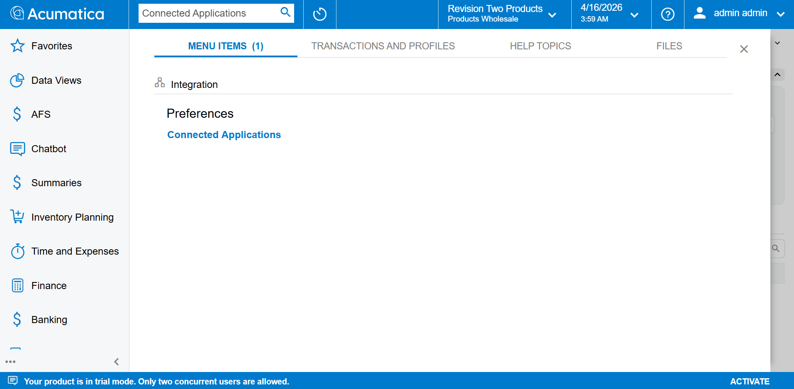
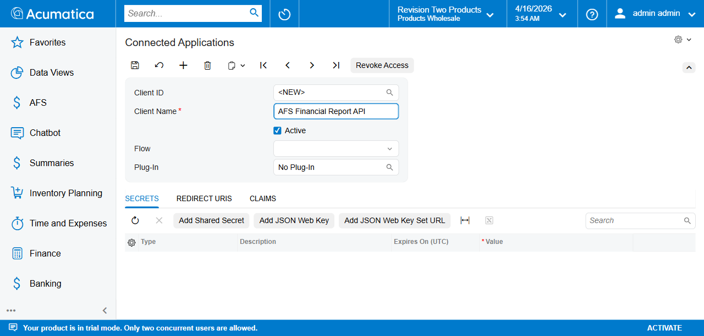
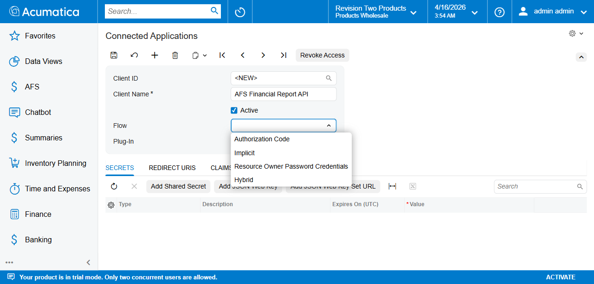
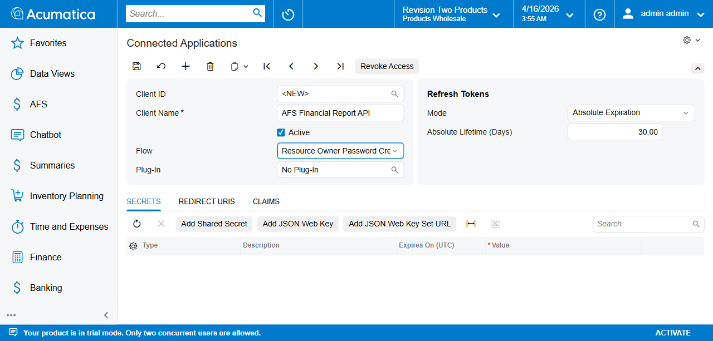
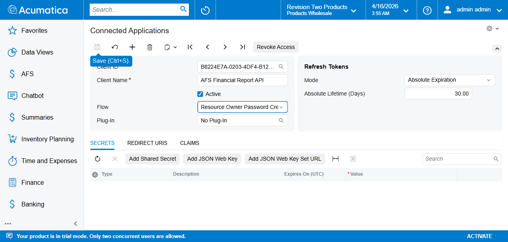
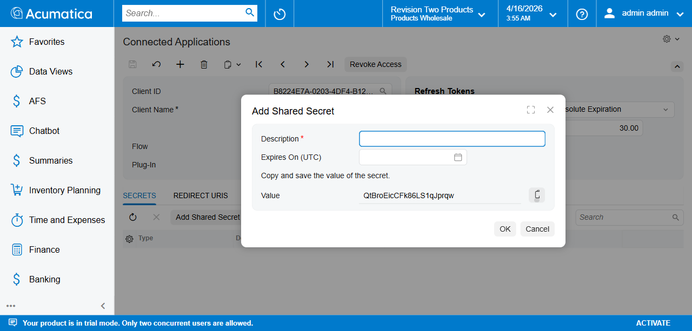
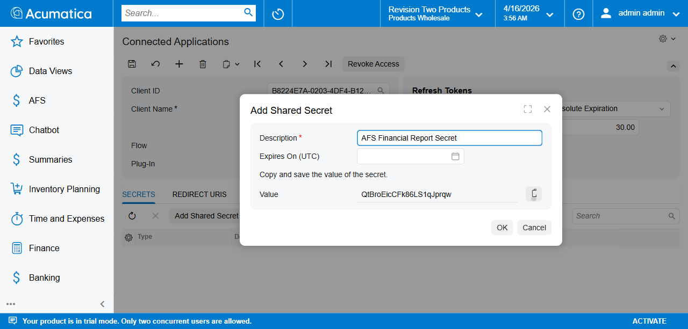
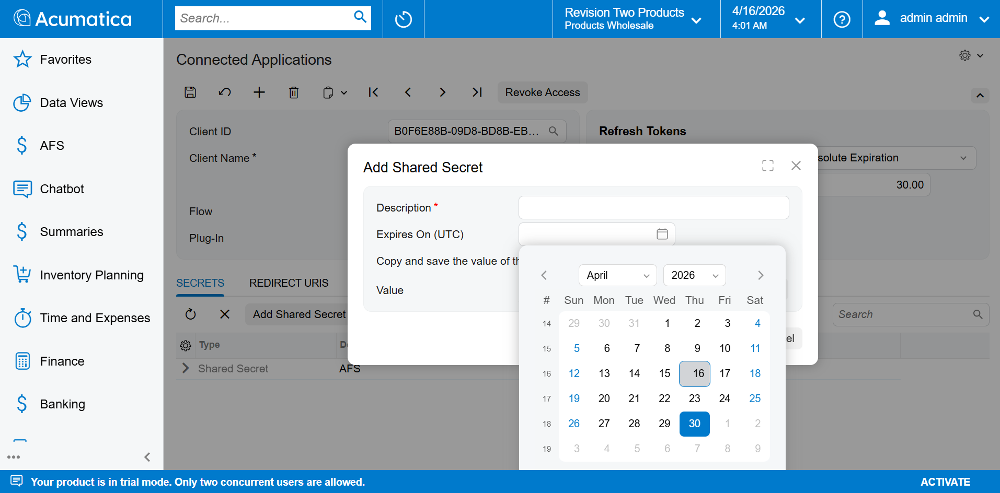
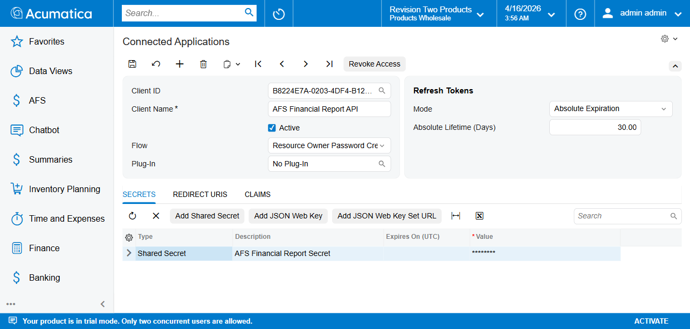
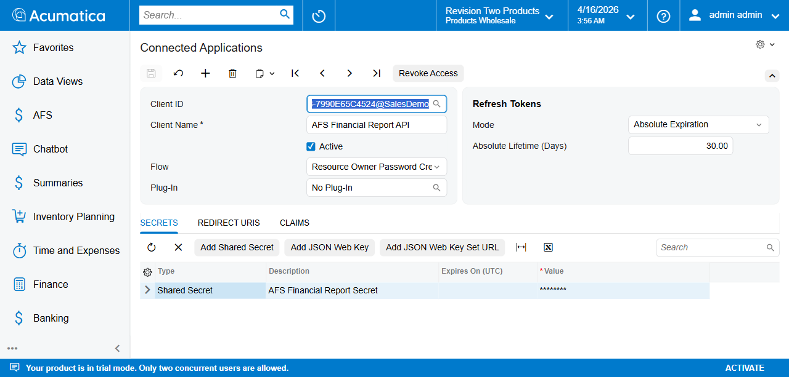

# Connected Application Setup — OAuth2 Resource Owner Password Credentials

This document describes how to create a Connected Application in Acumatica to obtain the **Client ID** and **Client Secret** required by the AFS Financial Report module.

---

## Prerequisites

- Acumatica 2025 R2 or later
- Administrator access to the Acumatica instance
- AFS Financial Report customization published

---

## Steps

### Step 1 — Navigate to Connected Applications

1. Log in to Acumatica as an administrator.
2. In the top search bar, type **Connected** and select **Connected Applications** under *Integration > Preferences*.

> **Screen ID:** SM303010

---

### Step 2 — Create a New Record

Click the **+** (Add) button in the toolbar to create a new record. The **Client ID** field will show `<NEW>` until saved.

---

### Step 3 — Enter Client Name

In the **Client Name** field, enter a meaningful name that identifies this application.

> Example: `AFS Financial Report API`

---

### Step 4 — Set the Flow

Click the **Flow** dropdown and select **Resource Owner Password Credentials**.

> Selecting this flow automatically reveals the **Refresh Tokens** section on the right.

---

### Step 5 — Configure Refresh Tokens

The **Refresh Tokens** section appears automatically with these defaults:

| Field                    | Default Value       |
| ------------------------ | ------------------- |
| Mode                     | Absolute Expiration |
| Absolute Lifetime (Days) | 30.00               |

Adjust the **Absolute Lifetime (Days)** if a longer token validity is required (e.g. `365` for 1 year).

---

### Step 6 — Save the Record

Click **Save** (or press `Ctrl+S`). Acumatica generates a unique **Client ID**.

> **Important:** Copy and store the full **Client ID** value. It will be needed in the Tenant Credentials screen (FR101001).
>
> The Client ID format is: `{GUID}@{TenantName}`
> Example: `B8224E7A-0203-4DF4-B12B-7990E65C4524@SalesDemo`

---

### Step 7 — Add a Shared Secret

In the **Secrets** tab, click **Add Shared Secret**. A popup appears with an auto-generated secret value.

> **Important:** The secret value is shown **only once**. Copy it now before clicking OK.

---

### Step 8 — Fill in Secret Details

1. **Description** — Enter a meaningful label.
   Example: `AFS Financial Report Secret`
2. **Expires On (UTC)** — Set an expiry date.
3. **Value** — The secret is auto-generated. Copy this value and store it securely.

---

### Step 9 — Click OK

Click **OK** to confirm. The secret appears in the Secrets grid with the value masked as `********`.

---

### Step 10 — Final Save

Click **Save** again to persist the secret.

---

## Summary of Values to Record

After completing setup, note down:

| Field                   | Where to Find                                              |
| ----------------------- | ---------------------------------------------------------- |
| **Client ID**     | Client ID field (full value with `@TenantName`)          |
| **Client Secret** | Copied from Add Shared Secret popup (Step 8)               |
| **Acumatica URL** | Base URL of your instance, e.g.`http://localhost/2025R2` |
| **Username**      | Acumatica user with API access                             |
| **Password**      | Password of above user                                     |

These values are entered in **Tenant Credentials (FR101001)** during AFS Financial Report setup.

---

## Next Step

Proceed to [Tenant Credentials Setup](TenantCredentials_Setup.md) and enter the Client ID and Secret obtained above.
