# Introduction

The **AFSCPFinancialReport** customization for Acumatica 2025 R2 turns GL data and Generic Inquiry results into mail-merged Word reports and AI-generated PowerPoint presentations. This manual walks an administrator through every screen end-to-end, in the order you would set them up on a fresh tenant.

## Module workflow at a glance

```
1. Connected Application (SM303010)         Acumatica OAuth2 client
        │  Client ID + Shared Secret
        ▼
2. Tenant Credentials (FR101001)            API credentials + Gamma key
        │  encrypted credentials per tenant
        ▼
   ┌──────────────────────────────┐
   │ 3. Report Definitions        │ ── GL Trial Balance statements (BS / PL / CF / EQ / Custom)
   │    (FR101002)                │    Five FY-to-date balance types, two placeholder periods.
   └──────────────────────────────┘
                 │ placeholders: {{PFX_LINE_CY}}, {{PFX_LINE_PY}}
                 │
   ┌──────────────────────────────┐
   │ 4. MBR Definitions           │ ── Any GI mapped to placeholder columns
   │    (FR101004)                │    Single-period, multi-row, calculated, formatted.
   └──────────────────────────────┘
                 │ placeholders: {{PFX_ALIAS}}, {{PFX_ALIAS_N_GICol}}
                 ▼
   ┌────────────────────────┐    ┌─────────────────────────────────┐
   │ 5. Financial Report    │    │ 6. MBR Report Generation        │
   │    (FR101000) → .docx  │    │    (FR101003) → .pptx via Gamma │
   └────────────────────────┘    └─────────────────────────────────┘
```

## How to read this manual

- **Chapters 1–6** cover one screen each, in the recommended setup order. Skim a chapter end-to-end before clicking through the screen for the first time, then come back as you fill the fields.
- **Appendix A — Placeholder Reference** is the catalogue of every placeholder shape the engine emits. Use it when authoring a Word template or a Gamma prompt.
- **Appendix B — Troubleshooting** lists every error message in `Helper/Messages.cs` with its cause and fix, plus the trace-prefix reference.

## Project-truth notes (v2.1.x)

Two facts changed in the v2.1.x refactor — keep these in mind when reading any older `.docx` template you inherit:

- **Balance types.** Five FY-to-date types only — `ENDING`, `BEGINNING`, `DEBIT`, `CREDIT`, `MOVEMENT`. The legacy single-period types (`PDEBIT`, `PCREDIT`, `PMOVEMENT`) were removed.
- **Placeholder periods.** Two suffixes only — `_CY` (current FY-to-date) and `_PY` (previous FY same window). The legacy `_PM` (previous-month) suffix was removed. Compute month-only deltas inside the Word template (`{{X_X_CY}} − {{X_X_PY}}`), not inside a Definition formula.

\newpage

# Chapter 1: Connected Application Setup (SM303010)

This chapter describes how to create a Connected Application in Acumatica to obtain the **Client ID** and **Client Secret** required by the AFS Financial Report module.

## Prerequisites

- Acumatica 2025 R2 or later
- Administrator access to the Acumatica instance
- AFS Financial Report customization published

## Steps

### Step 1 — Navigate to Connected Applications

1. Log in to Acumatica as an administrator.
2. In the top search bar, type **Connected** and select **Connected Applications** under *Integration > Preferences*.

> **Screen ID:** SM303010


### Step 2 — Create a New Record

Click the **+** (Add) button in the toolbar to create a new record. The **Client ID** field will show `<NEW>` until saved.

### Step 3 — Enter Client Name

In the **Client Name** field, enter a meaningful name that identifies this application.

> Example: `AFS Financial Report API`


### Step 4 — Set the Flow

Click the **Flow** dropdown and select **Resource Owner Password Credentials**.


> Selecting this flow automatically reveals the **Refresh Tokens** section on the right.

### Step 5 — Configure Refresh Tokens

The **Refresh Tokens** section appears automatically with these defaults:

| Field                    | Default Value       |
| ------------------------ | ------------------- |
| Mode                     | Absolute Expiration |
| Absolute Lifetime (Days) | 30.00               |

Adjust the **Absolute Lifetime (Days)** if a longer token validity is required (e.g. `365` for 1 year).

### Step 6 — Save the Record

Click **Save** (or press `Ctrl+S`). Acumatica generates a unique **Client ID**.


> **Important:** Copy and store the full **Client ID** value. It will be needed in the Tenant Credentials screen (FR101001).
>
> The Client ID format is: `{GUID}@{TenantName}`
> Example: `B8224E7A-0203-4DF4-B12B-7990E65C4524@SalesDemo`

### Step 7 — Add a Shared Secret

In the **Secrets** tab, click **Add Shared Secret**. A popup appears with an auto-generated secret value.


> **Important:** The secret value is shown **only once**. Copy it now before clicking OK.

### Step 8 — Fill in Secret Details

1. **Description** — Enter a meaningful label.
   Example: `AFS Financial Report Secret`
2. **Expires On (UTC)** — Set an expiry date.
3. **Value** — The secret is auto-generated. Copy this value and store it securely.


### Step 9 — Click OK

Click **OK** to confirm. The secret appears in the Secrets grid with the value masked as `********`.


### Step 10 — Final Save

Click **Save** again to persist the secret.


## Summary of Values to Record

After completing setup, note down:

| Field                   | Where to Find                                              |
| ----------------------- | ---------------------------------------------------------- |
| **Client ID**     | Client ID field (full value with `@TenantName`)          |
| **Client Secret** | Copied from Add Shared Secret popup (Step 8)               |
| **Acumatica URL** | Base URL of your instance, e.g.`http://localhost/2025R2` |
| **Username**      | Acumatica user with API access                             |
| **Password**      | Password of above user                                     |

These values are entered in **Tenant Credentials (FR101001)** during AFS Financial Report setup — see [Chapter 2](#chapter-2-tenant-credentials-fr101001).

\newpage

# Chapter 2: Tenant Credentials (FR101001)

This chapter describes how to store the **API credentials** that the AFS Financial Report module uses to read GL data from Acumatica's OData layer and (optionally) generate presentations through the Gamma API. One row per tenant — the engine looks up credentials by `Company Number` at run time.

> **Screen ID:** FR101001
> **Screen Title:** AFS Credentials Config
> **Menu path:** *AFS → Configuration → AFS Credentials Config*

## Prerequisites

- Acumatica 2025 R2 with the AFSCPFinancialReport customization published.
- A **Connected Application** already created in Acumatica — see [Chapter 1](#chapter-1-connected-application-setup-sm303010). You will need its **Client ID** and **Client Secret**.
- An Acumatica user account with access to the Generic Inquiries the report definitions read from (typically `AFS-Trial-Balance`).
- The **Company Number** for the tenant. Find it in *System → Manage → Companies*; it is the integer key, not the tenant name.
- *(Optional)* A Gamma API key from [gamma.app](https://gamma.app), only needed if you plan to use the [MBR Report Generation screen (FR101003)](#chapter-6-mbr-report-generation-fr101003).

## Steps

### Step 1 — Navigate to AFS Credentials Config

1. Log in to Acumatica.
2. In the top search bar, type **AFS Credentials** and select **AFS Credentials Config** under *AFS → Configuration*.

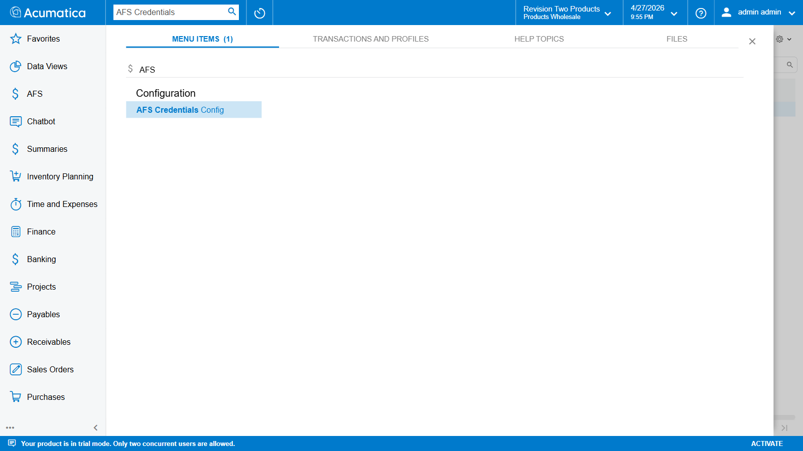

The screen opens in grid mode. Each existing tenant occupies one row. Sensitive columns (Client ID, Client Secret, Username, Password, Presentation API Key) display as `********` — they are encrypted at rest with `PXRSACryptString` and never re-shown in plaintext after save.

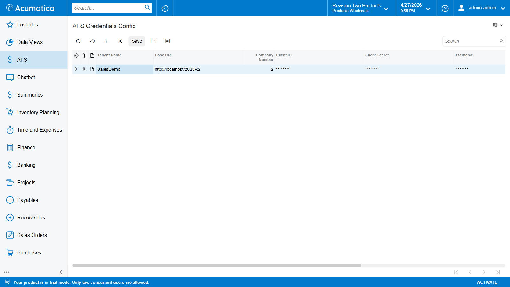

The toolbar carries the standard Acumatica grid actions:

| Icon | Tooltip       | Purpose                                              |
| ---- | ------------- | ---------------------------------------------------- |
| ↻    | Refresh       | Reload data from the database.                       |
| ↶    | Cancel (Esc)  | Discard all unsaved changes in the grid.             |
| +    | Add Row       | Insert a new empty row at the bottom.                |
| ×    | Delete        | Delete the currently selected row.                   |
| Save | Save          | Persist all pending inserts / edits / deletes.       |
| ⊢    | Adjust Columns| Auto-fit column widths.                              |
| ⊠    | Export to Excel| Export the grid contents.                           |

### Step 2 — Add a New Row

Click the **+** (Add Row) button on the toolbar. An empty row appears at the bottom of the grid with focus in the **Tenant Name** cell.

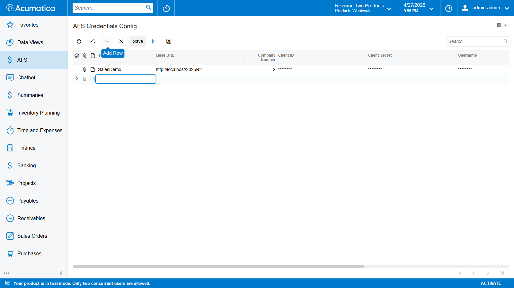

> The grid edits in place — there is no separate detail pane. Use **Tab** to move between cells.

### Step 3 — Fill the 8 Columns

Enter values for every column. Five of the eight are RSA-encrypted on save; once you tab out of an encrypted cell the value is masked as `********`, but it is committed to the row buffer correctly — Save persists it.

| #  | Column                  | Required | Encrypted | Example                                  |
| -- | ----------------------- | -------- | --------- | ---------------------------------------- |
| 1  | **Tenant Name**         | yes      | no        | `SalesDemo`                              |
| 2  | **Base URL**            | yes      | no        | `http://localhost/2025R2`                |
| 3  | **Company Number**      | yes (key)| no        | `2`                                      |
| 4  | **Client ID**           | yes      | yes       | `B8224E7A-0203-4DF4-B12B-7990E65C4524@SalesDemo` |
| 5  | **Client Secret**       | yes      | yes       | *(value copied once from Connected App popup)* |
| 6  | **Username**            | yes      | yes       | `admin`                                  |
| 7  | **Password**            | yes      | yes       | *(API user's password)*                  |
| 8  | **Presentation API Key**| optional | yes       | `gamma_xyz…` *(only needed for FR101003)*|

**Field rules**

- **Tenant Name** must match the tenant segment in the Acumatica URL exactly. It also appears as the suffix of the Connected Application's Client ID (`{GUID}@{TenantName}`).
- **Base URL** is the root of your Acumatica instance with **no trailing slash**. Use HTTPS in production.
- **Company Number** is the primary key of this row. Each tenant maps to exactly one row; saving two rows with the same Company Number fails on the unique key.
- **Client ID** / **Client Secret** come from the Connected Application created in [Chapter 1](#chapter-1-connected-application-setup-sm303010) — paste the full values without trimming.
- **Username** / **Password** are an Acumatica user account with access to the Generic Inquiries the report definitions read.
- **Presentation API Key** is the Gamma API key. Leave blank unless using FR101003 — the Financial Report screen (FR101000) does not need it.

After filling, the row looks like the screenshot below — non-encrypted fields show plain values; encrypted fields already mask once focus leaves the cell:

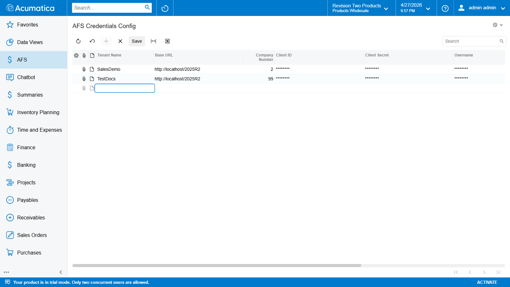

### Step 4 — Save

Click **Save** in the toolbar (or press `Ctrl+S`). The graph runs validation and persists the row:

- **Tenant Name** must be unique across all rows (`Messages.TenantNameMustBeUnique`).
- **Company Number** must be set (`Messages.CompanyNumRequired`).

If both pass, the encrypted fields are written to the database via `PXRSACryptString` and the row reloads showing all five sensitive columns as `********`. The saved row matches the existing **SalesDemo** example shown in Step 1.

> **Important.** The plaintext you typed is **not retrievable** after save. If you need to rotate a credential, paste a new value into the masked cell and Save again — Acumatica replaces the encrypted blob.

### Step 5 — *(Optional)* Discard Without Saving

If you started a new row by mistake, click the **Cancel (Esc)** button on the toolbar (curved-arrow icon). All pending inserts / edits / deletes are reverted; the grid returns to its last-saved state.


## How the Engine Uses This Row

When **Generate Report** runs on FR101000:

1. The graph reads the report record's `CompanyID` (the Acumatica company the record was created under).
2. `MapCompanyIDToTenantName` looks up the matching `FLRTTenantCredentials` row by `CompanyNum` and returns its `TenantName`.
3. `CredentialProvider.GetCredentials(tenantName)` decrypts the row and returns a strongly-typed `AcumaticaCredentials` object holding the Base URL, Client ID, Client Secret, Username, and Password.
4. `AuthService` performs the OAuth2 *Resource Owner Password Credentials* flow against `{BaseURL}/identity/connect/token` and caches the bearer token for the duration of the run.
5. `FinancialDataService` uses the bearer token to fetch the Generic Inquiry rows over OData.

If the row is missing or the Company Number doesn't match, the run fails immediately with `Messages.NoTenantMapping` — *"Tenant mapping not found."*

## Field Reference (DAC)

| DAC field         | Display name           | Type                       | Notes                                              |
| ----------------- | ---------------------- | -------------------------- | -------------------------------------------------- |
| `CompanyNum`      | Company Number         | `PXDBInt` (key)            | Primary key. Maps to Acumatica `CompanyID`.        |
| `TenantName`      | Tenant Name            | `PXDBString(50)`           | Plain text. Used to scope OAuth login.             |
| `BaseURL`         | Base URL               | `PXDBString(255)`          | Plain text.                                        |
| `ClientIDNew`     | Client ID              | `PXRSACryptString`         | Encrypted at rest.                                 |
| `ClientSecretNew` | Client Secret          | `PXRSACryptString`         | Encrypted at rest.                                 |
| `UsernameNew`     | Username               | `PXRSACryptString`         | Encrypted at rest.                                 |
| `PasswordNew`     | Password               | `PXRSACryptString`         | Encrypted at rest.                                 |
| `GammaApiKey`     | Presentation API Key   | `PXRSACryptString`         | Encrypted at rest. Optional — FR101003 only.       |

> The `*New` suffix on the encrypted fields is a legacy artefact from a schema migration; the UI just labels them **Client ID** / **Client Secret** / **Username** / **Password**.

## Security Notes

- All five sensitive fields use `PXRSACryptString` — the plaintext only exists in memory during the request that wrote it; the column on disk holds an RSA-encrypted blob keyed off the Acumatica web.config machine key.
- `CredentialProvider` caches decrypted values per tenant for the duration of a single report run, then drops the reference at job exit so the values are not retained between runs.
- Always use HTTPS for the Base URL in any non-local environment — the OAuth flow sends Username and Password in the request body.
- This row is the *only* place the Acumatica password and the Gamma API key live in the customization database. Treat the row as sensitive and restrict screen rights on FR101001 accordingly.

## Validation Errors You May See

| Error                                | Cause                                                                                  | Fix                                                              |
| ------------------------------------ | -------------------------------------------------------------------------------------- | ---------------------------------------------------------------- |
| `Tenant Name must be unique.`        | Two rows share the same Tenant Name.                                                   | Pick a unique name or edit the existing row instead of inserting.|
| `Company Number is required.`        | Saved a row with the Company Number cell blank.                                        | Fill the Company Number from *System → Manage → Companies*.      |
| `Tenant mapping not found.`          | Generated a report under a CompanyID with no matching `CompanyNum` row in this screen. | Add a row for that CompanyID, or move the report record to a tenant that already has credentials. |
| `Failed to authenticate.`            | Wrong Client ID / Client Secret / Username / Password, or Connected Application's Flow is not *Resource Owner Password Credentials*. | Re-paste the credentials from the Connected Applications screen. |

\newpage

# Chapter 3: Report Definition Setup (FR101002)

This chapter describes how to create an **AFS Report Definition**. A Report Definition is the blueprint that tells the Financial Report engine:

1. Which **Generic Inquiry (GI)** to pull GL data from,
2. Which **columns** on that GI carry the balance figures, filter keys, and period tags, and
3. Which **line items** (account ranges, subtotals, calculated lines, headings) to emit as placeholders in the final report.

One definition is typically created per statement type (Balance Sheet, P&L, Cash Flow, etc.) and then linked to the **[Financial Report (FR101000)](#chapter-5-financial-report-generation-fr101000)** or **[MBR Report Generation (FR101003)](#chapter-6-mbr-report-generation-fr101003)** screen.

> **Period model.** All balances surfaced by a definition are **fiscal-year-to-date** figures (FY start → selected period end). Each visible line emits **two** placeholders: `_CY` (current year) and `_PY` (previous year). There is no single-period / month-only balance type.

## Prerequisites

- Tenant credentials already saved in [Tenant Credentials (FR101001)](#chapter-2-tenant-credentials-fr101001).
- A Generic Inquiry is published that exposes the GL balances you want to consume. The stock GI is **`AFS-Trial-Balance`**; any GI with account / balance / period columns works.
- You know the GL account ranges that make up each line of the statement you are modelling.

## Steps

### Step 1 — Navigate to AFS Report Definition

In the top search bar type **AFS Report** and select **AFS Report Definition** under the *AFS* workspace.

> **Screen ID:** FR101002

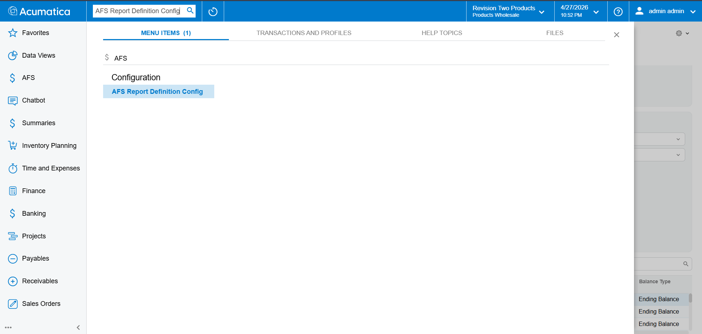

### Step 2 — Create a New Record

Click the **+** (Add) button. The **Definition Code** field shows `<NEW>` until saved.

### Step 3 — Fill the Header

Enter the four required header fields:

| Field                | Example             | Notes                                                                                                                                             |
| -------------------- | ------------------- | ------------------------------------------------------------------------------------------------------------------------------------------------- |
| **Definition Code**  | `DEMO-BS`           | Unique key, max 50 chars. This is the code the Financial Report / Presentation screen will select.                                                |
| **Prefix**           | `DB`                | Short alphanumeric tag, max 10 chars (`^[A-Za-z0-9]+$` — letters and digits only, no separators). Namespaces all placeholders emitted by this definition, e.g. `{{DB_TOTAL_ASSETS_CY}}`. **Must be unique across all definitions in the tenant.** |
| **Description**      | `Demo Balance Sheet`| Free-text label, max 255 chars. Appears in the selector dropdown on downstream screens.                                                           |
| **Report Type**      | `Balance Sheet`     | Metadata tag — see Step 4.                                                                                                                        |

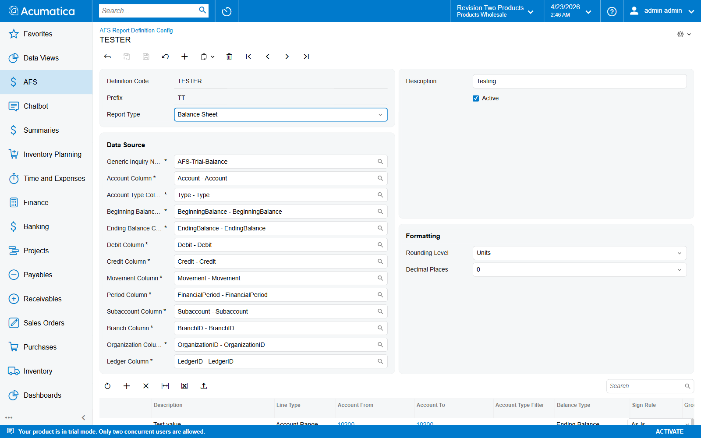

### Step 4 — Choose the Report Type

**Report Type** tags the definition so downstream screens can group it. It does not alter calculation — it is metadata only.

| Value | Label                |
| ----- | -------------------- |
| `BS`  | Balance Sheet (default) |
| `PL`  | Profit & Loss        |
| `CF`  | Cash Flow            |
| `CU`  | Custom               |

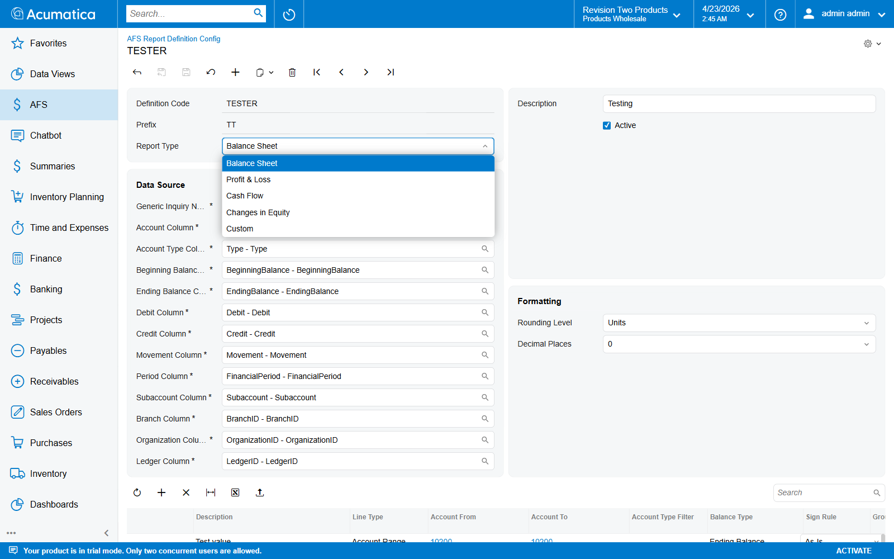

Also visible on the same header row:

- **Active** — uncheck to hide this definition from the selector on FR101000 / FR101003 without deleting it.

### Step 5 — Pick the Generic Inquiry

**Generic Inquiry Name** drives *where* the engine pulls GL balances from. Defaults to **`AFS-Trial-Balance`**. Use the selector (magnifier icon) to pick any published GI.

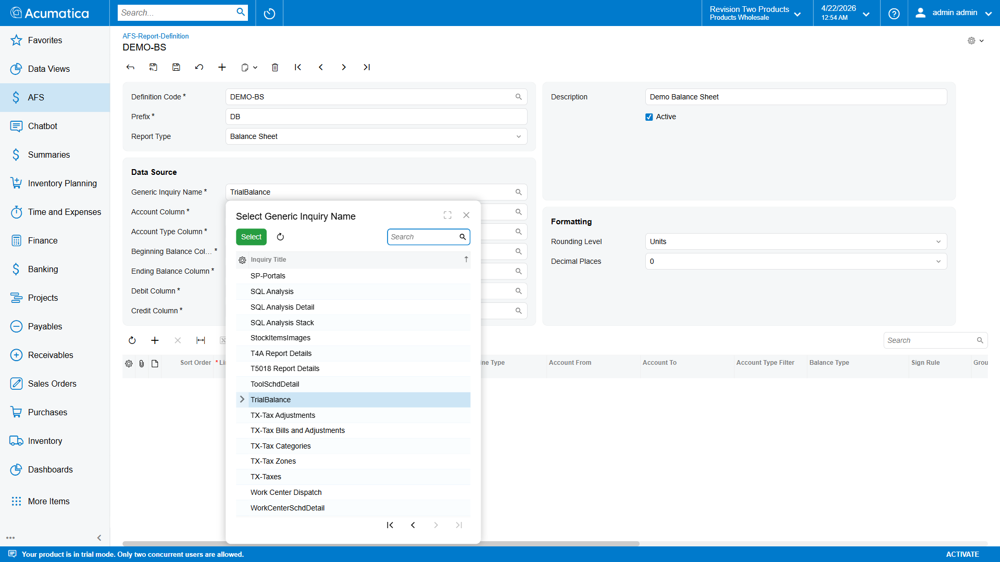

The selector lists all `GIDesign` records in the tenant. Any GI that returns rows keyed by account with balance figures can be used — the column mapping in Step 6 tells the engine which GI column carries each concept.

### Step 6 — Map the GI Columns (Data Source)

This section tells the engine *which column in the chosen GI* holds each balance concept, filter key, or period tag. Each field is a **GI-column selector** — it only shows columns that exist on the GI picked in Step 5. The defaults match Acumatica's stock **`AFS-Trial-Balance`** GI.

#### Balance columns

| Field                      | Default Column       | Purpose                                                                              |
| -------------------------- | -------------------- | ------------------------------------------------------------------------------------ |
| **Account Column**         | `Account`            | GL account code. Used for account-range filtering on `ACCOUNT` lines.                |
| **Account Type Column**    | `Type`               | Returns `A/L/E/I`. Drives automatic account-type sign normalization and the optional *Account Type Filter* on line items. |
| **Beginning Balance Column** | `BeginningBalance` | Opening balance at the start of the fiscal year. Read when `Balance Type = BEGINNING`.|
| **Ending Balance Column**  | `EndingBalance`      | Closing balance as at the selected period end. Read when `Balance Type = ENDING` *(default)*. |
| **Debit Column**           | `Debit`              | Fiscal-year-to-date debit sum. Read when `Balance Type = DEBIT`.                     |
| **Credit Column**          | `Credit`             | Fiscal-year-to-date credit sum. Read when `Balance Type = CREDIT`.                   |
| **Movement Column**        | `Movement`           | Listed in the OData `$select` clause for completeness. **Not consumed by the engine** — when `Balance Type = MOVEMENT` the engine derives the value as `Debit − Credit` from the columns mapped above. Safe to leave at the default. |

#### Period & filter columns

| Field                    | Default Column      | Purpose                                                                                  |
| ------------------------ | ------------------- | ---------------------------------------------------------------------------------------- |
| **Period Column**        | `FinancialPeriod`   | Period tag on each GI row (e.g. `04-2026`). The engine uses this to slice CY vs PY rows. |
| **Subaccount Column**    | `Subaccount`        | Column holding the Subaccount code. Referenced by the optional **Subaccount Filter** on each line item. |
| **Branch Column**        | `BranchID`          | Branch code column. Referenced by **Branch Filter**.                                     |
| **Organization Column**  | `OrganizationID`    | Organization code column. Referenced by **Organization Filter**.                         |
| **Ledger Column**        | `LedgerID`          | Ledger code column. Referenced by **Ledger Filter**.                                     |

> If you clone or customize the stock GI, rename these columns here to match the new field names. The 13 mapping fields default to the stock `AFS-Trial-Balance` column names — save is **not** blocked if you blank one out, but the engine will fall back to the default name (`Account`, `EndingBalance`, …) at fetch time. Set them explicitly when working against a renamed GI.


### Step 7 — Configure Formatting (Rounding)

Controls how numeric placeholders are formatted when they appear in the final Word / markdown output.

| Field                | Values                                | Notes                                                                            |
| -------------------- | ------------------------------------- | -------------------------------------------------------------------------------- |
| **Rounding Level**   | `UNITS` (default), `THOUS`, `MILL`    | Divides all numbers by 1 / 1,000 / 1,000,000 before rendering.                   |
| **Decimal Places**   | `0` (default), `1`, `2`               | Digits shown after the decimal point.                                            |

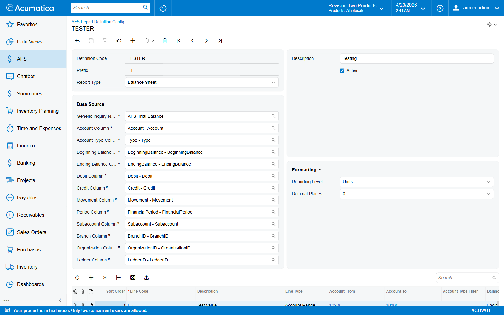

Example: With Rounding Level = `THOUS` and Decimal Places = `1`, a raw value of `1,234,567.89` renders as `1,234.6`.

**Save** the header (`Ctrl+S`) before adding line items.

## Line Items Grid

Each row in **Line Items** is a single placeholder that will appear in the generated report. The engine calculates one CY and one PY value per visible row. The grid columns are as follows.

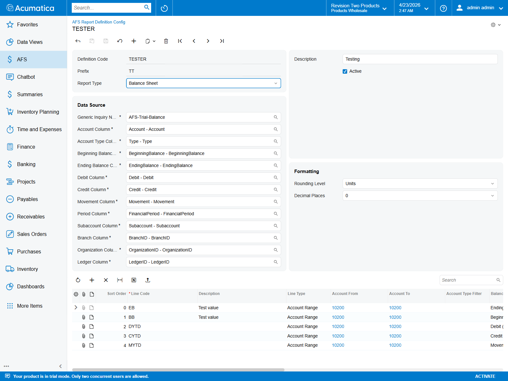

### Columns — overview

| Column                 | Required         | Description                                                                                                                                           |
| ---------------------- | ---------------- | ----------------------------------------------------------------------------------------------------------------------------------------------------- |
| **Sort Order**         | yes              | Integer controlling row order in the report. Lines are emitted in ascending `SortOrder`.                                                              |
| **Line Code**          | yes              | Unique token within this definition (≤100 chars). Forms the placeholder key, e.g. `CASH` → `{{DB_CASH_CY}}`, `{{DB_CASH_PY}}`.                        |
| **Description**        | yes if visible   | Human-readable label, shown in the generated markdown table.                                                                                          |
| **Line Type**          | yes              | Determines how the engine computes this line. See table below.                                                                                        |
| **Account From / To**  | Account lines    | Inclusive GL account range to sum. Example: `10000`…`10999`.                                                                                          |
| **Account Type Filter**| optional         | Restrict the range to a single GL account type.                                                                                                       |
| **Sign Rule**          | Account lines    | `ASIS` keeps the raw GL sign; `FLIP` multiplies by −1 for presentation (typical for Liability / Income).                                              |
| **Balance Type**       | Account lines    | Which GI balance column to read. Five options — all fiscal-year-to-date except the two point-in-time balances. See [Balance Type values](#balance-type-values). |
| **Group / Parent Line**| optional         | The subtotal `LineCode` this row rolls up into. Editable on `ACCOUNT`, `SUBTOTAL`, and `CALCULATED` lines (so subtotals can nest, and a calculated KPI can roll into a parent subtotal). Disabled on `HEADING`. Example: child rows CASH, AR, INV all set Parent = `CURRENT_ASSETS`. |
| **Formula**            | Calculated lines | Arithmetic expression over other `LineCode`s using `+ − × ÷` and parentheses. Example: `REVENUE - COGS`. References may also cross definitions using the fully qualified `<Prefix>_<LineCode>` form — see [Cross-Definition Formulas](#cross-definition-formulas). |
| **Visible in Report**  | yes              | Default true. Uncheck to keep the value internal (usable in formulas / subtotals) without emitting a placeholder.                                     |
| **Subaccount Filter**  | optional         | Exact-match subaccount, e.g. `000-000`. Blank = all subaccounts.                                                                                      |
| **Branch Filter**      | optional         | `BranchCD` selector. Blank = all branches.                                                                                                            |
| **Organization Filter**| optional         | `OrganizationCD` selector. Blank = all organizations.                                                                                                 |
| **Ledger Filter**      | optional         | `LedgerCD` selector. Blank = all ledgers.                                                                                                             |

> All filter columns only apply when **Line Type** = `ACCOUNT`. They are ignored by Subtotal / Calculated / Heading lines.

### Line Type values

| Code         | Label          | Behaviour                                                                                                                        |
| ------------ | -------------- | -------------------------------------------------------------------------------------------------------------------------------- |
| `ACCOUNT`    | Account Range  | Sum all GI rows where the account code falls inside `AccountFrom`…`AccountTo` (inclusive), apply Sign Rule, use Balance Type.    |
| `SUBTOTAL`   | Subtotal       | Sum all lines whose `ParentLineCode` equals this row's `LineCode`.                                                               |
| `CALCULATED` | Calculated     | Evaluate `Formula` at runtime, referencing other `LineCode`s. Supports `+ − × ÷` and parentheses.                                |
| `HEADING`    | Heading        | Display-only. No value is computed; used to emit a section header into the report.                                               |

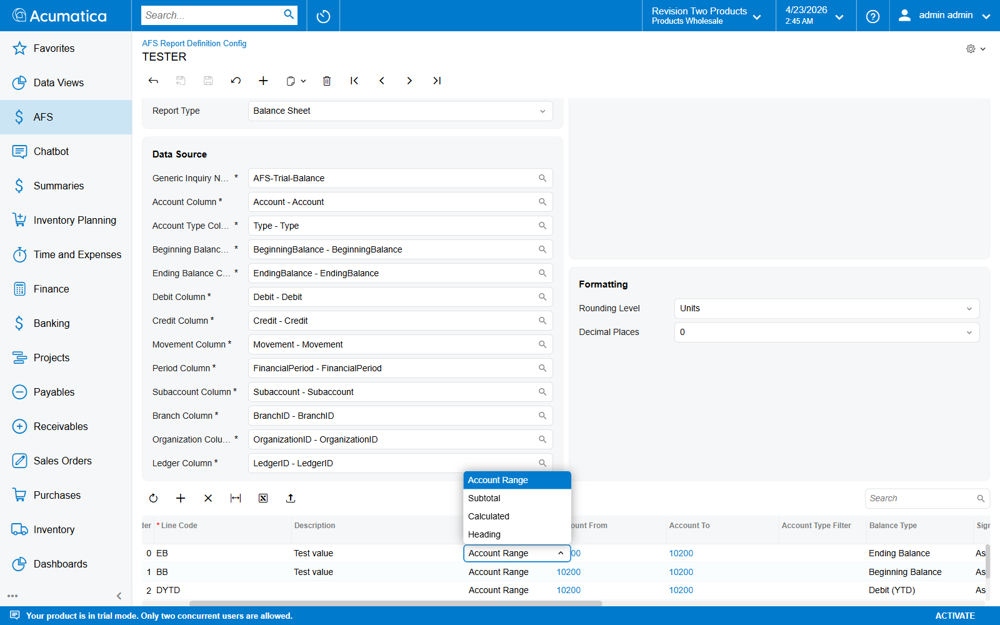

### Balance Type values

Applies only to `ACCOUNT` lines. Determines which column from the GI mapping is read. All movement figures (`DEBIT`, `CREDIT`, `MOVEMENT`) are **fiscal-year-to-date** — they accumulate from the FY start through the selected period end. There is no single-month balance type.

| Code        | Label              | Column used                    | Typical use                                                    |
| ----------- | ------------------ | ------------------------------ | -------------------------------------------------------------- |
| `ENDING`    | Ending Balance *(default)* | **Ending Balance Column**    | Balance Sheet lines (point-in-time snapshot at period end).    |
| `BEGINNING` | Beginning Balance  | **Beginning Balance Column**   | Opening-balance columns, capital roll-forwards.                |
| `DEBIT`     | Debit (YTD)        | **Debit Column**               | Gross debit activity FY-to-date.                               |
| `CREDIT`    | Credit (YTD)       | **Credit Column**              | Gross credit activity FY-to-date.                              |
| `MOVEMENT`  | Movement (YTD)     | **Debit Column − Credit Column** *(derived; the Movement Column mapping is fetched but not consumed)* | P&L lines — revenue, expenses, net movement FY-to-date. |

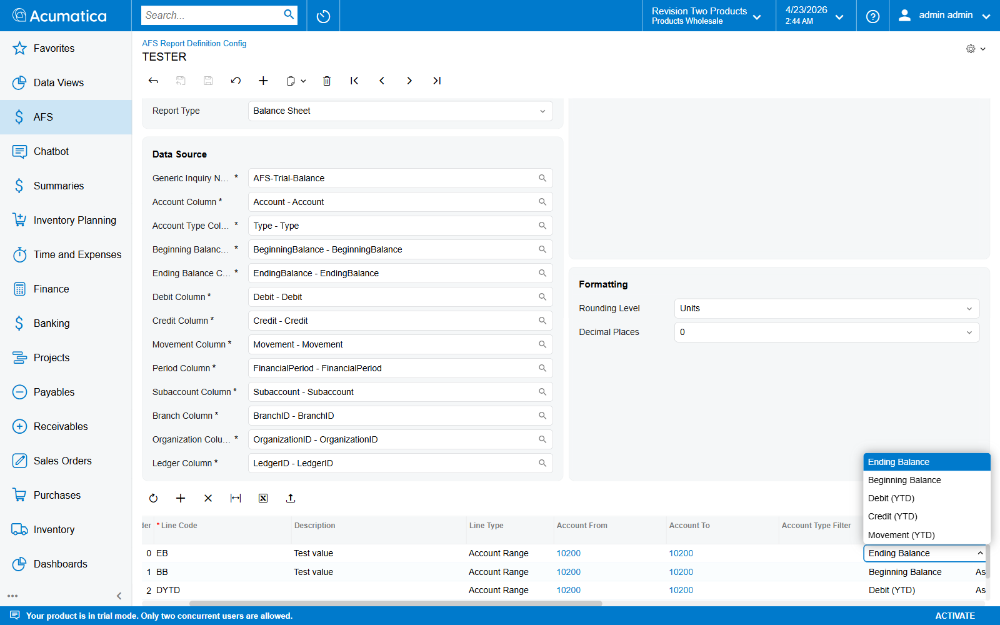

> **Why no single-period (month-only) balance type?** The stock AFS workflow reports fiscal-year performance (CY vs prior-year CY). If you need a month-only view, filter the underlying GI by period, or compute the delta in the template (`{{BS_X_CY}} - {{BS_X_PY}}`).

### Sign Rule values

Sign handling is **two-stage** inside the engine:

1. **Automatic account-type normalization** (`ApplyAccountTypeSign`). When the GI row has an **Account Type** (`A`/`L`/`E`/`I`) in the mapped type column, the engine multiplies the raw GL value by `−1` for credit-normal types (`L`, `I`). Asset/Expense values pass through unchanged. This turns credit-normal GL values (Acumatica stores them negative) into the positive figures expected on a financial statement.
2. **User-controlled Sign Rule** (this column). Applied **after** the automatic normalization.

| Code   | Label       | Math               | When to use                                                                                                                                                     |
| ------ | ----------- | ------------------ | --------------------------------------------------------------------------------------------------------------------------------------------------------------- |
| `ASIS` | As-Is       | no extra multiply  | **Default — correct for nearly every line.** The engine has already normalized credit-normal types for you.                                                    |
| `FLIP` | Flip Sign   | `× −1`             | Use only when (a) the GI's type column is blank/unmapped so automatic normalization did not fire, or (b) you specifically want the opposite of the normal sign. |

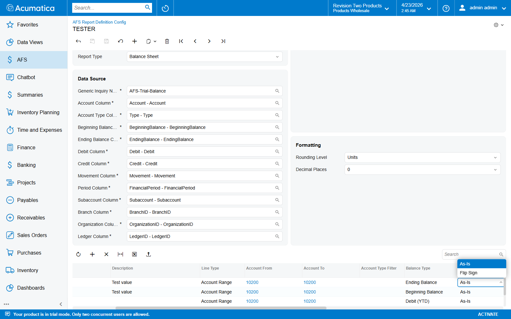

> **Gotcha.** Setting `FLIP` on a Liability/Income line when the type column *is* populated will double-flip (`−1 × −1 = +1` relative to raw, i.e. a negative value on the statement). If liabilities show up negative after generation, check this column first.

### Account Type Filter values

Optional hard-filter on the GL account type. Uses the column mapped in **Account Type Column**.

| Code   | Label         |
| ------ | ------------- |
| *(blank)* | All Types  |
| `A`    | Asset         |
| `L`    | Liability     |
| `E`    | Expense       |
| `I`    | Income        |

Leave blank unless you want to clamp a range that spans multiple account types.

## Worked Examples

Below are the minimum column values for each `LineType`.

### ACCOUNT line — sum a range

```
Sort Order   : 10
Line Code    : CASH
Description  : Cash and Cash Equivalents
Line Type    : Account Range
Account From : 10100
Account To   : 10199
Sign Rule    : As-Is
Balance Type : Ending Balance
Visible      : ✓
```

### SUBTOTAL line — sum child lines

```
Sort Order           : 100
Line Code            : CURRENT_ASSETS
Description          : Total Current Assets
Line Type            : Subtotal
Group / Parent Line  : (leave blank — this IS the parent)
Visible              : ✓
```

…and on the rows above, set **Group / Parent Line = `CURRENT_ASSETS`** for each child you want rolled up.

### CALCULATED line — formula over other codes

```
Sort Order  : 200
Line Code   : NET_INCOME
Description : Net Income
Line Type   : Calculated
Formula     : REVENUE - COGS - OPEX - TAX
Visible     : ✓
```

> Unqualified tokens (`REVENUE`, `COGS`, …) resolve **within this definition**. Prefix the token (`PL_REVENUE`, `BS_CASH`) to pull from another definition linked on the same Financial Report — see [Cross-Definition Formulas](#cross-definition-formulas).

### HEADING line — section divider

```
Sort Order  : 5
Line Code   : HDR_ASSETS
Description : ASSETS
Line Type   : Heading
Visible     : ✓   (unchecked headings are discarded silently)
```

## Placeholder Key Format

Each visible line emits **two** placeholders into the report:

```
{{<Prefix>_<LineCode>_CY}}   → current year, fiscal-year-to-date through selected period
{{<Prefix>_<LineCode>_PY}}   → previous year, same fiscal-year-to-date window
```

Example — with **Prefix = DB** and **Line Code = CASH**:

```
{{DB_CASH_CY}}
{{DB_CASH_PY}}
```

See [Appendix A — Placeholder Reference](#appendix-a-placeholder-reference) for the full placeholder catalogue.

## End-to-End Example — Mini Balance Sheet

This example walks through a complete **Balance Sheet** definition: the raw GL data that lands in the GI, the Line Items grid rows, and the placeholder values that come out the other end.

### 1 — Raw GI data (input)

Assume the `AFS-Trial-Balance` GI returns the following rows as at **end of April 2026** (Branch = `MAIN`, Ledger = `ACTUAL`):

| Account | Type | BeginningBalance | EndingBalance | Debit (YTD) | Credit (YTD) | Movement (YTD) |
| ------- | ---- | ---------------- | ------------- | ----------- | ------------ | -------------- |
| 10100   | A    | 40,000.00        | 52,500.00     | 18,000      | 5,500        | 12,500         |
| 10200   | A    | 80,000.00        | 96,000.00     | 30,000      | 14,000       | 16,000         |
| 10300   | A    | 25,000.00        | 31,500.00     | 10,000      | 3,500        | 6,500          |
| 20100   | L    | −20,000.00       | −28,000.00    | 2,000       | 10,000       | −8,000         |
| 20200   | L    | −50,000.00       | −60,000.00    | 5,000       | 15,000       | −10,000        |

> Liabilities carry negative signs at the GL level (credit-normal). The engine's automatic **account-type normalization** (see [Sign Rule values](#sign-rule-values)) converts these to positive for presentation before Sign Rule is applied. All lines below use `Sign Rule = ASIS` — the engine has already done the sign work.

### 2 — Definition header

```
Definition Code : DEMO-BS
Prefix          : DB
Description     : Demo Balance Sheet
Report Type     : Balance Sheet
Active          : ✓
Generic Inquiry : AFS-Trial-Balance
Account Column      : Account
Account Type Col    : Type
Beginning Bal Col   : BeginningBalance
Ending Bal Col      : EndingBalance
Debit Column        : Debit
Credit Column       : Credit
Movement Column     : Movement
Period Column       : FinancialPeriod
Subaccount Column   : Subaccount
Branch Column       : BranchID
Organization Column : OrganizationID
Ledger Column       : LedgerID
Rounding Level      : UNITS
Decimal Places      : 0
```

### 3 — Line Items grid

| Sort | Line Code         | Description               | Line Type  | Acct From | Acct To | Sign Rule | Balance Type | Parent          | Formula                                  | Visible |
| ---- | ----------------- | ------------------------- | ---------- | --------- | ------- | --------- | ------------ | --------------- | ---------------------------------------- | ------- |
| 5    | HDR_ASSETS        | ASSETS                    | Heading    |           |         |           |              |                 |                                          | ✓       |
| 10   | CASH              | Cash and Cash Equivalents | Account    | 10100     | 10100   | ASIS      | ENDING       | CURRENT_ASSETS  |                                          | ✓       |
| 20   | AR                | Accounts Receivable       | Account    | 10200     | 10200   | ASIS      | ENDING       | CURRENT_ASSETS  |                                          | ✓       |
| 30   | INVENTORY         | Inventory                 | Account    | 10300     | 10300   | ASIS      | ENDING       | CURRENT_ASSETS  |                                          | ✓       |
| 100  | CURRENT_ASSETS    | Total Current Assets      | Subtotal   |           |         |           |              |                 |                                          | ✓       |
| 105  | HDR_LIAB          | LIABILITIES               | Heading    |           |         |           |              |                 |                                          | ✓       |
| 110  | AP                | Accounts Payable          | Account    | 20100     | 20100   | ASIS      | ENDING       | TOTAL_LIAB      |                                          | ✓       |
| 120  | LOAN              | Long-Term Loan            | Account    | 20200     | 20200   | ASIS      | ENDING       | TOTAL_LIAB      |                                          | ✓       |
| 200  | TOTAL_LIAB        | Total Liabilities         | Subtotal   |           |         |           |              |                 |                                          | ✓       |
| 300  | NET_ASSETS        | Net Assets (A − L)        | Calculated |           |         |           |              |                 | `CURRENT_ASSETS - TOTAL_LIAB`            | ✓       |

### 4 — How each row computes

| Line Code         | Computation (auto type-sign × ASIS)                                                | Value (CY)  |
| ----------------- | ---------------------------------------------------------------------------------- | ----------- |
| `CASH`            | `EndingBalance[10100]` × type-sign(A)=+1 × ASIS = `52,500 × +1 × +1`               | `52,500`    |
| `AR`              | `EndingBalance[10200]` × type-sign(A)=+1 × ASIS                                    | `96,000`    |
| `INVENTORY`       | `EndingBalance[10300]` × type-sign(A)=+1 × ASIS                                    | `31,500`    |
| `CURRENT_ASSETS`  | Subtotal of children where `Parent = CURRENT_ASSETS`                               | `180,000`   |
| `AP`              | `EndingBalance[20100]` × type-sign(L)=−1 × ASIS = `−28,000 × −1 × +1`              | `28,000`    |
| `LOAN`            | `EndingBalance[20200]` × type-sign(L)=−1 × ASIS = `−60,000 × −1 × +1`              | `60,000`    |
| `TOTAL_LIAB`      | Subtotal of children where `Parent = TOTAL_LIAB`                                   | `88,000`    |
| `NET_ASSETS`      | `CURRENT_ASSETS − TOTAL_LIAB`                                                      | `92,000`    |

`NET_ASSETS` is the residual after liabilities — useful as a tie-out figure for downstream placeholder mappings.

### 5 — Placeholders emitted

With **Prefix = `DB`**, the engine writes the following key/value pairs into the placeholder dictionary:

| Placeholder                | Value (April-2026 CY / FY-to-date) |
| -------------------------- | ---------------------------------- |
| `{{DB_CASH_CY}}`           | `52,500`                           |
| `{{DB_AR_CY}}`             | `96,000`                           |
| `{{DB_INVENTORY_CY}}`      | `31,500`                           |
| `{{DB_CURRENT_ASSETS_CY}}` | `180,000`                          |
| `{{DB_AP_CY}}`             | `28,000`                           |
| `{{DB_LOAN_CY}}`           | `60,000`                           |
| `{{DB_TOTAL_LIAB_CY}}`     | `88,000`                           |
| `{{DB_NET_ASSETS_CY}}`     | `92,000`                           |

Each key is **also** emitted with a `_PY` suffix — same formula evaluated against the prior-year GI rows (April 2025, same FY-to-date window).

> Heading rows (`HDR_ASSETS`, `HDR_LIAB`) do **not** emit placeholders — they only print the description as a section header in the markdown.

## Cross-Definition Formulas

A `CALCULATED` line is not restricted to Line Codes declared inside its own definition. When two or more definitions are **linked on the same report record** (child grid on [Financial Report Generation](#chapter-5-financial-report-generation-fr101000)), the engine concatenates all of their placeholder dictionaries into one namespace before evaluating formulas. That means a line in one definition can reference a line in another simply by qualifying the token with the other definition's **Prefix**.

### Reference syntax

| Form                        | Resolved against                                              | Example                |
| --------------------------- | ------------------------------------------------------------- | ---------------------- |
| `LINE_CODE` *(unqualified)* | The current definition only.                                  | `REVENUE - COGS`       |
| `PREFIX_LINE_CODE`          | The definition whose `Prefix` matches the leading token.      | `PL_NI + BS_RECV`      |

The separator is a single underscore (the same one used in placeholder keys — `{{PL_NI_CY}}` becomes `PL_NI` inside a formula). Prefixes and Line Codes are matched case-insensitively on the parsed token.

> **Rule of thumb.** If you would spell the placeholder `{{PL_NI_CY}}` in the Word template, you write `PL_NI` in the formula. Drop the `{{ }}` and the period suffix.

### Automatic CY / PY evaluation

Each CALCULATED line's formula is evaluated **twice** — once against the Current-Year dictionary, once against the Previous-Year dictionary. Same formula, two different input dictionaries. That is how the two placeholder forms are produced:

| Placeholder             | Which dictionary is used |
| ----------------------- | ------------------------ |
| `{{PREFIX_LINE_CY}}`    | `_cyGlobal`              |
| `{{PREFIX_LINE_PY}}`    | `_pyGlobal`              |

Consequence: **you cannot mix periods inside a single formula.** A formula like `DB_CASH - DB_CASH_PY` does not work — `DB_CASH_PY` is not a valid global key and resolves to `0`.

### Requirements & caveats

1. **All referenced definitions must be linked on the same Financial Report record.** If a formula token cannot be resolved, the engine **logs a warning via `PXTrace`** and returns `0` — the run still completes, but the affected placeholders will be wrong.
2. **Unique prefixes.** Two definitions with the same Prefix cannot be linked to the same record. The save-time uniqueness check on FR101002 already prevents two definitions sharing a Prefix tenant-wide.
3. **No circular references.** The engine runs topological sort (Kahn's algorithm) at the start of evaluation and raises a `CircularDependencyDetected` error.
4. **Sort Order across definitions.** Sort Order is a pure presentation field — it never drives evaluation order.
5. **Rounding is applied only at the final placeholder step.** The dictionaries store **raw `decimal` values**; rounding only affects what the template prints, never what downstream formulas consume.

## Save and Validate

Save (`Ctrl+S`) to persist the definition and all line items. The graph runs the following validations in `RowPersisting`:

**Header — `FLRTReportDefinition`**

| Check                                         | Error message                              |
| --------------------------------------------- | ------------------------------------------ |
| Definition Code required.                     | `DefinitionCodeRequired`                   |
| Definition Code unique across all definitions.| `DefinitionCodeMustBeUnique`               |
| Prefix required.                              | `DefinitionPrefixRequired`                 |
| Prefix matches `^[A-Za-z0-9]+$`.              | `DefinitionPrefixMustBeAlphanumeric`       |
| Prefix unique across all definitions.         | `DefinitionPrefixMustBeUnique`             |

**Line items — `FLRTReportLineItem`**

| Check                                              | Error message                 |
| -------------------------------------------------- | ----------------------------- |
| Line Code required.                                | `LineCodeRequired`            |
| Line Code unique within the definition.            | `LineCodeMustBeUnique`        |
| `ACCOUNT` lines — Account From required.           | `AccountFromRequired`         |
| `ACCOUNT` lines — Account To required.             | `AccountToRequired`           |
| `CALCULATED` lines — Formula required.             | `FormulaRequired`             |

\newpage

# Chapter 4: MBR Definition Setup (FR101004)

This chapter describes how to create an **MBR Definition** (Monthly Board Report data source). An MBR Definition tells the AFS Financial Report engine how to pull values from **any Acumatica Generic Inquiry** — not just the GL Trial Balance — and exposes the results as named placeholders that the [MBR Report Generation](#chapter-6-mbr-report-generation-fr101003) screen and Word templates can consume.

Where [Chapter 3 — Report Definition Setup](#chapter-3-report-definition-setup-fr101002) is hard-wired to GL balance concepts (Account / EndingBalance / Debit / Credit), an MBR Definition is fully generic: you map any GI column to any output placeholder, with your own filters, aggregation, and formatting.

> **Screen ID:** FR101004
> **Screen Title:** AFS MBR Config
> **Menu path:** *AFS → Configuration → AFS MBR Config*
> **MBR =** Monthly Board Report — the executive-summary presentations that consume these data sources live on FR101003 (*AFS Monthly Board Report*).

## Prerequisites

- Tenant credentials saved in [Chapter 2 — Tenant Credentials Setup (FR101001)](#chapter-2-tenant-credentials-fr101001). The Detect Columns and Test Fetch actions both call OData using these credentials.
- A **published Generic Inquiry** that returns the data you want to surface (e.g. `PO-PurchaseOrder`, `AR-CustomerSummary`, a custom GI). The GI must be reachable via OData under the same tenant.
- A **unique Prefix** (2–10 alphanumeric chars) for namespacing this data source's placeholders. Must be unique across all MBR Definitions.

## Concepts

| Term | What it is |
|---|---|
| **Data Source** | One row in this screen — a header configuring the GI plus the filter columns. |
| **Column** | A child row defining one output placeholder. Four `LineType` flavours: `VALUE` (read + aggregate from GI), `MULTIROW` (expand top-N rows), `CALCULATED` (formula over other columns), `HEADING` (label only). |
| **Prefix** | Short alphanumeric tag prepended to every placeholder this data source emits — e.g. `PO_TOTAL_ORDERS`, `HR_HEADCOUNT`. |
| **Placeholder** | The token that lands in the merge dictionary: `` for VALUE / CALCULATED rows, `` for MULTIROW rows. |

## Steps

The walkthrough below builds a fresh data source from scratch — code `DEMODOCS`, prefix `DD`, GI `PO-PurchaseOrder`. Pick whatever values fit your scenario; the flow is the same.

### Step 1 — Navigate to AFS MBR Config

In the top search bar type **MBR** and select **AFS MBR Config** under *AFS → Configuration*. The second search hit, *AFS Monthly Board Report*, is the FR101003 presentation-generation screen — that's where you'll consume the placeholders later.

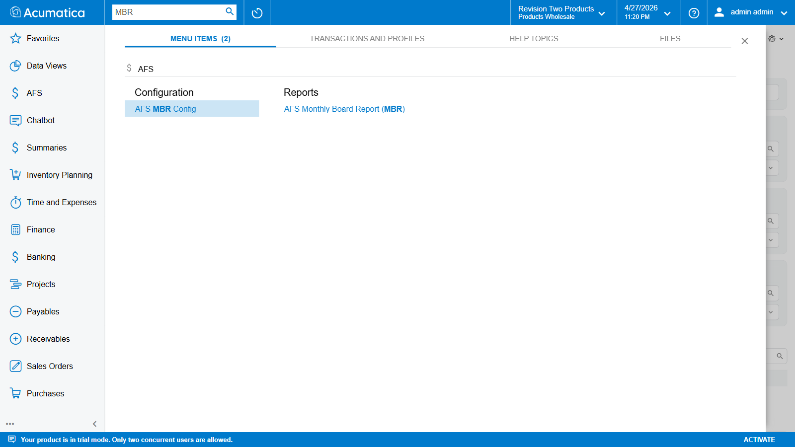

The screen opens in **New Record** mode with an empty header and an empty Columns grid. Two screen-specific buttons sit above the grid:

- **Detect Columns** — disabled until **Generic Inquiry** is set. Calls OData against the chosen GI, captures the runtime column list, and stores it on the record so the column selectors below show real OData property names.
- **Test Fetch** — runs the full data source against live data using a year / month / branch / org / ledger filter you provide in a dialog, prints every resulting placeholder + value to the trace log and an in-screen dialog. Use it to sanity-check the configuration before wiring it into a presentation.

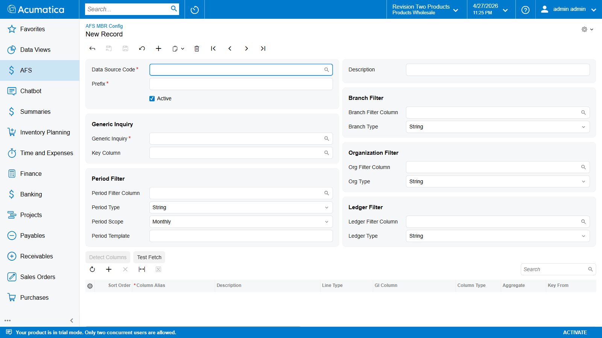

### Step 2 — Fill the Identity & Description

Type values into the four identity-group fields:

| Field             | Required | Notes                                                                                  |
| ----------------- | -------- | -------------------------------------------------------------------------------------- |
| **Data Source Code** | yes (key) | Unique identifier, max 50 chars. Locked after first save. |
| **Prefix**           | yes      | 2–10 alphanumeric chars. Namespaces every placeholder this row emits. Must be globally unique across **all** MBR Definitions and Report Definitions. |
| **Active**           | default ✓ | Uncheck to hide the data source from downstream screens without deleting it. |
| **Description**      | no       | Free-text label, max 255 chars. Shown in the selector. |

Once filled the screen breadcrumb updates to show the new code (`DEMODOCS`):

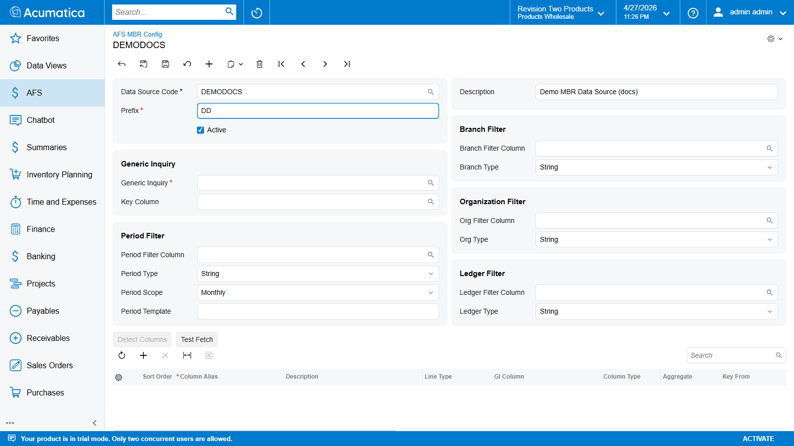

### Step 3 — Pick the Generic Inquiry

Click the magnifier next to **Generic Inquiry** (or focus the field and press F3). The selector lists every published GI in the tenant; type into the Search box at the top to narrow the list.

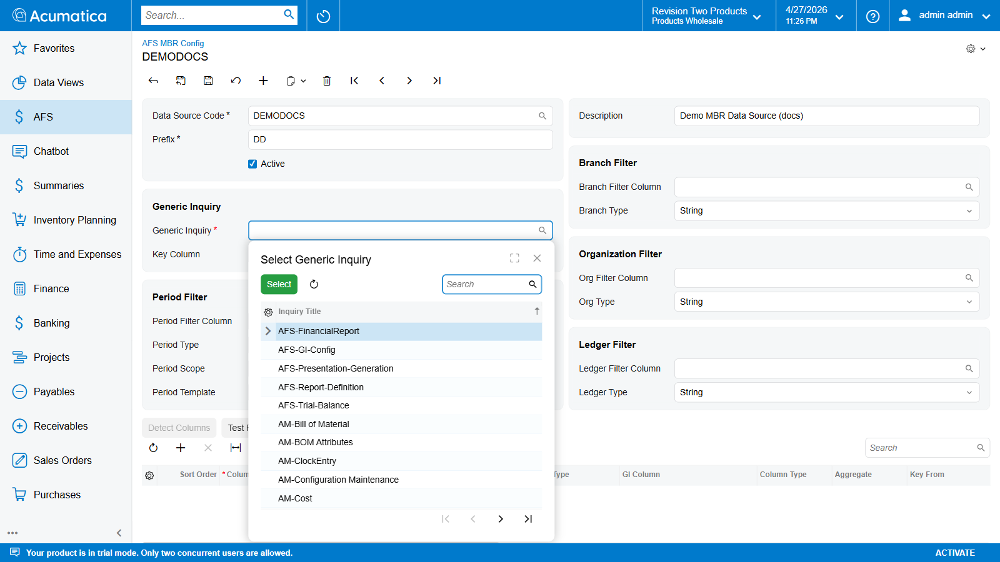

Double-click the GI you want — for the example we pick `PO-PurchaseOrder`. The header now shows it bound to that GI, and **Detect Columns** turns on:

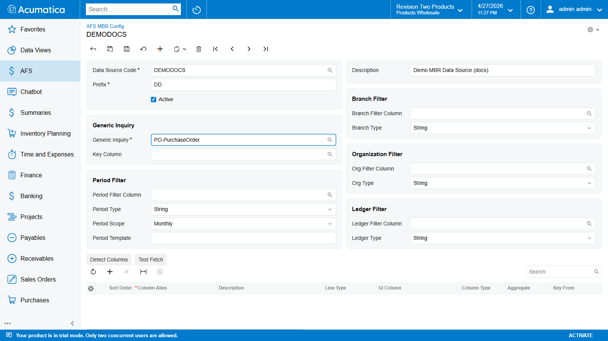

> **Key Column** is optional and identifies which GI column is the row "key" (analogue of `Account` in Trial Balance). It only matters if column rows below set `Key From / Key To` ranges.

### Step 4 — Detect Columns

Click **Detect Columns**. The graph opens an OData connection to the chosen GI, captures the runtime column list, stores it on the hidden `DetectedColumns` field, saves the record, and shows the result in a dialog:

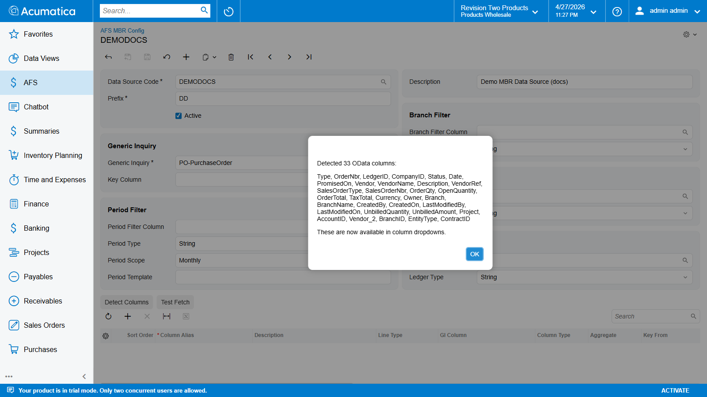

After clicking OK, every "GI Column" / "Filter Column" selector below now shows the **real OData property names** captured from the live GI.

> **Note:** the action also persists the record — `Data Source Code` and `Prefix` are key-locked from this point on. If you need to change either, delete the record and recreate it.

### Step 5 — Configure the Period Filter

The Period Filter group tells the engine **which GI column** carries the period and **how to format the OData predicate** when the presentation fires. All four fields are optional — leave **Period Filter Column** blank to skip period filtering entirely.

| Field                  | Notes                                                                                 |
| ---------------------- | ------------------------------------------------------------------------------------- |
| **Period Filter Column** | The GI column the engine adds to the OData `$filter` clause. Selector lists the columns Detect Columns captured. |
| **Period Type**          | How to format the OData predicate value. `String` / `Integer` / `Decimal` / `Date` / `Boolean`. |
| **Period Scope**         | How wide a window the period covers. `Exact` = `eq <value>` (Trial Balance-style strings like `"012025"`); `Monthly` = `ge first-of-month and lt first-of-next-month` (Date columns); `Yearly` = whole-year range. |
| **Period Template**      | Builds the value from the presentation header. Tokens: `{YEAR}`, `{MONTH}`. Examples: `{MONTH}{YEAR}` → `"012025"`, `{YEAR}-{MONTH}` → `"2025-01"`, `{YEAR}` → `"2025"`. For a Date column with `Monthly` scope the engine ignores the template and uses the period boundaries. |

For a `PO-PurchaseOrder` example the **Date** column with **Period Type = Date** and **Period Scope = Monthly** is the right shape:

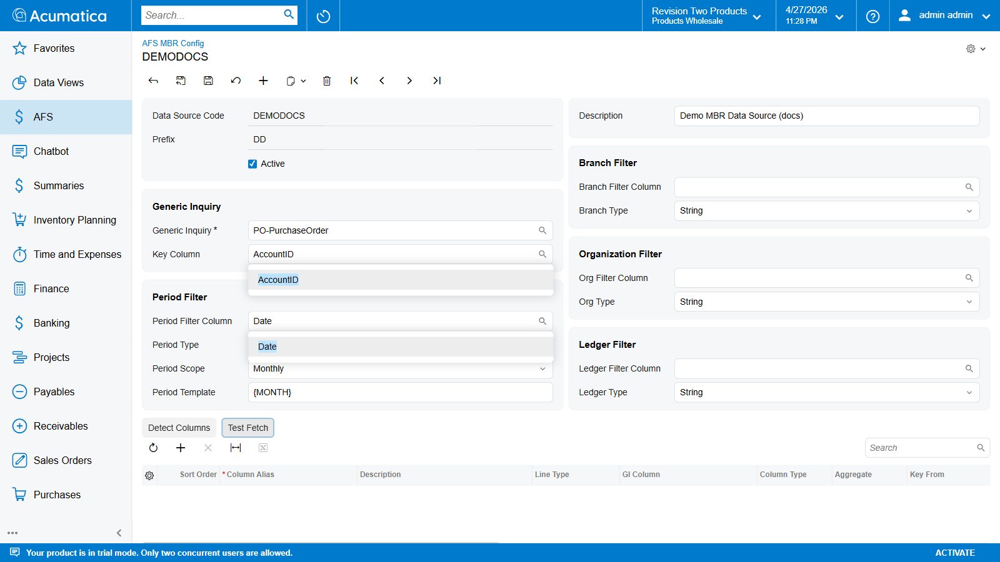

### Step 5b — Configure the Dimension Filters (Branch / Organization / Ledger)

Three companion groups on the right side of the header — **Branch Filter**, **Organization Filter**, **Ledger Filter** — narrow the GI rows by dimension. They are independent of the Period Filter and of each other.

#### What each field does

Each group has the same two-field shape:

| Field            | Purpose |
| ---------------- | ------- |
| **\<X> Filter Column** | The GI column the engine adds to the OData `$filter` clause for this dimension. Blank = no `$filter` predicate is added for this dimension. |
| **\<X> Type**          | How to format the predicate value when the engine substitutes the user-supplied value. `String` (wraps in single quotes — `eq 'HQ'`), `Integer` / `Decimal` (no quotes — `eq 2`), `Date` (ISO literal — `eq 2026-04-01T00:00:00`), `Boolean` (`true`/`false`). Pick the type that matches the OData property's actual type — wrong type produces a 400 from OData. |

#### Where the run-time values come from

The Filter Column and Type are *configuration only* — they declare the schema. The actual value to filter on is supplied at run time:

| Caller | Source |
| ------ | ------ |
| **Test Fetch** dialog (this screen) | The **Branch** / **Organization** / **Ledger** text boxes you fill in the dialog. |
| **Generate Presentation** on FR101003 | The presentation header's **Branch** / **Organization** / **Ledger** fields. |

Whichever dimension fields the caller leaves blank become **inactive** for that run — the engine simply omits the predicate.

#### How the predicates combine

Every active filter is AND-combined into the single `$filter` clause sent to the GI:

```
($filter = <PeriodPredicate>
       and <BranchPredicate>
       and <OrgPredicate>
       and <LedgerPredicate>
       and <Per-row Key Range from each Column row>
       and <Per-row Row Filter from each Column row>)
```

Worked example — Test Fetch supplies *Branch = `MAIN`*, *Organization = `CENSOF`*, *Ledger = `2`*; the column row also sets `Status eq 'Closed'` as its Row Filter:

```odata
$filter=Date ge 2026-04-01T00:00:00 and Date lt 2026-05-01T00:00:00
       and BranchID eq 'MAIN'
       and OrganizationID eq 'CENSOF'
       and LedgerID eq 2
       and Status eq 'Closed'
```

> **Type-mismatch trap.** Setting **Branch Type = Integer** but pointing **Branch Filter Column** at a string column produces an OData 400 error at fetch time, not a save-time validation error. If Test Fetch fails with `Bad Request — Invalid filter expression`, the wrong **Type** dropdown is the first thing to check.

### Step 6 — Add Column Rows

Each column row in the grid produces one output placeholder (or a set of placeholders for `MULTIROW` lines). Click **+** on the grid toolbar to add a row. The new row appears with default values: `Sort Order = 0`, `Line Type = Value (from GI)`, `Column Type = Decimal`, `Aggregate = Sum`, `Visible = ✓`.

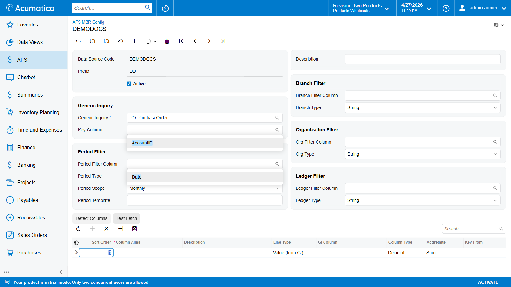

The grid has 17 columns. Their relevance depends on `LineType` — fields that don't apply to the current type are auto-disabled by the graph.

#### Common columns

| Column            | Required | Notes                                                                                |
| ----------------- | -------- | ------------------------------------------------------------------------------------ |
| **Sort Order**       | default 0 | Display order in the grid and in the markdown preview. Does **not** drive evaluation order — that uses topological sort. |
| **Column Alias**     | yes      | Unique within the data source. Allowed chars: letters, digits, underscore. Forms the placeholder key. |
| **Description**     | optional | Human-readable label. Shown as the row label in the markdown preview. |
| **Line Type**       | yes      | One of four — see table below. |
| **Visible**         | default ✓ | Uncheck to **calculate but not emit**. Useful for intermediate VALUE rows that only exist as inputs to a CALCULATED row. Disabled (and forced false) on `HEADING` rows. |
| **Format String**   | optional | Standard .NET format string applied at the final write step. See Format String reference below. |

#### Line Type values

Click the **Line Type** cell to open the dropdown:

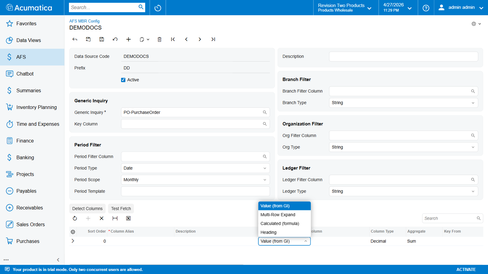

| Code         | Label                  | What it does |
| ------------ | ---------------------- | --- |
| `VALUE`      | Value (from GI)        | Read **GI Column**, aggregate matching rows with **Aggregate**. Single placeholder. |
| `MULTIROW`   | Multi-Row Expand       | Sort rows by **Order By Column**, take the top **Row Limit**, expand each row into placeholders keyed ``. |
| `CALCULATED` | Calculated (formula)   | Evaluate **Formula** at run time — arithmetic over other Column Aliases (`+ - * /`, parentheses). |
| `HEADING`    | Heading                | Label only. Emits no placeholder; sets Visible = false; disables every value-related field. |

#### VALUE-line columns

Editable when `LineType = VALUE`:

| Column          | Notes |
| --------------- | --- |
| **GI Column**     | The OData property to read. After Detect Columns runs, the dropdown shows the real GI columns. |
| **Column Type**   | How to parse the JSON value. `Decimal` / `Integer` / `Boolean` / `Date` / `String`. |
| **Aggregate**     | How to combine multiple matching rows — see Aggregate table below. |
| **Key From / To** | Inclusive range over the parent's `Key Column`. |
| **Row Filter (OData)** | Free-text OData predicate AND-combined with header filters. |

Click the **Aggregate** cell — 6 functions:

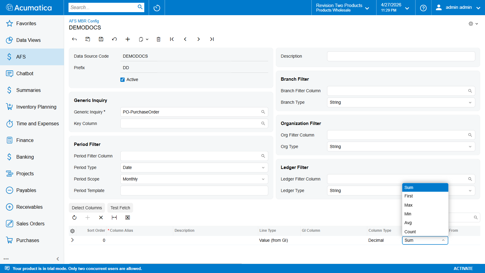

| Code  | Works on                              | Returns                                |
| ----- | ------------------------------------- | -------------------------------------- |
| `SUM`   | Decimal / Integer / Boolean (counts trues) | Total of values across matching rows. Empty result set → `0`. |
| `FIRST` | any                                   | First matching row's value. |
| `MAX`   | Decimal / Integer / Date              | Largest value. |
| `MIN`   | Decimal / Integer / Date              | Smallest value. |
| `AVG`   | Decimal / Integer                     | Arithmetic mean. |
| `COUNT` | any                                   | Number of matching rows. The column value is **ignored**. |

##### Row Filter (OData) — common patterns

| Goal | Row Filter |
| ---- | ---------- |
| Only closed orders | `Status eq 'Closed'` |
| Open orders above $1,000 | `Status eq 'Open' and OrderTotal gt 1000` |
| Multiple statuses | `Status eq 'Open' or Status eq 'Pending'` |
| Vendor name contains "Acme" | `contains(VendorName,'Acme')` |
| Created since a date | `CreatedOn ge 2025-01-01T00:00:00` |
| Field is null | `Description eq null` |
| Boolean true | `IsActive eq true` |

**Operators supported:** `eq`, `ne`, `lt`, `le`, `gt`, `ge`, `and`, `or`, `not`, plus `contains` / `startswith` / `endswith` / `tolower` / `toupper`.

**Quoting rules:**
- String literals: single quotes — `'Closed'`. Embed a single-quote by doubling it (`'O''Brien'`).
- Numeric literals: bare — `1000`, `4.5`.
- Date literals: ISO format with no quotes — `2025-01-01T00:00:00`.
- Boolean literals: `true` / `false` (lowercase, no quotes).
- Column names: bare (no quotes around the property name).

#### MULTIROW-line columns

Editable when `LineType = MULTIROW`. **Key From / To** and **Row Filter** also apply.

| Column                       | Notes |
| ---------------------------- | --- |
| **Order By Column**            | GI column to sort rows by before slicing. Required for MULTIROW. |
| **Sort Direction**             | `Descending` (default) or `Ascending`. |
| **Row Limit**                  | How many top rows to expand. Default 10. Keep ≤ 50 for templates. |
| **Display Columns (markdown)** | Comma-separated GI column names to include in the markdown preview only. |

A MULTIROW row produces one set of placeholders **per ranked row**:

```
{{PO_TOPVEND_1_Vendor}}      → "ACME-001"
{{PO_TOPVEND_1_OrderTotal}}  → "150,000"
{{PO_TOPVEND_2_Vendor}}      → "BIGCO-002"
{{PO_TOPVEND_2_OrderTotal}}  → "120,000"
{{PO_TOPVEND_3_Vendor}}      → "WIDGET-003"
{{PO_TOPVEND_3_OrderTotal}}  → "98,500"
```

#### CALCULATED-line columns

Editable when `LineType = CALCULATED`:

| Column      | Notes |
| ----------- | --- |
| **Formula**   | Arithmetic over other Column Aliases in **this same data source**. Operators: `+`, `−`, `*`, `/`, parentheses. **Cross-data-source references are not supported** on FR101004 — keep the formula scoped to one data source. |

**Examples:**

```
REVENUE - COST                          → gross margin
(REVENUE - COST) / REVENUE              → margin ratio
TOTAL_OPEN + TOTAL_PENDING              → backlog rolling total
```

#### Format String reference

`Format String` is a standard .NET `ToString(format)` string applied to the final value just before it lands in the placeholder dictionary.

| Type | Format | Input → Output |
| ---- | ------ | -------------- |
| Numeric | `N0`        | `1234567.89` → `1,234,568` |
| Numeric | `N2`        | `1234567.89` → `1,234,567.89` |
| Numeric | `#,##0`     | `1234567.89` → `1,234,568` |
| Numeric | `C0`        | `1234567.89` → `$1,234,568` |
| Numeric | `P0`        | `0.42` → `42 %` |
| Numeric | `P1`        | `0.425` → `42.5 %` |
| Date    | `yyyy-MM-dd`     | → `2026-04-28` |
| Date    | `dd MMM yyyy`    | → `28 Apr 2026` |
| Date    | `MMM yyyy`       | → `Apr 2026` |

### Step 7 — Save and Test Fetch

Press `Ctrl+S` (or click the toolbar Save button). The graph runs validation; persistence is blocked until the offending field is fixed.

After save, click **Test Fetch** to verify the configuration end-to-end against live data. A dialog asks for the period plus optional dimension filters:

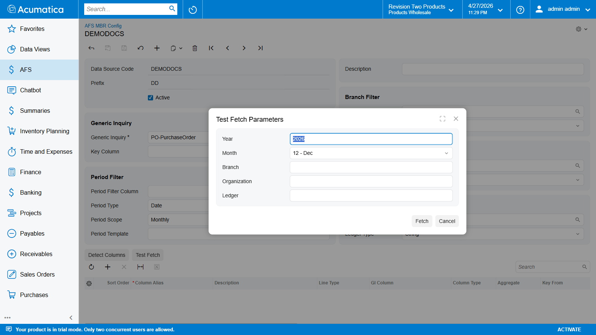

| Field          | Default      | Notes |
| -------------- | ------------ | ----- |
| **Year**         | `2026`         | Required. Fed into the `{YEAR}` token in **Period Template**. |
| **Month**        | `12 - Dec`     | Optional. Fed into `{MONTH}` (zero-padded). |
| **Branch**       | blank        | Optional value for the **Branch Filter Column**. |
| **Organization** | blank        | Optional value for the **Org Filter Column**. |
| **Ledger**       | blank        | Optional value for the **Ledger Filter Column**. |

Click **Fetch**. The engine builds the OData query, calls the GI, aggregates per VALUE column, evaluates CALCULATED formulas, expands MULTIROW rows, then displays every resulting `{{Placeholder}} = value` pair in a dialog (also written to the trace log).

### Step 8 — *(Optional)* Discard / Delete

To remove a record, click the **Delete** icon on the toolbar. Acumatica asks for confirmation: *"The current FLRT GI Data Source record will be deleted."* — click **Confirm**. The screen returns to **New Record** mode:

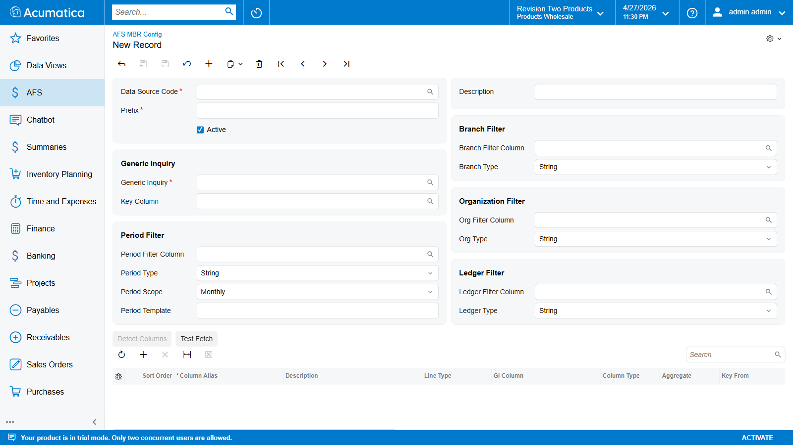

## Validation Errors

#### Header (`FLRTGIDataSource`)

| Check                                            | Error message                                    |
| ------------------------------------------------ | ------------------------------------------------ |
| Data Source Code required                        | `Data Source Code is required.`                  |
| Prefix required                                  | `Prefix is required.`                            |
| Prefix must match `^[A-Za-z0-9]+$`               | `Prefix must contain only letters and digits.`   |
| Prefix unique across all MBR Definitions         | `Prefix must be unique across all GI Data Sources.` |

#### Columns (`FLRTGIDataSourceColumn`)

| Check                                              | Error message                                          |
| -------------------------------------------------- | ------------------------------------------------------ |
| Column Alias required                              | `Column Alias is required.`                            |
| `VALUE` lines must have a GI Column                | `GI Column is required for Value lines.`               |
| `CALCULATED` lines must have a Formula             | `Formula is required for Calculated lines.`            |
| Column Alias unique within the data source        | `Column Alias must be unique within the data source.`  |

\newpage

# Chapter 5: Financial Report Generation (FR101000)

This chapter describes how to **generate a financial report** from the AFS Financial Report screen. Each record on this screen represents a *single run* of the Word-template merge engine: you pick a period, a Word template with `{{PLACEHOLDER}}` tokens, one or more **Report Definitions** (built in [Chapter 3](#chapter-3-report-definition-setup-fr101002)), and the engine fills every placeholder with the calculated GL figure and produces a downloadable `.docx`.

One record = one generated file. Status on the header tells you where the run is in its lifecycle.

## Prerequisites

- Tenant credentials saved in [Chapter 2 — Tenant Credentials (FR101001)](#chapter-2-tenant-credentials-fr101001). The generator uses them to read GL data through the same tenant the screen is opened in.
- At least one **Report Definition** created in [Chapter 3 — AFS Report Definition (FR101002)](#chapter-3-report-definition-setup-fr101002). The definition supplies the placeholders (`{{<Prefix>_<LineCode>_CY}}` and `{{<Prefix>_<LineCode>_PY}}`) that the template file will reference.
- A Word template (`.docx`) whose filename contains the literal token **`FRTemplate`** (for example `AFS-SalesDemo-Test_FRTemplate.docx`). The loader matches on that substring when resolving which attached file to merge.
- Fiscal periods open for the **Current Year** you intend to report on. The selector only lists years that exist in `FinPeriod`.

## Steps

### Step 1 — Navigate to the Financial Report screen

In the top search bar type **Financial Report** and select **AFS Financial Report** under the *AFS* workspace. The landing page opens in **New Record** mode with an empty header and an empty **Report Definitions** grid.

> **Screen ID:** FR101000

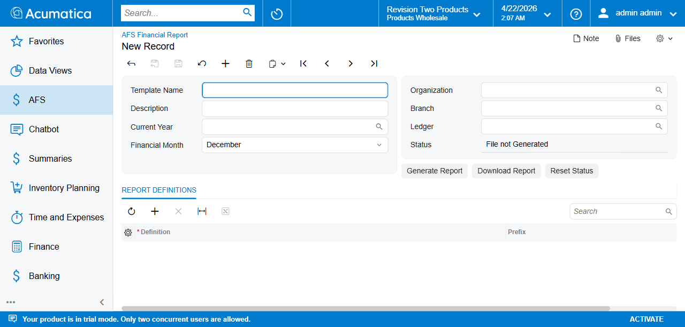

The toolbar at the top carries the standard Acumatica navigation. Directly underneath are the three **action buttons** wired on this screen:

- **Generate Report** — kicks off the background merge job.
- **Download Report** — returns the most recently produced `.docx`.
- **Reset Status** — clears a stuck `In Progress` or a `Failed` run back to `Pending` so it can be re-run.

### Step 2 — Create a new record

Click **+** (Add) in the toolbar. All header fields clear; **Status** defaults to `File not Generated` (the UI label for `Pending`). Nothing is committed until you save.

### Step 3 — Fill the header

The header is split into two column groups. The left group identifies the report and the period; the right group scopes the GL data and carries the run state.

| Field              | Required | Example                          | Notes                                                                                                                                                                                                                              |
| ------------------ | -------- | -------------------------------- | ---------------------------------------------------------------------------------------------------------------------------------------------------------------------------------------------------------------------------------- |
| **Template Name**  | yes      | `BS Annual Report 2024`          | Free-text code identifying this report run, up to 225 chars. Shown in the FR401000 list. Not the Word filename — this is the *record* name.                                                                                       |
| **Description**    | no       | `Balance Sheet for December 2024`| Free-text label, up to 50 chars.                                                                                                                                                                                                   |
| **Current Year**   | yes      | `2024`                           | Fiscal year the report runs for. The dropdown is populated from distinct `FinPeriod.FinYear` values, sorted descending.                                                                                                            |
| **Financial Month**| yes      | `December`                       | Month-of-year (`01`–`12`). Defaults to `12` (December). Sets the **fiscal year start month**. The FY-to-date window runs from this month in the prior calendar year through one month before it in the Current Year (12 months total). Same window shape is used for the `_PY` pass against the previous FY. |
| **Organization**   | no       | `PRODUCTS`                       | Optional filter. Blank = all organizations the tenant can see.                                                                                                                                                                     |
| **Branch**         | no       | `PRODWHOLE`                      | Optional filter. Blank = all branches.                                                                                                                                                                                             |
| **Ledger**         | no       | `ACTUAL`                         | Optional filter. Blank = all ledgers.                                                                                                                                                                                              |
| **Status**         | —        | *read-only*                      | Lifecycle field, managed by the engine — see the **Status lifecycle** section below.                                                                                                                                               |

### Step 4 — Pick the Current Year

Click the magnifier next to **Current Year** to open the selector. It shows every distinct `FinYear` on file (latest first). Double-click a row, or type the year directly into the field and press Tab.

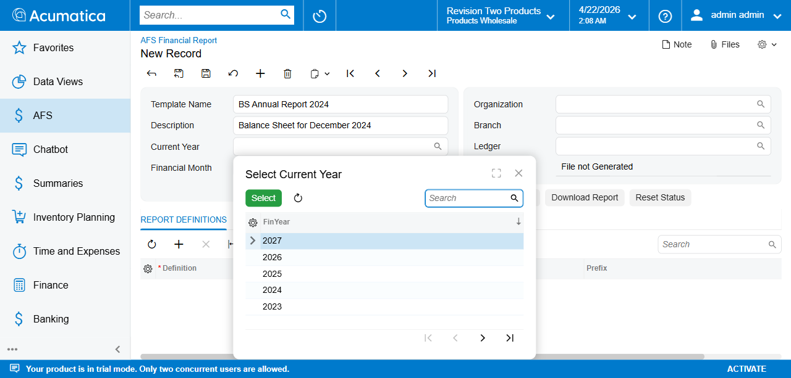

### Step 5 — Pick the Financial Month

**Financial Month** is a fixed dropdown (`January` … `December`). It defines the **fiscal year start month**. The engine's FY-to-date window runs from this month in the year before **Current Year** through one month before it in **Current Year** — 12 months total. Every line item in every linked Definition resolves twice — once for `_CY`, once for `_PY` — against this window:

- `_CY` — FY-to-date for the **Current Year** FY (e.g. `Current Year=2025`, `Financial Month=August` → Aug 2024 through Jul 2025).
- `_PY` — same window shifted back one fiscal year (e.g. Aug 2023 through Jul 2024).

For a calendar fiscal year, pick `January` (so the window is Jan→Dec of the Current Year).

There is no single-period (month-only) placeholder. If a month-only delta is needed, compute it inside the Word template (`{{PFX_X_CY}} - {{PFX_X_PY}}`) — formulas inside a Definition cannot mix periods.

Default is `December` (FY runs Dec(prior year) → Nov(Current Year)). Override per tenant's actual fiscal year start.

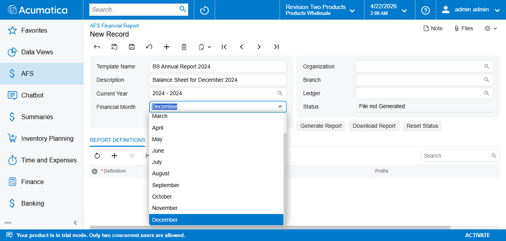

### Step 6 — Scope the GL data (Organization / Branch / Ledger)

The right-hand column group narrows *which GL rows* the linked Report Definitions see. Each field is optional.

| Field            | Selector source               | Example      |
| ---------------- | ----------------------------- | ------------ |
| **Organization** | `Organization.OrganizationCD` | `PRODUCTS`   |
| **Branch**       | `Branch.BranchCD`             | `PRODWHOLE`  |
| **Ledger**       | `Ledger.LedgerCD`             | `ACTUAL`     |

> The three filters are AND-combined with any per-line filters set inside the Report Definition. The header values act as a hard upper bound; per-line filters may further narrow, never widen.

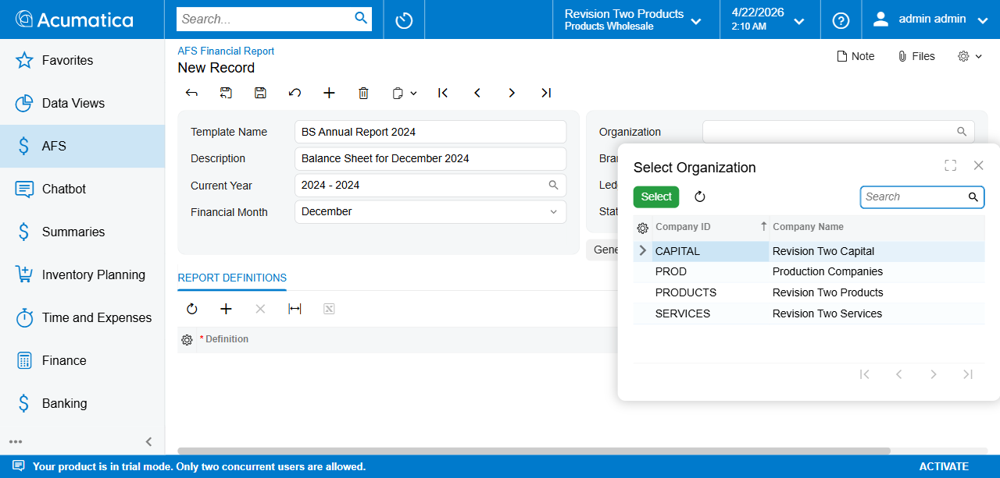

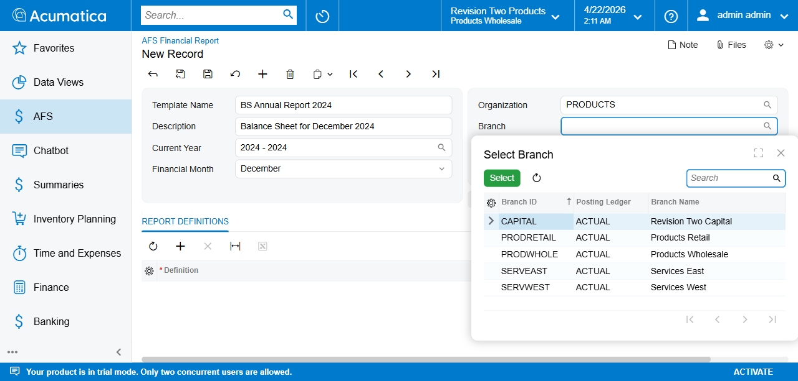

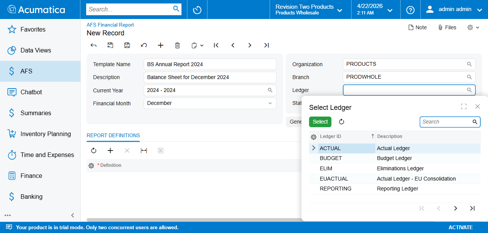

Once all header fields are populated the form looks like the below. Save (`Ctrl+S`) before attaching files or adding definitions:

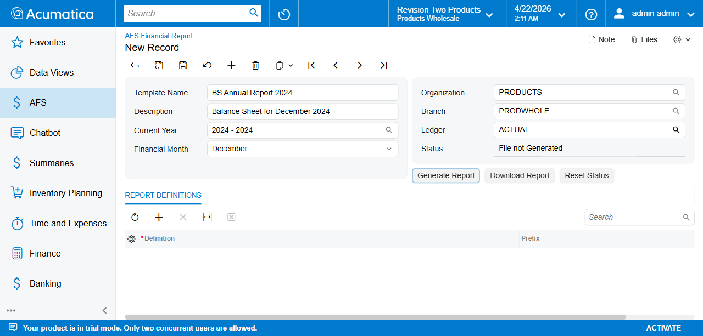

### Step 7 — Attach the Word template

Click the **Files** button (paperclip icon, top-right). An empty Files dialog opens.

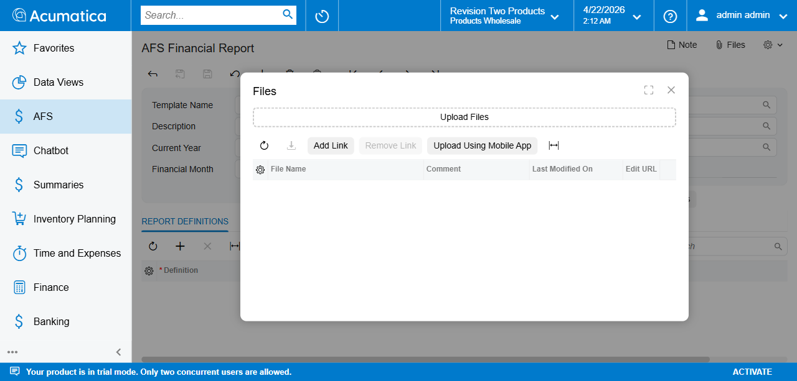

Click **Browse** (or drag-drop), pick your `.docx`, and upload. **The filename must contain the substring `FRTemplate`** — the generator scans the attached files on this record and picks the first one whose name matches. Example: `DemoTemplate_FRTemplate.docx` or `BS2024_FRTemplate.docx`.

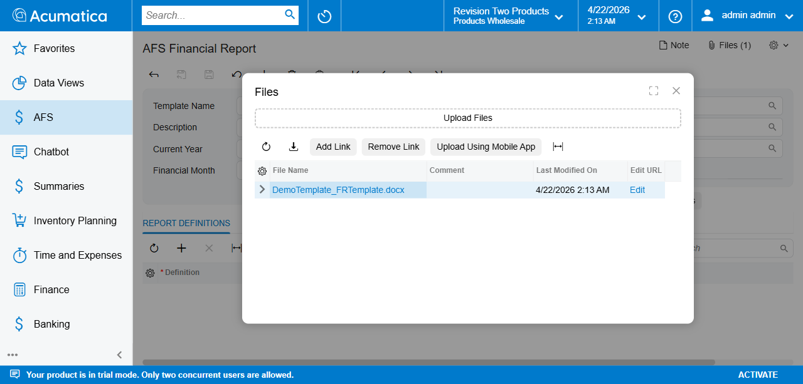

The Files button badge shows the attachment count (`Files(1)`). You can upload additional supporting files — only the one matching `FRTemplate` is merged; others are ignored.

### Step 8 — Link one or more Report Definitions

Switch to the **REPORT DEFINITIONS** tab below the header. This child grid is what tells the engine *which definitions* to run against the Word template. Every row adds another block of placeholders to the merge dictionary.

Click **+** on the grid toolbar to add a blank row.

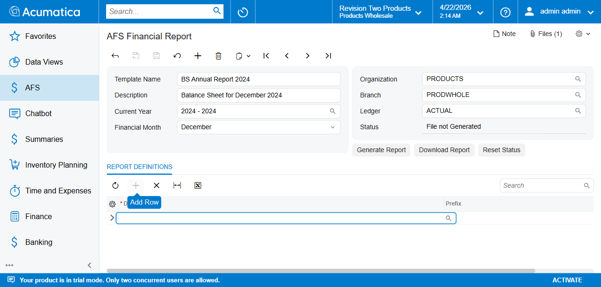

With the row focused, press **F3** (or click the magnifier) in the **Definition** cell. The selector opens and lists every definition marked *Active* on FR101002.


Pick the definition you want. The **Prefix** column on the grid fills automatically and is read-only here.

#### Why link more than one definition?

The merge engine concatenates the placeholder dictionaries from every linked definition before scanning the template. That means a single report can mix, say, a **Balance Sheet** definition and a **P&L** definition — the template just references both prefixes (`{{BS_CASH_CY}}` and `{{PL_REVENUE_CY}}`). Cross-definition **CALCULATED** lines are supported.

### Step 9 — Save

Press `Ctrl+S`. The graph does **not** validate header completeness at save time. Validation is deferred to **Generate Report**, which throws if Template Name is missing, no Definition is linked, or no `*FRTemplate*.docx` file is attached. Fill the header before clicking Generate to avoid an immediate failure.

## Header actions

The three buttons below the header are the only way to drive the lifecycle of a report record.

### Generate Report

Queues a background job that reads the GL data for the chosen period, evaluates every Line Item in every linked Definition, merges the resulting dictionary into the attached `FRTemplate` Word document, and writes the output back onto the record.

Status immediately transitions to `In Progress`. The job runs under `PXLongOperation` with a 15-minute timeout; you can navigate away from the screen and come back — Status will update on refresh.

### Download Report

Returns the last successfully generated `.docx` attached to this record. The button is hard-disabled only while a generation is **In Progress**; in all other states it is clickable but throws *"No generated file is available for download."* if no file has ever been produced. Effectively this means: only useful when Status = **Ready to Download**.

### Reset Status

Clears a stuck or failed run so the record can be re-queued. The button opens a confirmation dialog showing the current status:

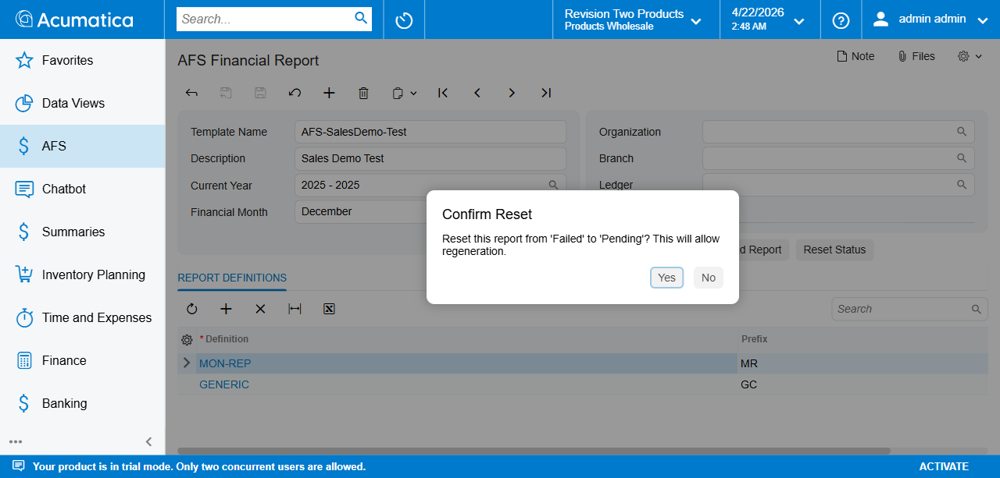

> Dialog message — `Reset this report from '<Current Status>' to 'Pending'? This will allow regeneration.`

- **Yes** — Status moves to `Pending` (`File not Generated`) **and `GeneratedFileID` is cleared**. The previously generated `.docx` is detached from the record so it cannot be downloaded; the next successful run produces a fresh file. Files panel attachments are not affected.
- **No** — Status is unchanged.

## Status lifecycle

Status is a one-character field on the DAC (`FLRTFinancialReport.Status`) rendered with user-friendly labels:

| DB value | UI label              | Meaning                                                                                                 |
| -------- | --------------------- | ------------------------------------------------------------------------------------------------------- |
| `N`      | **File not Generated**| Initial state. No `.docx` attached yet. **Generate Report** is allowed; **Download Report** is disabled.|
| `P`      | **In Progress**       | `PXLongOperation` job is running. While in this state every header field plus **Generate Report** and **Download Report** is disabled — only **Reset Status** is clickable. |
| `C`      | **Ready to Download** | Job finished; merged `.docx` is stored on the record. **Download Report** now returns the file.         |
| `F`      | **Failed**            | Job threw — typically a missing placeholder, malformed formula, or template parse error. Check the trace log, fix the cause, then **Reset Status** → **Generate Report**. |

> Note: the DB code for *In Progress* is `P`, not `IP`. The `N`/`P`/`C`/`F` codes are what land in the `Status` column on the database; the UI labels above are the user-facing strings.

```
Pending ──Generate──► In Progress ──success──► Ready to Download
                                   └──error──► Failed ──Reset──► Pending
```

## Worked Example — BS Annual Report 2024

A complete walkthrough of a typical run.

### 1 — Load or create the record

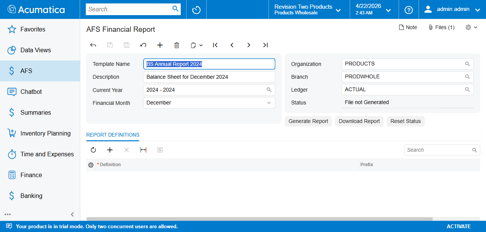

| Field            | Value                           |
| ---------------- | ------------------------------- |
| Template Name    | `BS Annual Report 2024`         |
| Description      | `Balance Sheet for December 2024`|
| Current Year     | `2024 - 2024`                   |
| Financial Month  | `December`                      |
| Organization     | `PRODUCTS`                      |
| Branch           | `PRODWHOLE`                     |
| Ledger           | `ACTUAL`                        |
| Status           | `File not Generated`            |

### 2 — Link the definition

In the **Report Definitions** grid, add a row and pick **GENERIC** (Prefix `GC`):

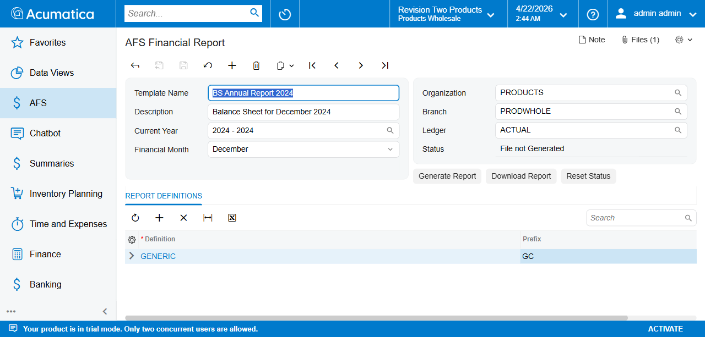

### 3 — Attach the template

Open the Files panel and upload `BS2024_FRTemplate.docx` (or similarly named file containing the `FRTemplate` token). The Files badge becomes `Files(1)`.

### 4 — Generate and download

Click **Generate Report**. Status flips to `In Progress`. Within a minute or two Status lands on `Ready to Download`:

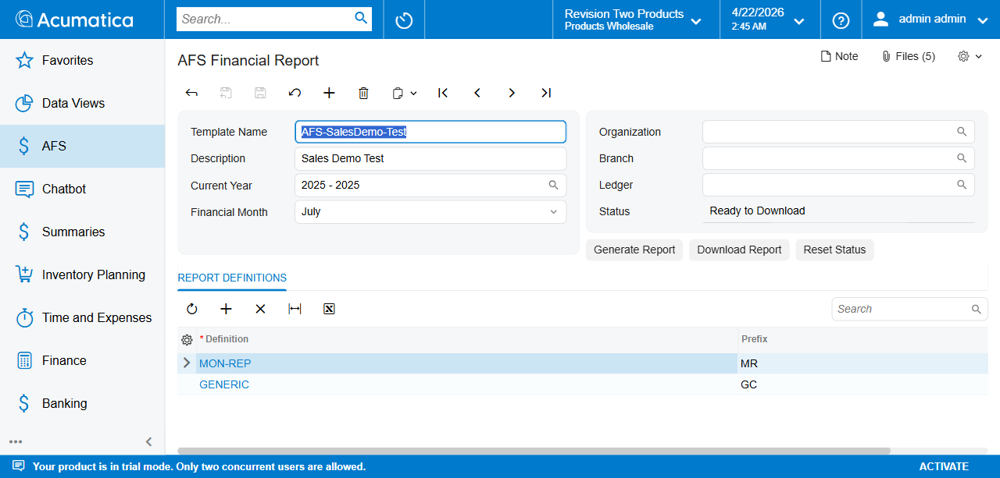

Click **Download Report** to pull the merged `.docx`. Every `{{GC_*_CY}}` and `{{GC_*_PY}}` placeholder in the template is now replaced with its calculated figure, rounded per the definition's Rounding Level / Decimal Places settings.

## Worked Example — Recovering from a Failed run

The example below shows a record that threw during generation.


To recover:

1. Open the record. Read the trace log to identify the error — typical causes are a `{{PREFIX_LINECODE_CY}}` (or `_PY`) placeholder in the template with no matching Line Code on any linked definition, or a CALCULATED formula referencing an unknown Line Code.
2. Fix the root cause in either the template or the definition.
3. Click **Reset Status** and confirm **Yes** in the dialog. Status returns to `File not Generated`.
4. Click **Generate Report** to re-run.

## The Records List — FR401000

The companion list screen **AFS-Financial-Report (FR401000)** shows every record on the system at a glance, grouped by status column.

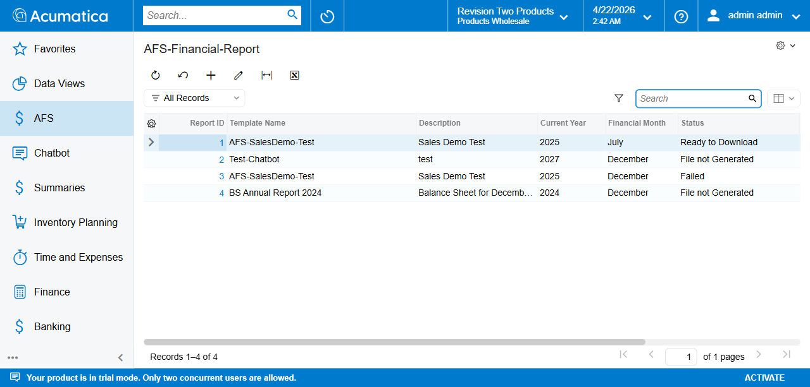

\newpage

# Chapter 6: MBR Report Generation (FR101003)

This chapter describes how to generate an **AI-driven Monthly Board Report** (MBR) from one or more linked **MBR Definitions** (data sources) using the Gamma presentation API. Each record on this screen represents a single run of the markdown-builder + Gamma pipeline:

1. The engine resolves every linked MBR Definition (FR101004) against live OData data for the chosen period and dimensions.
2. It builds a structured **markdown prompt** containing the resolved values, audience hints, and the user-supplied title / description.
3. It POSTs the markdown to the Gamma API, which returns a generated `.pptx` file.
4. The file is stored on the record and surfaced via the **Download Presentation** action.

> **Screen ID:** FR101003
> **Screen Title:** AFS Monthly Board Report (MBR)
> **Menu path:** *AFS → Reports → AFS Monthly Board Report (MBR)*

## Prerequisites

- Tenant credentials saved in [Chapter 2 — Tenant Credentials Setup (FR101001)](#chapter-2-tenant-credentials-fr101001), including the **Presentation API Key** (Gamma) field. The Generate Presentation action throws `Presentation API Key is not configured` if it's blank.
- At least one [MBR Definition (FR101004)](#chapter-4-mbr-definition-setup-fr101004) marked **Active**, with at least one column row that produces a placeholder.
- Fiscal periods open for the **Current Year** you intend to report on. The selector only lists years that exist in `FinPeriod`.

## Steps

### Step 1 — Navigate to AFS Monthly Board Report (MBR)

In the top search bar type **Monthly Board** and select **AFS Monthly Board Report (MBR)** under *AFS → Reports*. Note the related **AFS MBR Config** under *AFS → Configuration* — that's [FR101004](#chapter-4-mbr-definition-setup-fr101004), where the data sources you'll link here are defined.

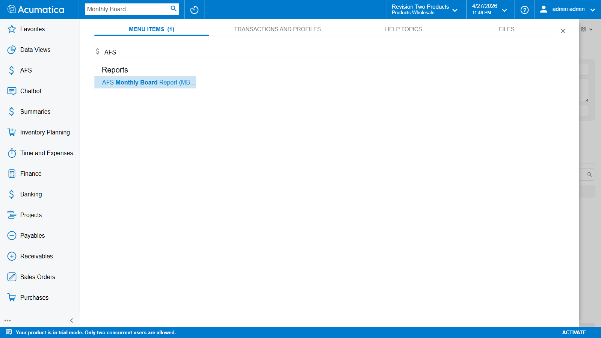

The screen opens in **New Record** mode with three header column groups, two tabs (`GI DATA SOURCES` / `PRESENTATION MARKDOWN`), and four action buttons.

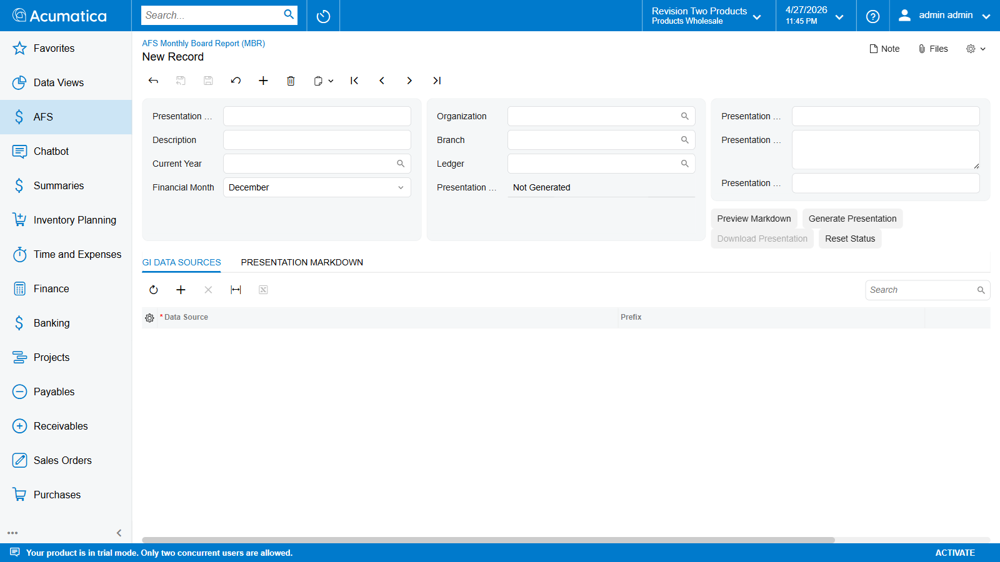

#### Toolbar + actions overview

The standard Acumatica record-navigation toolbar sits across the top of the form. Four screen-specific actions live in the right-hand action panel:

| Button | Behaviour |
| ------ | --------- |
| **Preview Markdown** | Resolves every linked data source against live OData, builds the Gamma prompt, persists it to the **Presentation Markdown** field. Does **not** call Gamma — use it to inspect what the model will see before incurring an API cost. Status doesn't change. |
| **Generate Presentation** | Same resolve-and-build step, then POSTs the markdown to Gamma. Saves the returned `.pptx` to the record. Status: `Pending` → `In Progress` → `Ready to Download`. 15-minute timeout. If `PresentationMarkdown` is already populated by a prior Preview Markdown, the engine skips the rebuild and submits the stored markdown unchanged. |
| **Download Presentation** | Returns the most recently generated `.pptx`. Hard-disabled until `SlideGeneratedFileID` is populated. |
| **Reset Status** | Confirmation dialog → clears `SlideStatus` to `Pending` and **nulls `SlideGeneratedFileID`**. Use after a stuck `In Progress` run, or after `Failed`, before re-running Generate. |

> While Status = `In Progress`, every header field is disabled and **Preview Markdown** + **Generate Presentation** are greyed out. **Reset Status** stays clickable so you can recover from a stuck run.

### Step 2 — Fill the Header

The header is split into three column groups.

#### Identity (left)

| Field             | Required | Notes                                                                                  |
| ----------------- | -------- | -------------------------------------------------------------------------------------- |
| **Presentation Name** | yes  | Free-text identifier, max 225 chars. Shown in the records list and on the breadcrumb. |
| **Description**       | no   | Short label, max 50 chars. |
| **Current Year**      | yes  | Fiscal year. Selector lists distinct `FinYear` values from `FinPeriod` (latest first). |
| **Financial Month**   | yes  | Month-of-year (`01`–`12`). Default `12` (December). Sets the period end of the FY-to-date window every linked Report Definition reads, **and** is fed into the `{MONTH}` token of every linked MBR Definition's Period Filter Template. |

#### Scope (middle)

| Field             | Required | Notes                                                                                  |
| ----------------- | -------- | -------------------------------------------------------------------------------------- |
| **Organization**     | optional | Optional dimension filter. Fills the `OrgFilterColumn` of every linked MBR Definition that has one configured. |
| **Branch**           | optional | Fills `BranchFilterColumn`. |
| **Ledger**           | optional | Fills `LedgerFilterColumn`. |
| **Presentation Status** | —      | Read-only lifecycle field. |

#### Gamma prompt fields (right)

| Field             | Required for Generate | Notes                                                                                  |
| ----------------- | --------------------- | -------------------------------------------------------------------------------------- |
| **Presentation Title** | yes  | Up to 500 chars. Becomes the title of the generated `.pptx`. Required by Generate Presentation — the action throws `Presentation Title is required` if blank. Preview Markdown does **not** require it. |
| **Presentation Description** | no | Up to 2000 chars. Optional context paragraph the markdown builder includes in the Gamma prompt's audience / framing block. |
| **Presentation Template ID** | no | Optional Gamma template ID. If set, `GeneratePresentationFromTemplate` is used instead of `GeneratePresentation` — the deck inherits the visual style of the named Gamma template. Leave blank for default Gamma styling. |

After filling, the form looks like the screenshot below:

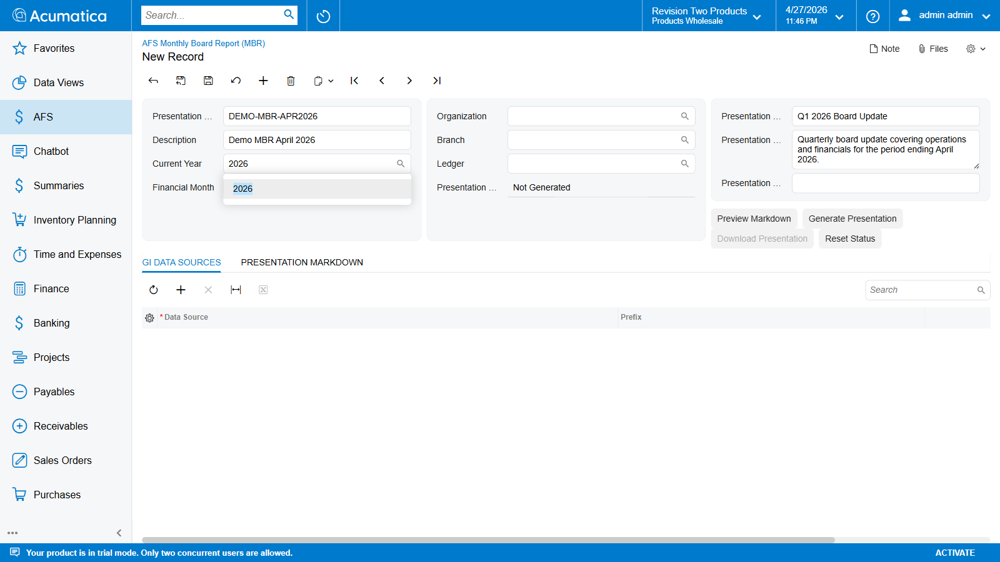

> Save (`Ctrl+S`) before opening the GI Data Sources tab — the child grid needs a saved parent record before it can attach links.

### Step 3 — Link MBR Definitions (GI Data Sources)

Switch to the **GI DATA SOURCES** tab below the header. This child grid is what tells the engine which MBR Definitions to resolve when building the prompt.

Click **+** on the grid toolbar to add a row, then click the magnifier in the **Data Source** cell (or press F3) — the selector opens listing every active MBR Definition:

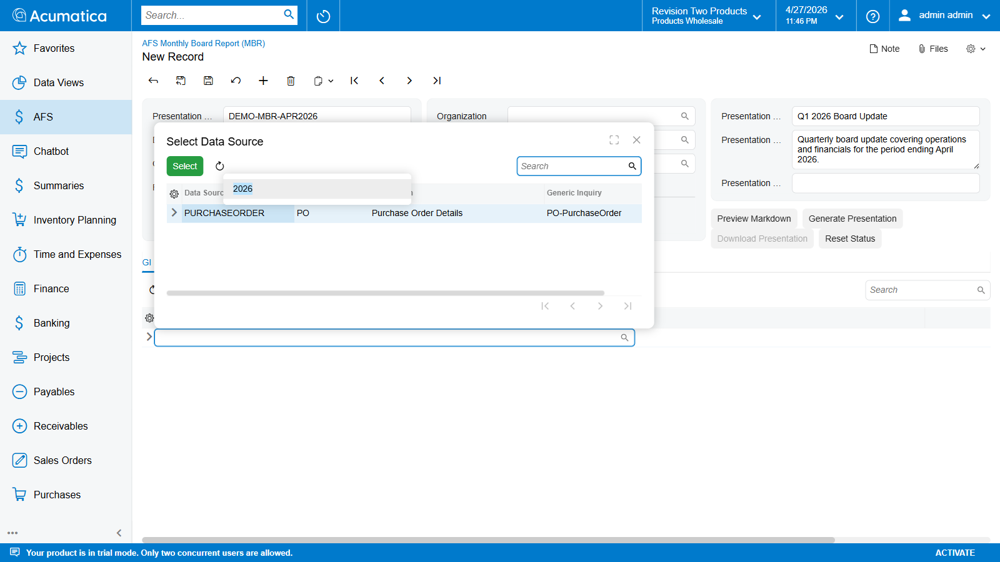

Double-click the data source you want. The grid populates with three columns:

| Column           | Source                                               | Purpose                                                                  |
| ---------------- | ---------------------------------------------------- | ------------------------------------------------------------------------ |
| **Data Source**    | `FLRTGIDataSource.dataSourceCD`                       | Key of the link row. One MBR Definition can be linked at most once per presentation. |
| **Prefix**         | `FLRTGIDataSource.Prefix` *(read-only display)*       | Convenience copy of the data source's prefix. |
| **Display Order**  | integer (default 0)                                   | Sort order in the markdown preview's Data section. |

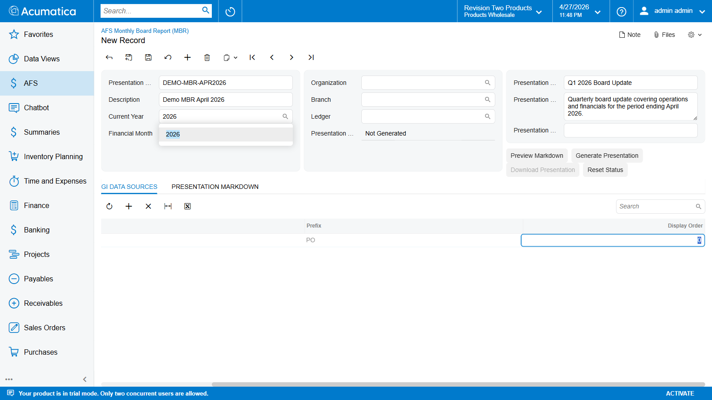

> **Multi-source presentations.** The markdown builder concatenates the placeholder dictionaries from every linked data source before composing the Gamma prompt. Two data sources cannot share the same Prefix; the link save fails with `Prefix '<PO>' is already used by another linked definition in this report` if you try.

### Step 4 — Preview the Markdown (optional but recommended)

Switch to the **PRESENTATION MARKDOWN** tab. It starts empty:


Click **Preview Markdown** in the action panel. The engine:

1. Authenticates against the tenant's OData endpoint.
2. Resolves every linked MBR Definition (full fetch + aggregate + format for VALUE rows, top-N expansion for MULTIROW rows, formula evaluation for CALCULATED rows).
3. Builds the Gamma prompt — a markdown document with header context (period, scope), the user-supplied audience/framing block, and a **Data** section listing every placeholder produced.
4. Persists the markdown to `PresentationMarkdown` and saves the record.

The whole step is wrapped in a 15-minute `PXLongOperation`. The textarea on the tab populates with the generated markdown:

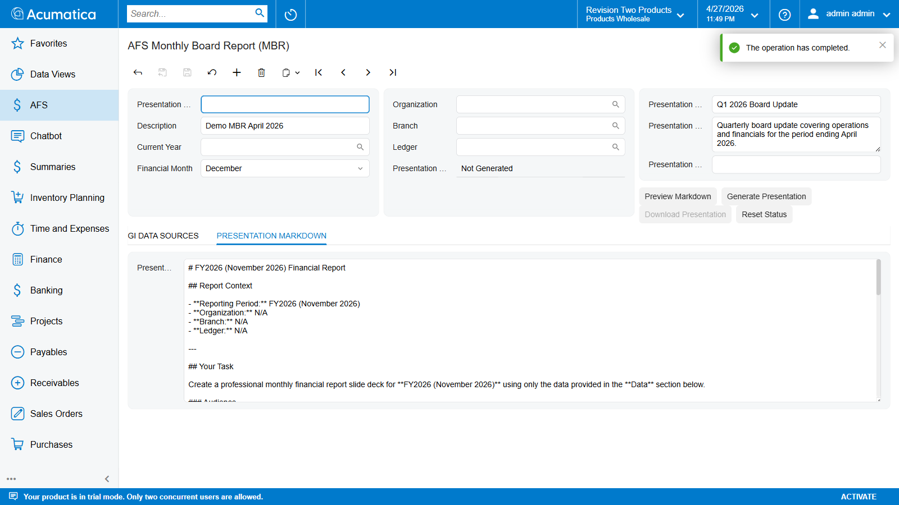

**Why preview before generating?**

- Verifies every data source resolves without OData errors.
- Lets you spot empty placeholders (data source mis-configured, period filter wrong, etc.) before incurring a Gamma API call.
- The persisted markdown is **reused** by the next Generate Presentation — Generate skips the rebuild step entirely if `PresentationMarkdown` is already populated. So a clean preview is also a way to "freeze" the prompt before committing it to Gamma.

> The textarea is editable — you can hand-tweak the markdown before clicking Generate Presentation. Useful for adding extra prompt instructions Gamma should see, but be aware that the next Preview Markdown overwrites your edits.

### Step 5 — Generate the Presentation

Click **Generate Presentation**. The engine:

1. Validates: presentation selected, Status not already `In Progress`, **Presentation Title** set, tenant `GammaApiKey` configured.
2. If `PresentationMarkdown` is already populated (from Step 4), it's reused unchanged. Otherwise the markdown builder runs in-flight.
3. Status flips to `In Progress`. Header fields and Preview / Generate buttons disable.
4. Markdown is POSTed to the Gamma API. If a `Presentation Template ID` is set, `GeneratePresentationFromTemplate` is called instead of the default endpoint.
5. Gamma returns a `.pptx` byte stream. The engine saves it as `<PresentationName>_Presentation_<yyyyMMdd_HHmm>.pptx` and stores the file's GUID on `SlideGeneratedFileID`.
6. Status flips to `Ready to Download`.

You can navigate away from the screen during the run — Status updates the next time you reload the record. The 15-minute timeout produces a `Failed` status (and a trace error) rather than hanging the screen.

### Step 6 — Download the Presentation

Once Status = `Ready to Download`, click **Download Presentation**. The browser downloads the merged `.pptx`. The Gamma deck is fully editable in PowerPoint — Gamma generates the slide layouts, charts, and bullet structure from the markdown prompt, but doesn't lock the output.

### Step 7 — *(Optional)* Reset Status

Open the record and click **Reset Status** — a confirmation dialog appears showing the current status:

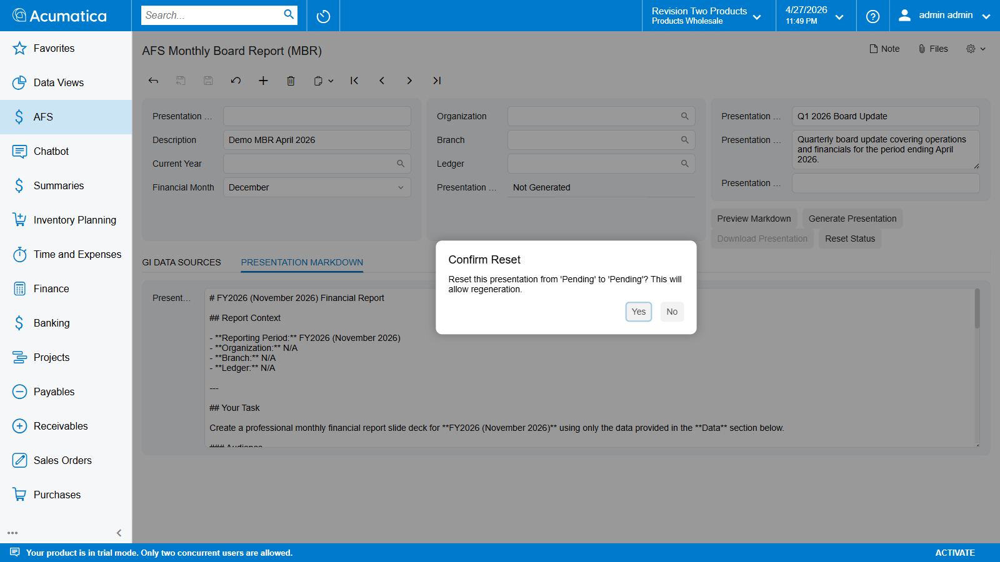

> Dialog message: `Reset this presentation from '<Current Status>' to 'Pending'? This will allow regeneration.`

- **Yes** — Status moves to `Pending` **and `SlideGeneratedFileID` is cleared**. The previously generated `.pptx` is detached from the record. The next Generate Presentation rebuilds from scratch (or from the stored `PresentationMarkdown` if you preserved it).
- **No** — Status is unchanged.

### Step 8 — *(Optional)* Delete the Record

Click the **Delete** icon on the toolbar and confirm. Deletes the presentation record plus its child Data Source / Definition Link rows. The screen returns to **New Record** mode:

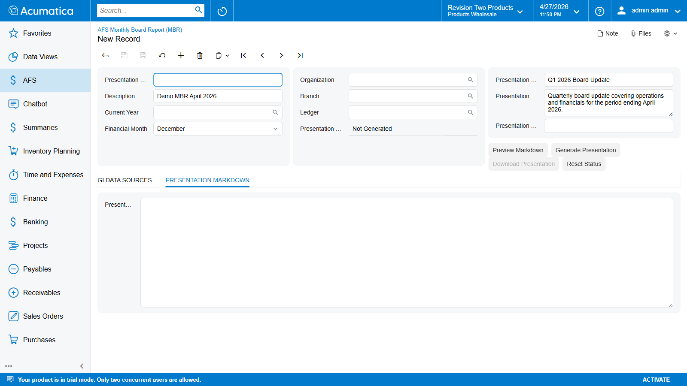

## Status lifecycle

`SlideStatus` is a one-character field on the DAC (`FLRTPresentationGeneration.SlideStatus`):

| DB value | UI label              | Meaning                                                                                                 |
| -------- | --------------------- | ------------------------------------------------------------------------------------------------------- |
| `N`      | **Not Generated**     | Initial state. No `.pptx` attached. Generate Presentation is allowed; Download Presentation is disabled.|
| `P`      | **In Progress**       | `PXLongOperation` is running. Header + Generate buttons disable; only Reset Status remains clickable.   |
| `C`      | **Ready to Download** | Job finished; merged `.pptx` is stored on the record. Download Presentation now returns the file.       |
| `F`      | **Failed**            | Job threw — typically a Gamma API error, a data source resolution failure, or a 15-minute timeout. Read the trace log, fix the cause, then **Reset Status** → **Generate Presentation**. |

```
Not Generated ──Generate──► In Progress ──success──► Ready to Download
                                       └──error──► Failed ──Reset──► Not Generated
```

## How the Engine Builds the Markdown

For reference — what `SlideGenerationService.BuildMarkdownPreview` actually emits:

1. **Header context block** — fiscal year, financial month formatted as "FY{Year} ({MonthName} {Year})", plus the Org / Branch / Ledger scope (or `N/A` when blank).
2. **Audience / framing block** — the user-supplied `PresentationDescription`, plus a hard-coded set of "Generate a professional monthly financial report slide deck…" instructions for Gamma.
3. **Data block** — one section per linked data source, with a heading per Column row. For VALUE rows: `**<Description>:** <formatted value>`. For MULTIROW rows: a markdown table with the configured `DisplayColumns`. For CALCULATED rows: `**<Description>:** <formula result>`. HEADING rows print as `### <Description>`.

The full markdown is what goes to Gamma — it's also what you can hand-edit on the Presentation Markdown tab.

\newpage

# Appendix A: Placeholder Reference

Complete catalogue of every placeholder type the AFS Financial Report module emits into the Word merge dictionary or the Gamma markdown prompt.

> **v2.1.x model.** Every placeholder is keyed by **exactly one of two period suffixes**: `_CY` (current FY-to-date) or `_PY` (previous FY same window). The legacy `_PM` (previous-month) suffix was removed in the v2.1.x refactor. Compute month-only deltas inside the Word template (`{{PFX_X_CY}} − {{PFX_X_PY}}`); a Definition formula cannot mix periods.

## A.1 Report Definition Placeholders

Produced by every visible line item on a [Report Definition (FR101002)](#chapter-3-report-definition-setup-fr101002). One pair per visible line:

```
{{<Prefix>_<LineCode>_CY}}
{{<Prefix>_<LineCode>_PY}}
```

| Component | Source                                              | Examples                  |
|-----------|-----------------------------------------------------|---------------------------|
| `<Prefix>` | `FLRTReportDefinition.DefinitionPrefix`              | `BS`, `PL`, `CF`, `EQ`, `DEMO` |
| `<LineCode>` | `FLRTReportLineItem.LineCode`                      | `CASH`, `TOTAL_ASSETS`, `NI`, `GROSS_PROFIT` |
| Period suffix | `_CY` or `_PY` *(constants in `Helper/Constants.cs`)* | `_CY`, `_PY` |

### Period suffixes

| Suffix | Meaning |
|--------|---------|
| `_CY`  | **Current Year** — fiscal-year-to-date through the end of the selected month, in the year picked on FR101000 / FR101003. |
| `_PY`  | **Previous Year** — fiscal-year-to-date through the same month, in the previous fiscal year. |

> No `_PM` suffix exists. If a template inherited from the v2.0 era still has `{{X_X_PM}}` tokens, they resolve to `0` in the Word document (and warn in the trace log).

### Examples

| Placeholder              | Meaning                                              |
|--------------------------|------------------------------------------------------|
| `{{BS_CASH_CY}}`         | Balance Sheet definition (`BS`), Line Code `CASH`, current FY-to-date.   |
| `{{BS_CASH_PY}}`         | Same line, previous FY same window.                  |
| `{{PL_REVENUE_CY}}`      | P&L definition, Line Code `REVENUE`, current period. |
| `{{PL_NI_PY}}`           | P&L Net Income, prior year.                          |
| `{{CF_OP_CASH_CY}}`      | Cash Flow definition, `OP_CASH` line, current.       |

### Lines that do **not** emit placeholders

- **`HEADING` lines** — display-only.
- **Lines with `Visible = false`** — still calculated but no `_CY` / `_PY` keys are written.
- **`SUBTOTAL` / `CALCULATED` lines with `Visible = false`** — same: internal value only.

## A.2 Year-Label Placeholders

Two convenience tokens added to the dictionary at the end of every report run by `ReportGenerationService`:

| Placeholder | Resolves to                       | Example |
|-------------|-----------------------------------|---------|
| `{{CY}}`    | The current year as a 4-digit string | `2026`  |
| `{{PY}}`    | The previous year as a 4-digit string | `2025`  |

Use in column headers and section labels:

```
| Account             | As at December {{CY}} | As at December {{PY}} |
|---------------------|-----------------------|-----------------------|
| Cash                | {{BS_CASH_CY}}        | {{BS_CASH_PY}}        |
```

## A.3 MBR Definition Placeholders

Produced by every visible column row on an [MBR Definition (FR101004)](#chapter-4-mbr-definition-setup-fr101004). Three flavours, one per `LineType`.

### A.3a Single Value (`LineType = VALUE`)

One placeholder per visible Column Alias:

```

```

| Component         | Source                                  | Example         |
|-------------------|-----------------------------------------|-----------------|
| `<Prefix>`        | `FLRTGIDataSource.Prefix`                | `PO`, `HR`, `SO` |
| `<ColumnAlias>`   | `FLRTGIDataSourceColumn.ColumnAlias`     | `TOTAL_AMOUNT`, `HEADCOUNT`, `OPEN_ORDERS` |

| Placeholder              | Meaning                                                  |
|--------------------------|----------------------------------------------------------|
| `{{PO_TOTAL_AMOUNT}}`    | PO data source, `TOTAL_AMOUNT` column, aggregate result. |
| `{{HR_HEADCOUNT}}`       | HR data source, `HEADCOUNT` column.                      |
| `{{SO_OPEN_ORDERS}}`     | Sales Order data source, count of open orders.           |

> No `_CY` / `_PY` suffix on MBR Definition placeholders. The MBR pipeline runs once per record against a single user-supplied period (Year + Month + dimensions on FR101003), not against two periods like Report Definitions do.

### A.3b Multi-Row Expand (`LineType = MULTIROW`)

Each ranked row produces one placeholder **per GI column**:

```

```

| Placeholder                              | Meaning                                                     |
|------------------------------------------|-------------------------------------------------------------|
| `{{PO_TOP_VENDORS_1_VendorName}}`        | Rank-1 row of `TOP_VENDORS` MULTIROW, value of `VendorName`. |
| `{{PO_TOP_VENDORS_1_OrderTotal}}`        | Rank-1 row, value of `OrderTotal`.                           |
| `{{PO_TOP_VENDORS_2_VendorName}}`        | Rank-2 row.                                                  |
| `{{PO_TOP_VENDORS_10_OrderTotal}}`       | Rank-10 row, OrderTotal column.                              |

Rank goes from `1` to the **Row Limit** configured on the column row (default 10). Word templates referencing a rank higher than `Row Limit` get an empty string.

### A.3c Calculated (`LineType = CALCULATED`)

Same shape as a VALUE placeholder — `` — but the value comes from evaluating the row's `Formula` against the other Column Aliases in the same data source.

```
{{PO_GROSS_MARGIN}}     ← Formula: REVENUE - COGS
{{PO_NET_MARGIN_PCT}}   ← Formula: NET / REVENUE  (with Format String = P1)
```

## A.4 Cross-Definition Formula Placeholders

A `CALCULATED` line in one Report Definition can reference Line Codes in another Report Definition, **provided both are linked to the same FR101000 / FR101003 record**. Tokens use the qualified `<Prefix>_<LineCode>` form (no period suffix — the engine substitutes `_CY` and `_PY` automatically on each evaluation pass).

| Formula in Definition (Prefix) | Token resolution                   | Placeholders emitted                      |
|--------------------------------|------------------------------------|-------------------------------------------|
| `BS_TA - PL_NI` *(in CF, prefix CF)* | `BS.TA` + `PL.NI` from linked defs | `{{CF_RESULT_CY}}`, `{{CF_RESULT_PY}}`    |
| `PL_REVENUE * 0.3` *(in CU, prefix CU)* | `PL.REVENUE` from linked def     | `{{CU_TAX_EST_CY}}`, `{{CU_TAX_EST_PY}}`  |
| `(REVENUE - COGS) / REVENUE` *(in PL)* | implicit prefix → `PL.REVENUE`, `PL.COGS` | `{{PL_GROSS_MARGIN_CY}}`, `{{PL_GROSS_MARGIN_PY}}` |

The formula is evaluated **twice** — once against the CY dictionary, once against the PY dictionary — producing both `_CY` and `_PY` placeholders automatically.

## A.5 Placeholder Resolution Rules

| Rule | Source |
|------|--------|
| **Case-insensitive lookup** — `{{BS_CASH_CY}}` matches `{{bs_cash_cy}}` and `{{Bs_Cash_Cy}}`. | `WordTemplateService` does case-insensitive Replace at merge time. |
| **Unmatched placeholders → `0`** for numeric tokens, empty string for `{{CY}}` / `{{PY}}` when the year is null. The token text is replaced regardless. | `Helper/Messages.UnknownFormulaLineCode` (warning emitted to trace). |
| **Maximum 1,000 placeholders per template** — enforced by `Constants.MaxPlaceholdersPerTemplate`. Templates exceeding this throw `Messages.TooManyPlaceholders` at generation time. | `Helper/Constants.cs:49`. |
| **Document scope** — placeholders work in the document body, headers, footers, and all table cells. The merge service walks every paragraph. | `WordTemplateService.cs`. |
| **Type each placeholder in one go in Word** — Word's auto-correct / spell-check sometimes splits `{{` or the underscore mid-typing, breaking the merge token. If a placeholder isn't replacing, retype the whole `{{...}}` token without pausing. | Word behaviour. |
| **HEADING and invisible lines emit no placeholder**. | `FLRTReportLineItem.IsVisible`. |

## A.6 Quick Lookup — Where Each Placeholder Comes From

| Placeholder shape                         | Producer                                       | Suffix (period)         |
|-------------------------------------------|------------------------------------------------|-------------------------|
| `{{<Prefix>_<LineCode>_CY}}` / `_PY`       | Report Definition line item (FR101002)          | `_CY` / `_PY`           |
| `{{<Prefix>_<LineCode>_CY}}` / `_PY` from `CALCULATED` | Report Definition formula (cross-def OK) | `_CY` / `_PY` (2-pass)  |
| ``              | MBR Definition VALUE / CALCULATED column (FR101004) | none                |
| ``  | MBR Definition MULTIROW column (FR101004)       | none                    |
| `{{CY}}` / `{{PY}}`                       | `ReportGenerationService` year-label injector   | year string itself      |

## A.7 Diagnosing a Stale or Wrong Placeholder

| Symptom                                         | Likely cause                                                                  | Fix                                              |
|-------------------------------------------------|-------------------------------------------------------------------------------|--------------------------------------------------|
| `{{X_Y_PM}}` left untouched in output           | Legacy `_PM` token; engine doesn't emit it.                                   | Replace with `{{X_Y_CY}}` and `{{X_Y_PY}}` columns. |
| Placeholder shows `0` instead of expected value | Line Code typo, Prefix mismatch, or referenced definition not linked to record.| Verify the `<Prefix>_<LineCode>` matches a line on a linked definition. |
| Placeholder shows `-` (single dash)             | The line was calculated but the value rounded to zero.                        | Expected — zero values render as `-` for readability. |
| Placeholder shows `(1,234)` (parentheses)       | The line evaluated to a negative number.                                      | Expected — negatives render in parentheses, accounting style. |
| `Trace warning: 'Formula references unknown key'` | Cross-definition reference where the other definition isn't linked.          | Add the missing definition to the FR101000 / FR101003 grid. |

\newpage

# Appendix B: Troubleshooting

Common errors and how to fix them. Error message text matches `Helper/Messages.cs` verbatim where applicable — search the trace log for the exact string.

## B.1 Authentication & Tenant Errors

| Error message                                                                              | Cause                                                              | Fix |
|--------------------------------------------------------------------------------------------|--------------------------------------------------------------------|-----|
| `Failed to authenticate`                                                                    | OAuth2 call to `{BaseURL}/identity/connect/token` returned an error. | Re-paste credentials on [Tenant Credentials (FR101001)](#chapter-2-tenant-credentials-fr101001). All five values are encrypted at rest — overwrite by typing again, then Save. |
| `Failed to authenticate. Please check credentials.`                                         | Same as above, friendlier wording for invalid credentials.          | Same fix. |
| `Access token not found in response.`                                                       | Connected Application's OAuth2 Flow is wrong — must be **Resource Owner Password Credentials**. | On [Connected Application Setup (SM303010)](#chapter-1-connected-application-setup-sm303010), confirm Flow = `Resource Owner Password Credentials`. |
| `Token expiration not found in response.`                                                   | Same Connected App misconfiguration as above.                       | Same fix. |
| `Failed to refresh token`                                                                   | Refresh token expired and the renewal call failed.                  | Logout / Login again will re-issue. If persistent, regenerate the Connected Application's Shared Secret. |
| `Tenant Name is required.`                                                                  | Saving FR101001 with a blank Tenant Name.                           | Fill the Tenant Name (must match the tenant segment in the Acumatica URL). |
| `Tenant Name must be unique.`                                                               | Two FR101001 rows share a Tenant Name.                              | Edit the existing row instead of inserting; or pick a unique Tenant Name. |
| `Company Number is required.`                                                               | Saving FR101001 with a blank Company Number.                         | Fill the integer Company Number from *System → Manage → Companies*. |
| `Tenant mapping not found.`                                                                  | A report / presentation was created under a Company that has no row in `FLRTTenantCredentials`. | Add a Tenant Credentials row for that company on FR101001. |

## B.2 Report Generation Errors (FR101000)

| Error message                                                                              | Cause                                                              | Fix |
|--------------------------------------------------------------------------------------------|--------------------------------------------------------------------|-----|
| `Please select a template to generate the report.`                                          | Generate Report clicked with no record loaded.                      | Open or insert a record first. |
| `No report selected or report ID is missing.`                                               | The header didn't save before Generate Report was clicked.          | Save the record first (`Ctrl+S`), then Generate. |
| `The selected template does not have any attached files.`                                   | Generate Report clicked but no `.docx` is attached.                 | Open Files (paperclip icon), upload a `.docx` whose filename contains `FRTemplate`. |
| `No files are associated with this record.`                                                  | Same — no attachments at all.                                       | Same fix. |
| `Failed to retrieve the file content.`                                                       | Attachment exists but file content can't be loaded.                 | Re-upload the file via the Files panel. |
| `The selected template file is empty or could not be retrieved.`                             | Attached file is 0 bytes.                                           | Replace with a real `.docx`. |
| `Word document main part is null.`                                                          | The attached file is corrupted or not a valid `.docx`.              | Re-create the Word template. |
| `Unable to save the generated file.`                                                         | File system write failed.                                            | Check Acumatica server's `App_Data` permissions; check disk space. |
| `A report generation process is already running for this template.`                          | Generate clicked while Status = `In Progress`.                      | Wait, or click **Reset Status** if the run is stuck. |
| `Report generation timed out after 15 minutes.`                                              | The merge or OData fetch exceeded the timeout.                      | Simplify the template or split the report. |
| `Template contains {0} placeholders. Maximum allowed is {1}.`                                | The template has more than 1,000 placeholders.                       | Split the template into multiple report records. |
| `No generated file is available for download. Please generate the report first.`             | Download Report clicked but `GeneratedFileID` is null.              | Run Generate Report and wait for `Ready to Download`. |

> **Status codes are `N` / `P` / `C` / `F`**, not `P` / `IP` / `C` / `F`. The UI label "File not Generated" maps to DB code `N`.

## B.3 Report Definition Errors (FR101002)

Validation runs in `FLRTReportDefinitionMaint.RowPersisting`.

| Error message                                                                                   |
|-------------------------------------------------------------------------------------------------|
| `Definition Code is required.`                                                                  |
| `Definition Code must be unique.`                                                               |
| `Definition Prefix is required. Enter a short alphanumeric code (e.g. BS, PL, CF).`              |
| `Definition Prefix must contain letters and digits only — no spaces, underscores, or special characters.` |
| `Definition Prefix must be unique across all definitions. Another definition already uses this prefix.` |
| `Line Code is required.`                                                                         |
| `Line Code must be unique within the same definition.`                                           |
| `Account From is required for Account Range line types.`                                         |
| `Account To is required for Account Range line types.`                                            |
| `Formula is required for Calculated line types.`                                                 |
| `Formula references unknown Line Code '{0}'. Ensure it is defined with a lower Sort Order.`     |
| `Formula evaluation failed for line '{0}': {1}`                                                  |
| `Circular dependency detected in report definitions. The following line codes form a cycle and cannot be resolved: {0}.` |
| `Duplicate line code(s) detected: {0}. Each definition prefix and line code combination must be unique across all linked definitions.` |

## B.4 MBR Report Generation Errors (FR101003)

| Error message                                                                              |
|--------------------------------------------------------------------------------------------|
| `Please enter a Presentation Title before generating a presentation.`                       |
| `Presentation API Key is not configured. Please enter your API Key in the Tenant Credentials screen.` |
| `A presentation generation process is already running for this report.`                     |
| `No report definitions linked. Please add at least one definition on the Report Definitions tab before generating a presentation.` |
| `The following visible line items are missing descriptions: {0}. Please fill in all descriptions before generating a presentation.` |
| `No presentation is available for download. Please generate a presentation first.`           |
| `Presentation generation timed out after {0} minutes.`                                       |

## B.5 MBR Definition Errors (FR101004)

Validation in `FLRTGIDataSourceMaint.RowPersisting`.

| Error message                                                       |
|---------------------------------------------------------------------|
| `Data Source Code is required.`                                      |
| `Prefix is required.`                                                |
| `Prefix must contain only letters and digits.`                       |
| `Prefix must be unique across all GI Data Sources.`                  |
| `Column Alias is required.`                                          |
| `GI Column is required for Value lines.`                             |
| `Formula is required for Calculated lines.`                          |
| `Column Alias must be unique within the data source.`                |
| `Generic Inquiry name is required before detecting columns.`         |
| `No API credentials found. Configure tenant credentials first.`      |
| `No columns detected from GI '{0}'. Verify the GI name and API credentials.` |

### `FormatException: Input string was not in a correct format` (most common runtime error)

Means the engine tried to parse a non-numeric value as a `decimal`.

**Root cause:** The **GI Column** name on a VALUE row doesn't match the actual OData property name returned at run time, so the JSON path picks up a different column (often a string) and fails the cast.

**Fix:**

1. Open FR101004, load the data source.
2. Click **Detect Columns** — note the exact OData column names in the dialog.
3. Update each Column row's **GI Column** cell using the dropdown.
4. Save, retry Test Fetch.

**Example:**

- You typed: `Order Total` *(with space)*
- OData actual name: `OrderTotal` *(no space)*
- Result: VALUE row reads a non-existent column, gets a default text response, can't cast to decimal → `FormatException`.

## B.6 "All values come back as 0"

| Likely cause                                                  | Diagnostic                                                                |
|--------------------------------------------------------------|---------------------------------------------------------------------------|
| Period filter excluded every row                              | Click **Test Fetch** with a known-good period. Drop the dimension filters first. |
| Wrong Column Type / Aggregate combination (e.g. `Sum` on a `String` column) | Open the data source, change Column Type to match the GI property's actual type. |
| Header dimension filters too narrow                           | Test Fetch with all four blank — values appearing means the filters are the problem. |
| Wrong **Period Template** for the column type                 | Date columns with `Monthly` scope ignore the template; the engine uses period boundaries. Set Type = Date. |
| Account-type sign normalization flipped the value             | Check the underlying GL data — credit-normal account types (L / I) get auto-flipped to positive. |
| Cross-definition formula references a definition not linked    | Trace log shows `Formula references unknown key 'PFX_LINE'`. Add the missing definition to the FR101000 / FR101003 link grid. |

## B.7 Reset Status

If a record is stuck in `In Progress` or `Failed`:

1. Open the record on FR101000 (Financial Report) or FR101003 (MBR Report).
2. Click **Reset Status** in the action panel.
3. Confirm the dialog.
4. Status returns to **Pending** (UI label: `File not Generated` on FR101000, `Not Generated` on FR101003 — both DB code `N`).
5. **Important:** `GeneratedFileID` / `SlideGeneratedFileID` is **also cleared** by Reset — the previously generated `.docx` / `.pptx` is detached. The next Generate run produces a fresh file.

## B.8 Where to Find Logs

All operations write detailed trace information.

**Location:** *System → Management → Trace*

### Trace prefix catalogue

| Prefix                       | Subsystem                                                                                  |
|------------------------------|--------------------------------------------------------------------------------------------|
| `[Step N]`                   | Report generation pipeline phases (FR101000 Generate Report).                                |
| `[Pipeline]`                 | Report Definition link resolution.                                                            |
| `[Pipeline/Presentation]`    | Same as `[Pipeline]` but for FR101003 paths.                                                  |
| `[Engine]`                   | `ReportCalculationEngine` warnings.                                                           |
| `[Slide]`                    | Markdown builder for FR101003.                                                                 |
| `[Gamma]`                    | Gamma API communication (FR101003 Generate Presentation).                                      |
| `[GIDataFetch]`              | MBR Definition OData fetch + aggregation.                                                     |
| `[GIDataFetchService]`       | Lower-level fetch service warnings.                                                          |
| `[GIDataSource]`             | Detect Columns action on FR101004.                                                             |
| `[GIDataSource TestFetch]`   | Test Fetch action result on FR101004.                                                          |
| `[Cache]`                    | Credential cache (in-memory).                                                                |
| `[Decrypt]`                  | Credential loading from `FLRTTenantCredentials` (RSA decrypt).                                |
| `[GIColumnSelector]`         | OData column-list cache feeding the GI Column dropdowns on FR101004.                          |

### Useful trace entries

| Entry                                                                | What it tells you                                                |
|----------------------------------------------------------------------|------------------------------------------------------------------|
| `[GIDataFetch] Available OData columns: <list>`                       | Exact runtime column names — copy from here when fixing `FormatException`. |
| `[GIDataFetch] Filter=<odata>`                                       | The exact `$filter` clause sent to OData. |
| `[GIDataFetch] Fetched N rows from '<GIName>'`                        | Confirms data was retrieved. |
| `[Step 7] Final placeholder count: N`                                 | End-of-pipeline placeholder total for FR101000. |
| `[Engine] No match: range A:B filters Sub='X'`                        | A line item's account range / dimension filter combo matched zero GL rows. |

\newpage

# About This Manual

## Producing this Word document

This manual is generated from a single Markdown source (`AFSCPFinancialReport_UserManual.md`) plus the `images/` folder. To convert to `.docx`:

```bash
pandoc AFSCPFinancialReport_UserManual.md \
  -o AFSCPFinancialReport_UserManual.docx \
  --toc --toc-depth=3 \
  --reference-doc=reference.docx
```

- `--toc --toc-depth=3` generates a Word-style table of contents covering Chapter, Section, and Sub-section headings.
- `--reference-doc=reference.docx` is optional — supply a Word file with your house styles (fonts, page margins, header/footer) and Pandoc will use them.
- Pandoc embeds every `images/...` reference automatically — keep the `images/` folder alongside the markdown file when running the command.

The `\newpage` directives between chapters become Word page breaks. Tables convert to native Word tables. Code blocks (` ``` `) become Word "code" paragraphs. Bullet and numbered lists keep their hierarchy.

## Source code references

Every error message, status code, and DAC field cited in this manual is sourced from the `AFSCPFinancialReportv213032026` codebase as of v2.1.3. Key reference files inside the customization project:

| Concern | File |
|---------|------|
| Status codes (`N` / `P` / `C` / `F`) | `Helper/Constants.cs` (`ReportStatus`) |
| Placeholder suffixes (`CY` / `PY`) | `Helper/Constants.cs` (`Constants.CurrentYearSuffix` / `PreviousYearSuffix`) |
| Error messages | `Helper/Messages.cs` |
| Validation rules — Report Definition | `Graph/FLRTReportDefinitionMaint.cs` (`RowPersisting`) |
| Validation rules — MBR Definition | `Graph/FLRTGIDataSourceMaint.cs` (`RowPersisting`) |
| Generation pipeline — Word | `Services/ReportGenerationService.cs` |
| Generation pipeline — Gamma | `Graph/FLRTFinancialPresentationMaint.cs` (Generate Presentation action) |
| Markdown builder for Gamma | `Services/SlideGenerationService.cs` |
| OData fetch + aggregation | `Services/GIDataFetchService.cs` |
| Engine arithmetic + topological sort | `Services/ReportCalculationEngine.cs` |
