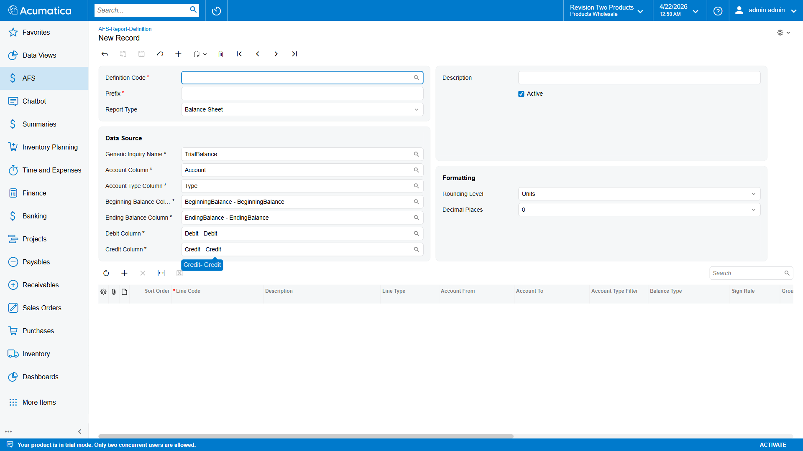
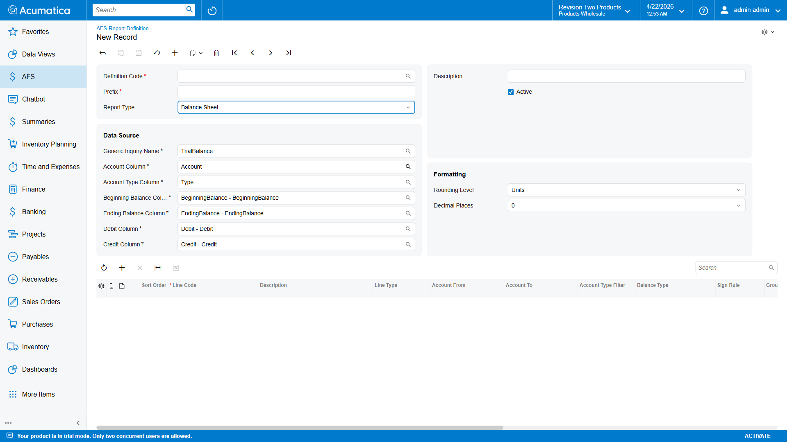
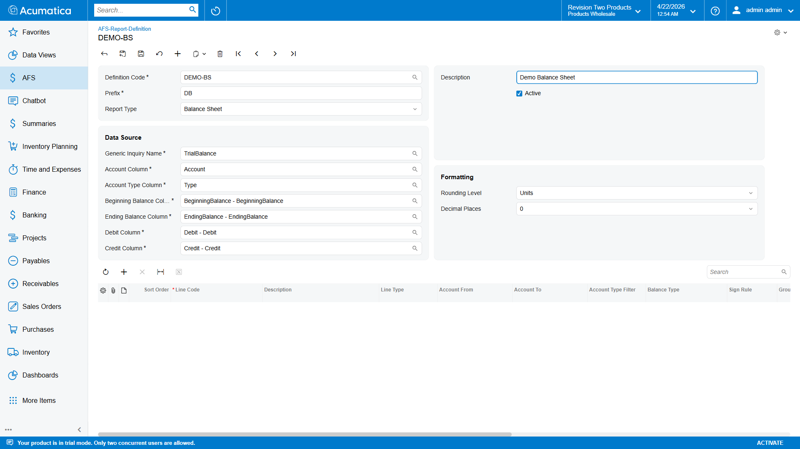
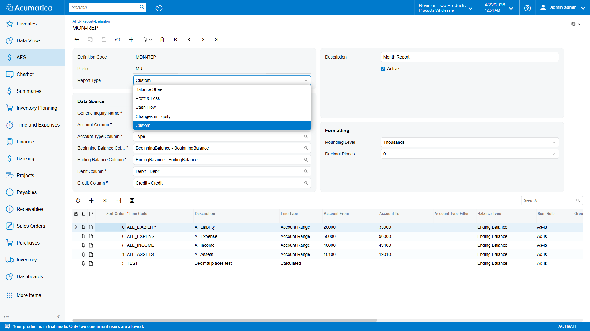
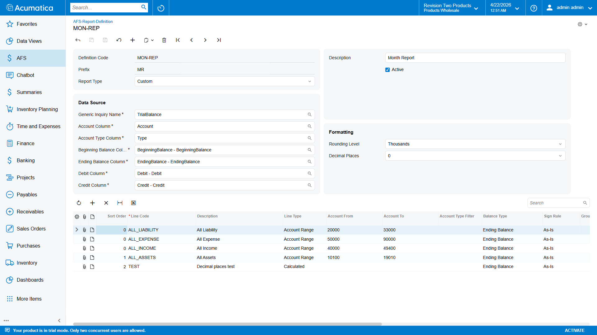
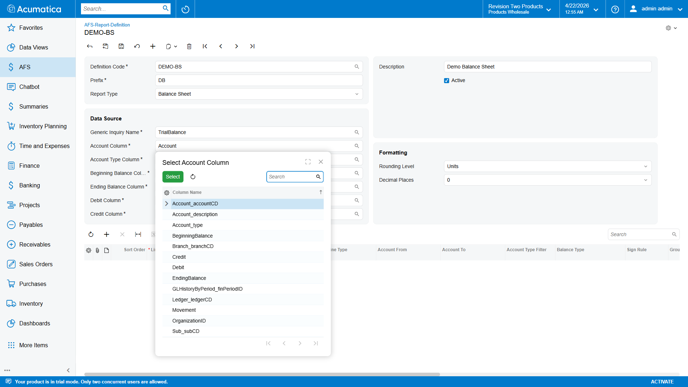
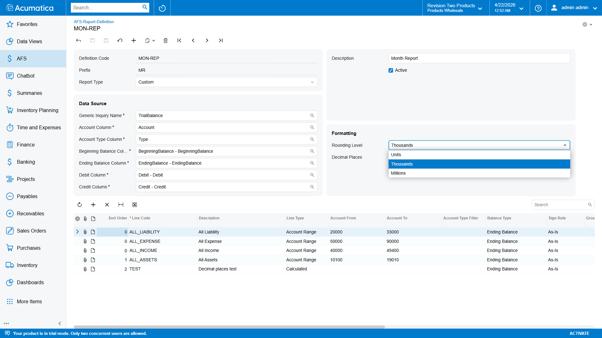
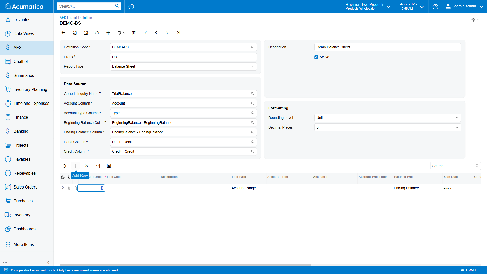
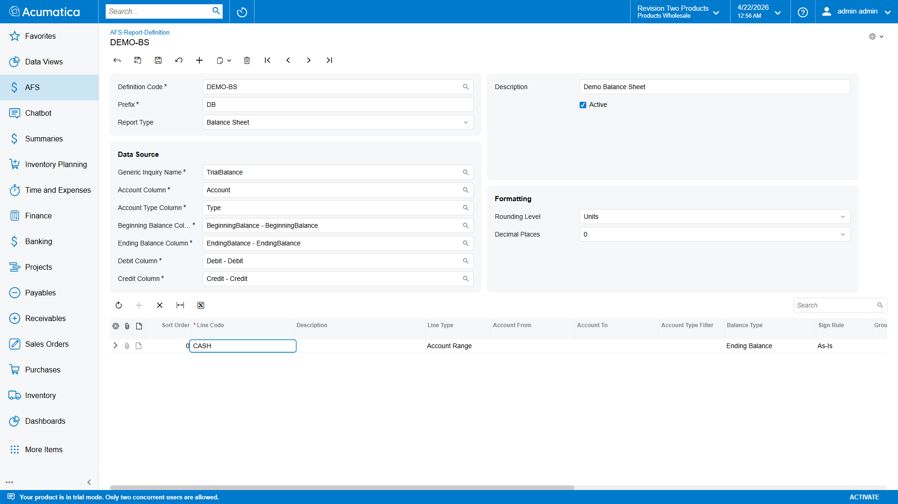

# Report Definition Setup — FR101002

This document describes how to create an **AFS Report Definition**. A Report Definition is the blueprint that tells the Financial Report engine:

1. Which **Generic Inquiry (GI)** to pull GL data from,
2. Which **columns** on that GI carry the balance figures, and
3. Which **line items** (account ranges, subtotals, calculated lines, headings) to emit as placeholders in the final report.

One definition is typically created per statement type (Balance Sheet, P&L, Cash Flow, etc.) and then linked to the **Financial Report (FR301000)** or **Presentation Generation (FR301001)** screen.

---

## Prerequisites

- Tenant credentials already saved in [Tenant Credentials (FR101001)](01_TenantCredentials_Setup.md).
- A Generic Inquiry is published that exposes the GL balances you want to consume. The default GI is named **`TrialBalance`**; any GI with account/balance columns works.
- You know the GL account ranges that make up each line of the statement you are modelling.

---

## Steps

### Step 1 — Navigate to AFS Report Definition

1. In the top search bar type **AFS Report** and select **AFS Report Definition** under the *AFS* workspace.

> **Screen ID:** FR101002



---

### Step 2 — Create a New Record

Click the **+** (Add) button. The **Definition Code** field shows `<NEW>` until saved.



---

### Step 3 — Fill the Header

Enter the three required header fields:

| Field                | Example             | Notes                                                                                                                                             |
| -------------------- | ------------------- | ------------------------------------------------------------------------------------------------------------------------------------------------- |
| **Definition Code**  | `DEMO-BS`           | Unique key, max 50 chars. This is the code the Financial Report / Presentation screen will select.                                                |
| **Prefix**           | `DB`                | Short alphanumeric tag, max 10 chars (`^[A-Za-z0-9]+$` — letters and digits only, no separators). Namespaces all placeholders emitted by this definition, e.g. `{{DB_TOTAL_ASSETS_CY}}`. **Must be unique across all definitions in the tenant.** |
| **Description**      | `Demo Balance Sheet`| Free-text label, max 255 chars. Appears in the selector dropdown on downstream screens.                                                           |



---

### Step 4 — Choose the Report Type

**Report Type** tags the definition so downstream screens can group it. It does not alter calculation — it is metadata only.

| Value | Label                |
| ----- | -------------------- |
| `BS`  | Balance Sheet (default) |
| `PL`  | Profit & Loss        |
| `CF`  | Cash Flow            |
| `EQ`  | Changes in Equity    |
| `CU`  | Custom               |



Also visible on the same header row:

- **Active** — uncheck to hide this definition from the selector on FR301000 / FR301001 without deleting it.

---

### Step 5 — Pick the Generic Inquiry

**Generic Inquiry Name** drives *where* the engine pulls GL balances from. Defaults to **`TrialBalance`**. Use the selector (magnifier icon) to pick any published GI.


The selector lists all `GIDesign` records in the tenant. Any GI that returns rows keyed by account with balance figures can be used — the column mapping in Step 6 tells the engine which GI column carries each concept.

After saving, the header is populated and ready for column mapping:



---

### Step 6 — Map the GI Columns

This section tells the engine *which column in the chosen GI* holds each balance concept. Each field is a **GI-column selector** — it only shows columns that exist on the GI picked in Step 5.

| Field                     | Default Column       | Purpose                                                                                   |
| ------------------------- | -------------------- | ----------------------------------------------------------------------------------------- |
| **Account Column**        | `Account`            | Column that returns the GL account code. Used for account-range filtering.                |
| **Account Type Column**   | `Type`               | Column returning `A/L/E/I/Q`. Used by the optional *Account Type Filter* on line items.   |
| **Beginning Balance Column** | `BeginningBalance`| Opening balance at the start of the fiscal year.                                          |
| **Ending Balance Column** | `EndingBalance`      | Closing balance for the selected period (most common balance type).                       |
| **Debit Column**          | `Debit`              | YTD debit movement.                                                                       |
| **Credit Column**         | `Credit`             | YTD credit movement.                                                                      |

> The defaults match Acumatica's stock **TrialBalance** GI. If you clone or customize that GI, rename the columns here to match.



---

### Step 7 — Configure Rounding

Controls how numeric placeholders are formatted when they appear in the final Word / markdown output.

| Field                | Values                                | Notes                                                                            |
| -------------------- | ------------------------------------- | -------------------------------------------------------------------------------- |
| **Rounding Level**   | `UNITS` (default), `THOUS`, `MILL`    | Divides all numbers by 1 / 1,000 / 1,000,000 before rendering.                   |
| **Decimal Places**   | `0` (default), `1`, `2`               | Digits shown after the decimal point.                                            |



Example: With Rounding Level = `THOUS` and Decimal Places = `1`, a raw value of `1,234,567.89` renders as `1,234.6`.

**Save** the header (`Ctrl+S`) before adding line items.

---

## Line Items Grid

Each row in **Line Items** is a single placeholder that will appear in the generated report. The engine calculates one CY / PM / PY value per visible row. The grid columns are as follows.



### Columns — overview

| Column                 | Required         | Description                                                                                                                                           |
| ---------------------- | ---------------- | ----------------------------------------------------------------------------------------------------------------------------------------------------- |
| **Sort Order**         | yes              | Integer controlling row order in the report. Lines are emitted in ascending `SortOrder`.                                                              |
| **Line Code**          | yes              | Unique token within this definition (≤100 chars). Forms the placeholder key, e.g. `CASH` → `{{DB_CASH_CY}}`, `{{DB_CASH_PM}}`, `{{DB_CASH_PY}}`.     |
| **Description**        | yes if visible   | Human-readable label, shown in the generated markdown table.                                                                                          |
| **Line Type**          | yes              | Determines how the engine computes this line. See table below.                                                                                        |
| **Account From / To**  | Account lines    | Inclusive GL account range to sum. Example: `10000`…`10999`.                                                                                          |
| **Account Type Filter**| optional         | Restrict the range to a single GL account type.                                                                                                       |
| **Sign Rule**          | Account lines    | `ASIS` keeps the raw GL sign; `FLIP` multiplies by −1 for presentation (typical for Liability / Income / Equity).                                     |
| **Balance Type**       | Account lines    | Which GI balance column to read (Ending, YTD movement, period movement, etc.).                                                                        |
| **Group / Parent Line**| Subtotal lines   | The `LineCode` whose children this subtotal sums. Example: child rows CASH, AR, INV all set Parent = `CURRENT_ASSETS`.                                |
| **Formula**            | Calculated lines | Arithmetic expression over other `LineCode`s using `+ − × ÷` and parentheses. Example: `REVENUE - COGS`. References may also cross definitions using the fully qualified `<Prefix>_<LineCode>` form — see [Cross-Definition Formulas](#cross-definition-formulas). |
| **Visible in Report**  | yes              | Default true. Uncheck to keep the value internal (usable in formulas / subtotals) without emitting a placeholder.                                     |
| **Subaccount Filter**  | optional         | Exact-match subaccount, e.g. `000-000`. Blank = all subaccounts.                                                                                      |
| **Branch Filter**      | optional         | `BranchCD` selector. Blank = all branches.                                                                                                            |
| **Organization Filter**| optional         | `OrganizationCD` selector. Blank = all organizations.                                                                                                 |
| **Ledger Filter**      | optional         | `LedgerCD` selector. Blank = all ledgers.                                                                                                             |

> All filter columns only apply when **Line Type** = `ACCOUNT`. They are ignored by Subtotal / Calculated / Heading lines.

---

### Line Type values

| Code         | Label          | Behaviour                                                                                                                        |
| ------------ | -------------- | -------------------------------------------------------------------------------------------------------------------------------- |
| `ACCOUNT`    | Account Range  | Sum all GI rows where the account code falls inside `AccountFrom`…`AccountTo` (inclusive), apply Sign Rule, use Balance Type.    |
| `SUBTOTAL`   | Subtotal       | Sum all lines whose `ParentLineCode` equals this row's `LineCode`.                                                               |
| `CALCULATED` | Calculated     | Evaluate `Formula` at runtime, referencing other `LineCode`s. Supports `+ − × ÷` and parentheses.                                |
| `HEADING`    | Heading        | Display-only. No value is computed; used to emit a section header into the report.                                               |



---

### Balance Type values

Applies only to `ACCOUNT` lines. Determines which column from the GI mapping is read.

| Code          | Label                        | Column used                  |
| ------------- | ---------------------------- | ---------------------------- |
| `ENDING`      | Ending Balance *(default)*   | **Ending Balance Column**    |
| `BEGINNING`   | Beginning Balance            | **Beginning Balance Column** |
| `DEBIT`       | Debit (YTD)                  | **Debit Column**             |
| `CREDIT`      | Credit (YTD)                 | **Credit Column**            |
| `MOVEMENT`    | Movement (YTD)               | `Debit − Credit` YTD         |
| `PDEBIT`      | Period Debit                 | Debit for the selected single period. |
| `PCREDIT`     | Period Credit                | Credit for the selected single period. |
| `PMOVEMENT`   | Period Movement              | `Debit − Credit` for the selected single period. |

> Use `PDEBIT / PCREDIT / PMOVEMENT` for monthly P&L lines. Use `ENDING` for Balance Sheet lines.

---

### Sign Rule values

Sign handling is **two-stage** inside the engine:

1. **Automatic account-type normalization** (`ApplyAccountTypeSign`). When the GI row has an **Account Type** (`A`/`L`/`E`/`I`/`Q`) in the mapped type column, the engine multiplies the raw GL value by `−1` for credit-normal types (`L`, `I`, `Q`). Asset/Expense values pass through unchanged. This turns credit-normal GL values (Acumatica stores them negative) into the positive figures expected on a financial statement.
2. **User-controlled Sign Rule** (this column). Applied **after** the automatic normalization.

| Code   | Label       | Math               | When to use                                                                                                                                                     |
| ------ | ----------- | ------------------ | --------------------------------------------------------------------------------------------------------------------------------------------------------------- |
| `ASIS` | As-Is       | no extra multiply  | **Default — correct for nearly every line.** The engine has already normalized credit-normal types for you.                                                    |
| `FLIP` | Flip Sign   | `× −1`             | Use only when (a) the GI's type column is blank/unmapped so automatic normalization did not fire, or (b) you specifically want the opposite of the normal sign. |

> **Gotcha.** Setting `FLIP` on a Liability/Income/Equity line when the type column *is* populated will double-flip (`−1 × −1 = +1` relative to raw, i.e. a negative value on the statement). If liabilities show up negative after generation, check this column first.

---

### Account Type Filter values

Optional hard-filter on the GL account type. Uses the column mapped in **Account Type Column**.

| Code   | Label         |
| ------ | ------------- |
| *(blank)* | All Types  |
| `A`    | Asset         |
| `L`    | Liability     |
| `E`    | Expense       |
| `I`    | Income        |
| `Q`    | Equity        |

Leave blank unless you want to clamp a range that spans multiple account types.

---

## Worked Examples

Below are the minimum column values for each `LineType`.

### ACCOUNT line — sum a range

```
Sort Order   : 10
Line Code    : CASH
Description  : Cash and Cash Equivalents
Line Type    : Account Range
Account From : 10100
Account To   : 10199
Sign Rule    : As-Is
Balance Type : Ending Balance
Visible      : ✓
```

### SUBTOTAL line — sum child lines

```
Sort Order           : 100
Line Code            : CURRENT_ASSETS
Description          : Total Current Assets
Line Type            : Subtotal
Group / Parent Line  : (leave blank — this IS the parent)
Visible              : ✓
```
…and on the rows above, set **Group / Parent Line = `CURRENT_ASSETS`** for each child you want rolled up.

### CALCULATED line — formula over other codes

```
Sort Order  : 200
Line Code   : NET_INCOME
Description : Net Income
Line Type   : Calculated
Formula     : REVENUE - COGS - OPEX - TAX
Visible     : ✓
```

> Unqualified tokens (`REVENUE`, `COGS`, …) resolve **within this definition**. Prefix the token (`PL_REVENUE`, `BS_CASH`) to pull from another definition linked on the same Financial Report — see [Cross-Definition Formulas](#cross-definition-formulas).

### HEADING line — section divider

```
Sort Order  : 5
Line Code   : HDR_ASSETS
Description : ASSETS
Line Type   : Heading
Visible     : ✓   (unchecked headings are discarded silently)
```

---

## Placeholder Key Format

Each visible line emits three placeholders into the report:

```
{{<Prefix>_<LineCode>_CY}}   → current period
{{<Prefix>_<LineCode>_PM}}   → previous month, same year
{{<Prefix>_<LineCode>_PY}}   → same month, previous year
```

Example — with **Prefix = DB** and **Line Code = CASH**:

```
{{DB_CASH_CY}}
{{DB_CASH_PM}}
{{DB_CASH_PY}}
```

See [Placeholder Reference](06_Placeholder_Reference.md) for the full placeholder catalogue.

---

## End-to-End Example — Mini Balance Sheet

This example walks through a complete **Balance Sheet** definition: the raw GL data that lands in the GI, the Line Items grid rows, and the placeholder values that come out the other end.

### 1 — Raw GI data (input)

Assume the `TrialBalance` GI returns the following rows for the reporting period **April 2026** (Branch = `MAIN`, Ledger = `ACTUAL`):

| Account | Type | BeginningBalance | EndingBalance | Debit    | Credit   |
| ------- | ---- | ---------------- | ------------- | -------- | -------- |
| 10100   | A    | 40,000.00        | 52,500.00     | 18,000   | 5,500    |
| 10200   | A    | 80,000.00        | 96,000.00     | 30,000   | 14,000   |
| 10300   | A    | 25,000.00        | 31,500.00     | 10,000   | 3,500    |
| 20100   | L    | −20,000.00       | −28,000.00    | 2,000    | 10,000   |
| 20200   | L    | −50,000.00       | −60,000.00    | 5,000    | 15,000   |
| 30100   | Q    | −75,000.00       | −92,000.00    | 0        | 17,000   |

> Liabilities and Equity carry negative signs at the GL level (credit-normal). The engine's automatic **account-type normalization** (see [Sign Rule values](#sign-rule-values)) converts these to positive for presentation before Sign Rule is applied. All lines below use `Sign Rule = ASIS` — the engine has already done the sign work.

### 2 — Definition header

```
Definition Code : DEMO-BS
Prefix          : DB
Description     : Demo Balance Sheet
Report Type     : Balance Sheet
Active          : ✓
Generic Inquiry : TrialBalance
Account Column     : Account
Account Type Col   : Type
Beginning Bal Col  : BeginningBalance
Ending Bal Col     : EndingBalance
Debit Column       : Debit
Credit Column      : Credit
Rounding Level     : UNITS
Decimal Places     : 0
```

### 3 — Line Items grid

| Sort | Line Code         | Description               | Line Type  | Acct From | Acct To | Sign Rule | Balance Type | Parent          | Formula                                  | Visible |
| ---- | ----------------- | ------------------------- | ---------- | --------- | ------- | --------- | ------------ | --------------- | ---------------------------------------- | ------- |
| 5    | HDR_ASSETS        | ASSETS                    | Heading    |           |         |           |              |                 |                                          | ✓       |
| 10   | CASH              | Cash and Cash Equivalents | Account    | 10100     | 10100   | ASIS      | ENDING       | CURRENT_ASSETS  |                                          | ✓       |
| 20   | AR                | Accounts Receivable       | Account    | 10200     | 10200   | ASIS      | ENDING       | CURRENT_ASSETS  |                                          | ✓       |
| 30   | INVENTORY         | Inventory                 | Account    | 10300     | 10300   | ASIS      | ENDING       | CURRENT_ASSETS  |                                          | ✓       |
| 100  | CURRENT_ASSETS    | Total Current Assets      | Subtotal   |           |         |           |              |                 |                                          | ✓       |
| 105  | HDR_LIAB_EQ       | LIABILITIES & EQUITY      | Heading    |           |         |           |              |                 |                                          | ✓       |
| 110  | AP                | Accounts Payable          | Account    | 20100     | 20100   | ASIS      | ENDING       | TOTAL_LIAB      |                                          | ✓       |
| 120  | LOAN              | Long-Term Loan            | Account    | 20200     | 20200   | ASIS      | ENDING       | TOTAL_LIAB      |                                          | ✓       |
| 200  | TOTAL_LIAB        | Total Liabilities         | Subtotal   |           |         |           |              |                 |                                          | ✓       |
| 210  | EQUITY            | Shareholder Equity        | Account    | 30100     | 30100   | ASIS      | ENDING       |                 |                                          | ✓       |
| 300  | CHECK_TOTAL       | Assets − (Liab + Equity)  | Calculated |           |         |           |              |                 | `CURRENT_ASSETS - TOTAL_LIAB - EQUITY`   | ✓       |

### 4 — How each row computes

| Line Code         | Computation (auto type-sign × ASIS)                                                | Value (CY)  |
| ----------------- | ---------------------------------------------------------------------------------- | ----------- |
| `CASH`            | `EndingBalance[10100]` × type-sign(A)=+1 × ASIS = `52,500 × +1 × +1`               | `52,500`    |
| `AR`              | `EndingBalance[10200]` × type-sign(A)=+1 × ASIS                                    | `96,000`    |
| `INVENTORY`       | `EndingBalance[10300]` × type-sign(A)=+1 × ASIS                                    | `31,500`    |
| `CURRENT_ASSETS`  | Subtotal of children where `Parent = CURRENT_ASSETS`                               | `180,000`   |
| `AP`              | `EndingBalance[20100]` × type-sign(L)=−1 × ASIS = `−28,000 × −1 × +1`              | `28,000`    |
| `LOAN`            | `EndingBalance[20200]` × type-sign(L)=−1 × ASIS = `−60,000 × −1 × +1`              | `60,000`    |
| `TOTAL_LIAB`      | Subtotal of children where `Parent = TOTAL_LIAB`                                   | `88,000`    |
| `EQUITY`          | `EndingBalance[30100]` × type-sign(Q)=−1 × ASIS = `−92,000 × −1 × +1`              | `92,000`    |
| `CHECK_TOTAL`     | `CURRENT_ASSETS − TOTAL_LIAB − EQUITY`                                             | `0`         |

`CHECK_TOTAL = 0` confirms the balance sheet balances — a useful CALCULATED line to include while testing.

### 5 — Placeholders emitted

With **Prefix = `DB`**, the engine writes the following key/value pairs into the placeholder dictionary (the same keys appear in the generated markdown and in any Word template mail-merge):

| Placeholder              | Value (April 2026 / CY) |
| ------------------------ | ----------------------- |
| `{{DB_CASH_CY}}`         | `52,500`                |
| `{{DB_AR_CY}}`           | `96,000`                |
| `{{DB_INVENTORY_CY}}`    | `31,500`                |
| `{{DB_CURRENT_ASSETS_CY}}` | `180,000`             |
| `{{DB_AP_CY}}`           | `28,000`                |
| `{{DB_LOAN_CY}}`         | `60,000`                |
| `{{DB_TOTAL_LIAB_CY}}`   | `88,000`                |
| `{{DB_EQUITY_CY}}`       | `92,000`                |
| `{{DB_CHECK_TOTAL_CY}}`  | `0`                     |

Each key is also emitted with suffixes `_PM` (prior month, same year) and `_PY` (same month, prior year), computed against the March 2026 and April 2025 GI rows respectively.

> Heading rows (`HDR_ASSETS`, `HDR_LIAB_EQ`) do **not** emit placeholders — they only print the description as a section header in the markdown.

### 6 — Effect of Rounding Level

If you switch **Rounding Level = `THOUS`** and **Decimal Places = `1`**, the same placeholders render as:

| Placeholder              | UNITS / 0   | THOUS / 1   |
| ------------------------ | ----------- | ----------- |
| `{{DB_CASH_CY}}`         | `52,500`    | `52.5`      |
| `{{DB_CURRENT_ASSETS_CY}}` | `180,000` | `180.0`     |
| `{{DB_EQUITY_CY}}`       | `92,000`    | `92.0`      |

Useful when the audience is senior management and you want figures in thousands or millions.

---

## End-to-End Example — Mini Profit & Loss

A parallel P&L definition that feeds off the **same** April 2026 GI. This example is referenced by the Cross-Definition Formulas section below (the Ratios and Cash Flow examples both consume `DP_*` lines from here).

### 1 — Raw GI data (input)

Assume the `TrialBalance` GI returns the following rows for **April 2026** (same scope as the Mini BS — Branch `MAIN`, Ledger `ACTUAL`):

| Account | Type | PeriodDebit | PeriodCredit | PeriodMovement (Debit − Credit) |
| ------- | ---- | ----------- | ------------ | -------------------------------- |
| 40100   | I    | 500         | 250,500      | −250,000                         |
| 50100   | E    | 100,100     | 100          | 100,000                          |
| 60100   | E    | 60,000      | 0            | 60,000                           |
| 70100   | E    | 20,000      | 0            | 20,000                           |

> Income accounts are credit-normal — their period movement is negative at the GL level. The engine's automatic **account-type normalization** (`Type = I` → `× −1`) converts this to a positive figure before Sign Rule is applied, so REVENUE below uses `Sign Rule = ASIS`. Expense accounts (`Type = E`) are debit-normal positive — also ASIS. `Balance Type = PMOVEMENT` reads single-period `Debit − Credit` (not YTD).

### 2 — Definition header

```
Definition Code : DEMO-PL
Prefix          : DP
Description     : Demo Profit & Loss
Report Type     : Profit & Loss
Active          : ✓
Generic Inquiry : TrialBalance
Account Column     : Account
Account Type Col   : Type
Beginning Bal Col  : BeginningBalance
Ending Bal Col     : EndingBalance
Debit Column       : Debit
Credit Column      : Credit
Rounding Level     : UNITS
Decimal Places     : 0
```

### 3 — Line Items grid

| Sort | Line Code | Description               | Line Type  | Acct From | Acct To | Sign Rule | Balance Type | Formula              | Visible |
| ---- | --------- | ------------------------- | ---------- | --------- | ------- | --------- | ------------ | -------------------- | ------- |
| 5    | HDR_PL    | PROFIT & LOSS             | Heading    |           |         |           |              |                      | ✓       |
| 10   | REVENUE   | Revenue                   | Account    | 40100     | 40100   | ASIS      | PMOVEMENT    |                      | ✓       |
| 20   | COGS      | Cost of Goods Sold        | Account    | 50100     | 50100   | ASIS      | PMOVEMENT    |                      | ✓       |
| 30   | GP        | Gross Profit              | Calculated |           |         |           |              | `REVENUE - COGS`     | ✓       |
| 40   | OPEX      | Operating Expenses        | Account    | 60100     | 60100   | ASIS      | PMOVEMENT    |                      | ✓       |
| 50   | TAX       | Income Tax                | Account    | 70100     | 70100   | ASIS      | PMOVEMENT    |                      | ✓       |
| 60   | NI        | Net Income                | Calculated |           |         |           |              | `GP - OPEX - TAX`    | ✓       |

### 4 — How each row computes

| Line Code | Computation (auto type-sign × ASIS)                                        | Value (CY) |
| --------- | -------------------------------------------------------------------------- | ---------- |
| `REVENUE` | `PMovement[40100]` × type-sign(I)=−1 × ASIS = `−250,000 × −1 × +1`         | `250,000`  |
| `COGS`    | `PMovement[50100]` × type-sign(E)=+1 × ASIS                                | `100,000`  |
| `GP`      | `REVENUE − COGS`                                                           | `150,000`  |
| `OPEX`    | `PMovement[60100]` × type-sign(E)=+1 × ASIS                                | `60,000`   |
| `TAX`     | `PMovement[70100]` × type-sign(E)=+1 × ASIS                                | `20,000`   |
| `NI`      | `GP − OPEX − TAX`                                                          | `70,000`   |

### 5 — Placeholders emitted

| Placeholder              | Value (April 2026 / CY) |
| ------------------------ | ----------------------- |
| `{{DP_REVENUE_CY}}`      | `250,000`               |
| `{{DP_COGS_CY}}`         | `100,000`               |
| `{{DP_GP_CY}}`           | `150,000`               |
| `{{DP_OPEX_CY}}`         | `60,000`                |
| `{{DP_TAX_CY}}`          | `20,000`                |
| `{{DP_NI_CY}}`           | `70,000`                |

Each key is also emitted with `_PM` and `_PY` suffixes computed against the March 2026 and April 2025 period movements.

---

## Cross-Definition Formulas

A `CALCULATED` line is not restricted to Line Codes declared inside its own definition. When two or more definitions are **linked on the same report record** (child grid on [Financial Report Generation — Step 8](FinancialReport_Generation.md#step-8--link-one-or-more-report-definitions)), the engine concatenates all of their placeholder dictionaries into one namespace before evaluating formulas. That means a line in one definition can reference a line in another simply by qualifying the token with the other definition's **Prefix**.

### Reference syntax

| Form                        | Resolved against                                              | Example                |
| --------------------------- | ------------------------------------------------------------- | ---------------------- |
| `LINE_CODE` *(unqualified)* | The current definition only.                                  | `REVENUE - COGS`       |
| `PREFIX_LINE_CODE`          | The definition whose `Prefix` matches the leading token.      | `PL_NI + BS_RECV`      |

The separator is a single underscore (the same one used in placeholder keys — `{{PL_NI_CY}}` becomes `PL_NI` inside a formula). Prefixes and Line Codes are matched case-insensitively on the parsed token; case of the typed text is preserved only for display.

> **Rule of thumb.** If you would spell the placeholder `{{PL_NI_CY}}` in the Word template, you write `PL_NI` in the formula. Drop the `{{ }}` and the period suffix.

### Resolution order

Formula tokens never include a period suffix — they address a Line Code only. Global keys are of the form `PREFIX_LINECODE` (no `_CY` / `_PM` / `_PY` on the end). For each token the resolver:

1. Tries each known Prefix (longest first) — if the token starts with `<Prefix>_`, treat the token as already fully qualified (`PL_NI` → global key `PL_NI`).
2. Otherwise treat as implicit — prepend the **current definition's** Prefix (`NI` inside the PL definition → `PL_NI`).
3. If the resulting global key is missing from the dictionary → warning logged, value defaults to `0`.

### Automatic CY / PM / PY evaluation

Each CALCULATED line's formula is evaluated **three times** — once against the Current-Year dictionary, once against the Previous-Month dictionary, once against the Previous-Year dictionary. Same formula, three different input dictionaries:

```csharp
cyVal = EvaluateFormula(formula, prefix, knownPrefixes, _cyGlobal);
pmVal = EvaluateFormula(formula, prefix, knownPrefixes, _pmGlobal);
pyVal = EvaluateFormula(formula, prefix, knownPrefixes, _pyGlobal);
```

That is how the three placeholder forms are produced:

| Placeholder             | Which dictionary is used |
| ----------------------- | ------------------------ |
| `{{PREFIX_LINE_CY}}`    | `_cyGlobal`              |
| `{{PREFIX_LINE_PM}}`    | `_pmGlobal`              |
| `{{PREFIX_LINE_PY}}`    | `_pyGlobal`              |

Consequence: **you cannot mix periods inside a single formula.** A formula like `DB_CASH - DB_CASH_PM` does not work — `DB_CASH_PM` is not a valid global key and resolves to `0`. Whatever period the outer evaluation pass is running, every token is looked up against that same period's dictionary.

> **Rule.** Write formulas in terms of Line Codes only (`DB_CASH`, `DP_NI`). The engine picks the right period automatically for each of the three passes. All three output placeholders (`_CY`, `_PM`, `_PY`) drop out of that for free.

### Worked example A — Financial Ratios (consumes `DB` + `DP`)

This example uses the two definitions already worked through above — **Mini Balance Sheet** (Prefix `DB`) and **Mini Profit & Loss** (Prefix `DP`) — and adds a third definition that computes ratios by referencing both. All three are linked to the same Financial Report record for April 2026.

**Available formula tokens** (from the two prior examples — all reference Line Codes, no period suffix):

| From DB (Balance Sheet)             | April 2026 (CY) | From DP (Profit & Loss) | April 2026 (CY) |
| ----------------------------------- | --------------- | ----------------------- | --------------- |
| `DB_CASH`                           | `52,500`        | `DP_REVENUE`            | `250,000`       |
| `DB_AR`                             | `96,000`        | `DP_COGS`               | `100,000`       |
| `DB_INVENTORY`                      | `31,500`        | `DP_GP`                 | `150,000`       |
| `DB_CURRENT_ASSETS`                 | `180,000`       | `DP_OPEX`               | `60,000`        |
| `DB_AP`                             | `28,000`        | `DP_TAX`                | `20,000`        |
| `DB_LOAN`                           | `60,000`        | `DP_NI`                 | `70,000`        |
| `DB_TOTAL_LIAB`                     | `88,000`        |                         |                 |
| `DB_EQUITY`                         | `92,000`        |                         |                 |

> The values shown are the April-2026 (CY) figures. The same tokens resolve to different values on the PM pass (March 2026) and the PY pass (April 2025), so the same formula produces `_CY`, `_PM`, and `_PY` placeholders automatically. See **Automatic CY / PM / PY evaluation** above.

> Mini BS has no separate Fixed Assets range, so `DB_CURRENT_ASSETS` = Total Assets for this dataset. The identity `CURRENT_ASSETS = TOTAL_LIAB + EQUITY` (`180,000 = 88,000 + 92,000`) confirms it.

**Ratios definition header**

```
Definition Code : DEMO-RATIOS
Prefix          : DR
Description     : Demo Financial Ratios (cross-definition)
Report Type     : Custom
Active          : ✓
Rounding Level  : UNITS
Decimal Places  : 2        ← ratios are fractional; show 2 decimals
```

**Ratios line items**

| Sort | Line Code       | Description           | Line Type  | Formula                                              |
| ---- | --------------- | --------------------- | ---------- | ---------------------------------------------------- |
| 10   | `DEBT_EQUITY`   | Debt / Equity         | Calculated | `DB_TOTAL_LIAB / DB_EQUITY`                          |
| 20   | `GROSS_MARGIN`  | Gross Margin          | Calculated | `DP_GP / DP_REVENUE`                                 |
| 30   | `NET_MARGIN`    | Net Margin            | Calculated | `DP_NI / DP_REVENUE`                                 |
| 40   | `ROA`           | Return on Assets      | Calculated | `DP_NI / DB_CURRENT_ASSETS`                          |
| 50   | `QUICK_RATIO`   | Quick Ratio           | Calculated | `(DB_CASH + DB_AR) / DB_AP`                          |
| 60   | `CHECK_ID`      | Identity tie-out      | Calculated | `DB_CURRENT_ASSETS - DB_TOTAL_LIAB - DB_EQUITY`      |

**Resolution of every token**

| Token                   | Resolved against                                           |
| ----------------------- | ---------------------------------------------------------- |
| `DB_TOTAL_LIAB`         | Mini Balance Sheet definition (`DB`), Line Code `TOTAL_LIAB`. |
| `DB_EQUITY`             | `DB.EQUITY`.                                               |
| `DP_GP`, `DP_REVENUE`   | Mini P&L definition (`DP`).                                |
| `DP_NI`                 | `DP.NI` = `70,000`.                                        |
| `DB_CURRENT_ASSETS`     | `DB.CURRENT_ASSETS` = `180,000`.                           |

**Computed values**

| Line Code       | Computation                                    | Value (CY) |
| --------------- | ---------------------------------------------- | ---------- |
| `DEBT_EQUITY`   | `88,000 / 92,000`                              | `0.96`     |
| `GROSS_MARGIN`  | `150,000 / 250,000`                            | `0.60`     |
| `NET_MARGIN`    | `70,000 / 250,000`                             | `0.28`     |
| `ROA`           | `70,000 / 180,000`                             | `0.39`     |
| `QUICK_RATIO`   | `(52,500 + 96,000) / 28,000`                   | `5.30`     |
| `CHECK_ID`      | `180,000 − 88,000 − 92,000`                    | `0.00`     |

**Placeholders emitted**

Each formula is evaluated three times (once per period dictionary), so every ratio line drops three placeholders into the merge dictionary:

| Line Code      | `{{..._CY}}` (April 2026) | `{{..._PM}}` (March 2026) | `{{..._PY}}` (April 2025) |
| -------------- | ------------------------- | ------------------------- | ------------------------- |
| `DEBT_EQUITY`  | `0.96`                    | *(March BS totals)*       | *(April 2025 BS totals)*  |
| `GROSS_MARGIN` | `0.60`                    | *(March PL totals)*       | *(April 2025 PL totals)*  |
| `NET_MARGIN`   | `0.28`                    | ″                         | ″                         |
| `ROA`          | `0.39`                    | ″                         | ″                         |
| `QUICK_RATIO`  | `5.30`                    | ″                         | ″                         |
| `CHECK_ID`     | `0.00`                    | `0.00`                    | `0.00`                    |

The CY values are what the April-2026 inputs above produce. The PM and PY values are the same formulas evaluated against the March 2026 and April 2025 dictionaries — they are computed automatically, you do not author separate formulas for them.

To make this run end-to-end: open the FR101000 record, set Current Year = `2026`, Financial Month = `April`, attach a Word template that references any of the `{{DR_*}}` / `{{DB_*}}` / `{{DP_*}}` placeholders, and link **all three** definitions (`DEMO-BS`, `DEMO-PL`, `DEMO-RATIOS`) in the Report Definitions grid. Miss any one of the three and the Ratios formulas resolve to `0` and log a warning.

---

### Worked example B — Cash Flow statement

A third definition that produces a period-movement Cash Flow by referencing BS and PL totals. The engine's automatic 3-pass evaluation means the same formulas emit `_CY`, `_PM`, and `_PY` placeholders covering April 2026 vs. March 2026 vs. April 2025 — without any per-period formula authoring.

**Cash Flow definition header**

```
Definition Code : DEMO-CF
Prefix          : DC
Description     : Demo Cash Flow (cross-definition)
Report Type     : Cash Flow
Active          : ✓
Rounding Level  : UNITS
Decimal Places  : 0
```

**Cash Flow line items**

| Sort | Line Code      | Description                  | Line Type  | Formula                                      |
| ---- | -------------- | ---------------------------- | ---------- | -------------------------------------------- |
| 10   | `NI_INPUT`     | Net Income (from P&L)        | Calculated | `DP_NI`                                      |
| 20   | `OPER_WC`      | Operating Working Capital    | Calculated | `DB_AR + DB_INVENTORY - DB_AP`               |
| 30   | `CASH_POS`     | Cash Position (BS)           | Calculated | `DB_CASH`                                    |
| 40   | `DEBT_POS`     | Debt Position (BS)           | Calculated | `DB_LOAN`                                    |
| 50   | `FREE_CF_APPROX` | Free Cash Flow (approx.)   | Calculated | `NI_INPUT - OPER_WC`                         |
| 60   | `DEBT_COVER`   | Cash / Debt coverage ratio   | Calculated | `CASH_POS / DEBT_POS`                        |

Values for each of the three periods drop out automatically from the 3-pass evaluation. For the **CY pass** (April 2026) the linked DB and DP dictionaries hold the values shown in the *Available formula tokens* table above, so:

| Line Code          | Expression (CY)                                   | Value (CY) |
| ------------------ | ------------------------------------------------- | ---------- |
| `NI_INPUT`         | `DP_NI` = `70,000`                                | `70,000`   |
| `OPER_WC`          | `96,000 + 31,500 − 28,000`                        | `99,500`   |
| `CASH_POS`         | `DB_CASH` = `52,500`                              | `52,500`   |
| `DEBT_POS`         | `DB_LOAN` = `60,000`                              | `60,000`   |
| `FREE_CF_APPROX`   | `70,000 − 99,500`                                 | `−29,500`  |
| `DEBT_COVER`       | `52,500 / 60,000`                                 | `0.88`     |

**Placeholders emitted**

| Placeholder                   | CY value   | PM / PY  |
| ----------------------------- | ---------- | -------- |
| `{{DC_NI_INPUT_CY}}`          | `70,000`   | auto     |
| `{{DC_OPER_WC_CY}}`           | `99,500`   | auto     |
| `{{DC_CASH_POS_CY}}`          | `52,500`   | auto     |
| `{{DC_FREE_CF_APPROX_CY}}`    | `−29,500`  | auto     |
| `{{DC_DEBT_COVER_CY}}`        | `0.88`     | auto     |

`_PM` and `_PY` counterparts are computed by the exact same formulas, evaluated against `_pmGlobal` and `_pyGlobal` respectively. The Word template can reference all three periods side by side — typical for a KPI dashboard showing "This month / Last month / Same month prior year" columns.

> **If you need an explicit delta between two periods** (e.g. "cash this month minus cash last month"), compute that inside the **template**, not in the definition. A Word template macro / field can subtract `{{DC_CASH_POS_CY}}` from `{{DC_CASH_POS_PM}}` directly. A formula cannot, because tokens always resolve against the single dictionary for the pass currently running.

1. **All referenced definitions must be linked on the same Financial Report record.** The Financial Report screen does not auto-add definitions; you link them explicitly in the **Report Definitions** grid. If a formula token cannot be resolved (the referenced Prefix is unknown, or the LineCode does not exist on the linked definition), the engine **logs a warning via `PXTrace`** and returns `0` for that token — the run still completes with Status `Ready to Download`, but the affected placeholders will be wrong. Always check the trace log after a run that references cross-definition tokens for the first time.
2. **Unique prefixes.** Two definitions with the same Prefix cannot be linked to the same record — the resolver would be ambiguous. The save-time uniqueness check on FR101002 already prevents two definitions sharing a Prefix tenant-wide, so this is enforced at the source.
3. **No circular references.** `CF_OP_CASH` may reference `PL_NI`, but `PL_NI` cannot in turn reference `CF_*`. The engine runs topological sort (Kahn's algorithm) at the start of evaluation and raises a `CircularDependencyDetected` error listing the offending Line Codes; break the cycle by restructuring formulas or by demoting a shared computation into one of the definitions.
4. **Sort Order across definitions.** Sort Order is a pure presentation field — it never drives evaluation order. Within a single definition *and* across definitions, the engine builds a global dependency graph from all formulas / parent-child subtotals and evaluates in topological order. Write formulas in any order; the engine will compute inputs before dependents automatically.
5. **Rounding is applied only at the final placeholder step.** The `_cyGlobal` / `_pmGlobal` / `_pyGlobal` dictionaries that feed every formula store **raw `decimal` values**. Rounding is applied only by `BuildPlaceholderMap` when formatting each value into the string that goes into the Word-merge dictionary. Consequence: a cross-definition formula like `DR_ROA = DP_NI / DB_CURRENT_ASSETS` uses the full-precision numerator and denominator from the PL and BS definitions, regardless of those definitions' Rounding settings. Rounding only affects what the template prints, never what downstream formulas consume.

---

## Save and Validate

Save (`Ctrl+S`) to persist the definition and all line items. The graph runs the following validations in `RowPersisting` — save is blocked and an error marker appears on the offending field until the condition is fixed:

**Header — `FLRTReportDefinition`**

| Check                                         | Error message                              |
| --------------------------------------------- | ------------------------------------------ |
| Definition Code required.                     | `DefinitionCodeRequired`                   |
| Definition Code unique across all definitions.| `DefinitionCodeMustBeUnique`               |
| Prefix required.                              | `DefinitionPrefixRequired`                 |
| Prefix matches `^[A-Za-z0-9]+$` (letters & digits only). | `DefinitionPrefixMustBeAlphanumeric` |
| Prefix unique across all definitions.         | `DefinitionPrefixMustBeUnique`             |

**Line items — `FLRTReportLineItem`**

| Check                                              | Error message                 |
| -------------------------------------------------- | ----------------------------- |
| Line Code required.                                | `LineCodeRequired`            |
| Line Code unique within the definition.            | `LineCodeMustBeUnique`        |
| `ACCOUNT` lines — Account From required.           | `AccountFromRequired`         |
| `ACCOUNT` lines — Account To required.             | `AccountToRequired`           |
| `CALCULATED` lines — Formula required.             | `FormulaRequired`             |

Validation that is **not** enforced at save (but will bite at generation time):

- **Description on visible lines.** A visible line with a blank Description emits an empty label in the markdown output — ugly but not blocked. Fill it in manually.
- **Formula token resolvability.** Unknown tokens are not detected at save. They surface at generation as a `PXTrace` warning and a `0` value (see [Cross-Definition Formulas — Requirements & caveats](#requirements--caveats)).
- **Circular dependencies.** Detected only at generation time, by the topological sort. Error surfaces as `CircularDependencyDetected`.

---

## Next Step

Proceed to [Financial Report Generation](03_FinancialReport_Generation.md) or [Presentation Generation](05_Presentation_Generation.md) and link this definition to produce output.
